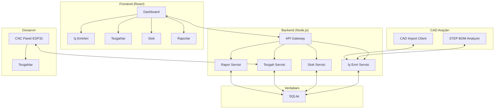

# ÜRTM Takip Sistemi

Üretim Takip Sistemi (ÜRTM), imalat endüstrisi için geliştirilmiş, end-to-end üretim yönetimi çözümüdür.

## 🏭 Sistem Hakkında

ÜRTM Takip, karmaşik üretim süreçlerini dijitalleştiren kapsamlı bir sistemdir. İş emri yönetiminden stok takibine, CNC entegrasyonundan CAD/CAM otomasyonuna kadar tüm üretim döngüsünü tek bir platformda yönetir.

### 🎯 Ana Özellikler

- **İş Emri Yönetimi**: Planlama, takip ve durum yönetimi
- **Üretim Planlama**: V1 (BOM tabanlı) ve V2 (JSON tabanlı) çift sistem
- **Tezgah Yönetimi**: Gerçek zamanlı durum takibi ve ESP32 entegrasyonu
- **Stok Yönetimi**: Otomatik stok güncelleme ve kritik seviye uyarıları
- **BOM Yönetimi**: Malzeme listesi ve maliyet analizi
- **Mobil Destek**: Android/iOS uyumlu responsive tasarım
- **CAD Entegrasyonu**: STEP dosya analizi ve BOM çıkarma
- **Raporlama**: Detaylı üretim raporları ve Excel export

### 🛠️ Teknik Altyapı

- **Backend**: Node.js + Express.js + Sequelize ORM + SQLite
- **Frontend**: React 18 + Vite + Material-UI + Redux Toolkit
- **Donanım**: ESP32 tabanlı CNC monitoring paneli
- **CAD Araçları**: Python + FreeCAD + SolidWorks COM automation
- **Real-time**: Socket.IO ile anlık veri akışı

## 📋 İçindekiler

- [Hızlı Başlangıç](#-hızlı-başlangıç)
- [Sistem Mimarisi](#-sistem-mimarisi)
- [Modüller](#-modüller)
- [Kurulum](#-kurulum)
- [Kullanım](#-kullanım)
- [Dokümantasyon](#-dokümantasyon)
- [Katkıda Bulunma](#-katkıda-bulunma)

## 🚀 Hızlı Başlangıç

### Gereksinimler

- Node.js 18+
- NPM 8+
- Python 3.8+ (CAD araçları için)
- ESP32 geliştirme ortamı (CNC panel için)

### Kurulum

```bash
# Projeyi klonlayın
git clone https://github.com/username/URTMtakip.git
cd URTMtakip

# Branch kontrolü
git checkout v13.dev15

# Tüm bağımlılıkları kurun
npm run install:all

# Veritabanı migrasyonlarını çalıştırın
cd backend && npm run migrate

# Geliştirme sunucusunu başlatın
cd .. && npm run dev
```

Sistem şu adreslerde çalışacaktır:
- **Frontend**: http://localhost:5173
- **Backend API**: http://localhost:3000

## 🏗️ Sistem Mimarisi



## 📦 Modüller

### 1. İş Emri Yönetimi
- **Özellikler**: İş emri oluşturma, durum takibi, tezgah atama
- **Durumlar**: Planlandı → Üretimde → Tamamlandı/İptal
- **Entegrasyon**: Stok, BOM, tezgah durumları

### 2. Üretim Planlama
- **V1 Sistem**: BOM tabanlı, karmaşik planlama
- **V2 Sistem**: JSON tabanlı, basitleştirilmiş planlama
- **Özellikler**: Excel import, sürükle-bırak arayüzü, kritik stok analizi

### 3. Parça ve BOM Yönetimi
- **Parça Katalog**: Teknik çizimler, fotoğraflar, stok entegrasyonu
- **BOM Sistemi**: Hiyerarşik malzeme listesi, maliyet hesaplamaları

### 4. Tezgah Yönetimi
- **Yazılım**: Tezgah tanımları, bakım takibi, performans analizi
- **Donanım**: ESP32 panel, gerçek zamanlı durum, LED göstergeler

### 5. Stok Yönetimi
- **Otomatik Güncelleme**: İş emirlerinden stoğa otomatik yansıtma
- **Hareket Takibi**: Giriş/çıkış, fire oranları, kritik seviye uyarıları

### 6. Operasyonel Modüller
- **Fason İşler**: Teklif yönetimi, kapama, süreç takibi
- **Sevkiyat**: Teslimat yönetimi, resim dokümantasyonu
- **Arıza-Bakım**: Bakım planlama, arıza takibi, maliyet analizi

### 7. Raporlama
- **Üretim Raporları**: Verimlilik, makine performansı
- **Excel Entegrasyonu**: Detaylı rapor export, custom report builder

## 🔧 Kurulum Detayları

### Port Konfigürasyonu
- **Frontend**: Port 5173 (sabit)
- **Backend**: Port 3000 (sabit)
- **Port çakışması durumunda**: `npm run restart` komutunu kullanın

### Ortam Değişkenleri
`backend/.env` dosyasını oluşturun:

```env
NODE_ENV=development
PORT=3000
JWT_SECRET=your-secret-key
CORS_ORIGIN=http://localhost:5173
UPLOAD_MAX_SIZE=100MB
```

### CNC Panel Kurulumu
```bash
cd CNC_panel
# include/config.h dosyasını düzenleyin (Wi-Fi, sunucu IP)
pio run -t upload
pio device monitor
```

### Python CAD Araçları
```bash
# STEP BOM Analyzer
cd STEP_BOM_Analyzer
pip install -r requirements.txt
python main.py

# CAD Import Client (Windows only)
cd CAD_Import_Client
pip install -r requirements.txt
python main.py
```

## 💻 Kullanım

### İş Akışı

1. **Parça Tanımlama**: Üretilecek parçaları sisteme kaydedin
2. **BOM Oluşturma**: Parçaların malzeme listelerini hazırlayın
3. **İş Emri Oluşturma**: Üretim için iş emirleri oluşturun
4. **Planlama**: İş emirlerini tezgahlara atayın
5. **Üretim Takibi**: Gerçek zamanlı durum takibi yapın
6. **Sevkiyat**: Tamamlanan işleri teslim edin

### Mobil Kullanım

Sistem otomatik olarak mobil cihazları algılar:
- **Responsive Tasarım**: Tüm ekran boyutlarına uyumlu
- **Touch Optimizasyon**: Dokunmatik arayüz
- **Hızlı Erişim**: Üretim alanı için optimize edilmiş menüler

### CNC Panel Entegrasyonu

1. ESP32 cihazını tezgaha yakın konumlandırın
2. Wi-Fi ve sunucu ayarlarını yapılandırın
3. Cihazı güce bağlayın
4. LED göstergeler ile durumu izleyin

## 📚 Dokümantasyon

### 🚀 Proje Dokümantasyonu (Oluşturulan)
- [Proje Yapısı Analizi](./URTMTAKIP_PROJE_ANALIZ_RAPORU.md) - Komplekt sistem analizi ve mimari örüntüler
- [API Dokümantasyonu](./API_Documentation.md) - 60+ endpoint ve Socket.IO olayları
- [Veritabanı Dokümantasyonu](./docs/DATABASE.md) - 25+ model ve migration sistemi
- [Frontend Mimarisi](./docs/FRONTEND.md) - React, Redux ve responsive tasarım

### Geliştirme Dokümanları
- [Backend Dokümantasyonu](./docs/backend-documentation.md)
- [Frontend Dokümantasyonu](./docs/frontend-documentation.md)
- [API Dokümantasyonu](./docs/api-documentation.md)
- [Veritabanı Şeması](./docs/database-schema.md)

### Araç Dokümanları
- [CNC Panel ve Python Araçları](./docs/hardware-tools-documentation.md)
- [Geliştirme Rehberi](./docs/development-guide.md)

### Proje Dokümanları
- [Sistem Mimarisi](./docs/system-architecture.md)
- [Deployment Rehberi](./docs/deployment-guide.md)
- [Kullanım Kılavuzu](./docs/user-guide.md)

## 🛠️ Geliştirme

### Geliştirme Kuralları
1. **Port Kullanımı**: Frontend (5173), Backend (3000) - değiştirilemez
2. **Commit Mesajları**: Conventional Commits standardı
3. **Kod Standartları**: ESLint + Prettier
4. **Test**: Jest (backend), Vitest (frontend)

### Proje Yapısı
```
URTMtakip/
├── backend/          # Node.js API sunucusu
├── frontend/         # React uygulaması
├── CNC_panel/        # ESP32 donanım kodu
├── STEP_BOM_Analyzer/# Python STEP analizi
├── CAD_Import_Client/# Python SolidWorks client
├── docs/             # Dokümantasyon
└── openspec/         # OpenSpec konfigürasyonu
```

### Development Komutları
```bash
# Geliştirme sunucusu
npm run dev

# Testler
npm test

# Build
npm run build

# Kod kalitesi
npm run lint
npm run format
```

## 🤝 Katkıda Bulunma

Katkıda bulunmak için aşağıdaki adımları izleyin:

1. Fork yapın
2. Feature branch oluşturun (`git checkout -b feature/amazing-feature`)
3. Değişiklikleri commit edin (`git commit -m 'feat: amazing feature'`)
4. Branch'e push edin (`git push origin feature/amazing-feature`)
5. Pull Request oluşturun

### Development Guidelines
- [Code of Conduct](./CODE_OF_CONDUCT.md)
- [Contributing Guide](./CONTRIBUTING.md)

## 📄 Lisans

Bu proje MIT Lisansı altında lisanslanmıştır - [LICENSE](./LICENSE) dosyasına bakın.

## 🎯 Roadmap

### v14 (Yakında)
- [ ] GraphQL API entegrasyonu
- [ ] Advanced reporting dashboard
- [ ] Multi-tenant desteği
- [ ] AI tabanlı üretim optimizasyonu

### v15 (Gelecek)
- [ ] Flutter mobil uygulama
- [ ] Cloud deployment desteği
- [ ] ERP entegrasyonları
- [ ] Blockchain traceability

## 📞 İletişim

- **Proje Sahibi**: [İsmail Rıgat](mailto:ismail.rigat@example.com)
- **Documentation**: [Dokümantasyon](./docs/)
- **Issues**: [GitHub Issues](https://github.com/username/URTMtakip/issues)

## 🙏 Teşekkürler

Aşağıdaki açık kaynak projelere teşekkürler:
- [React](https://reactjs.org)
- [Node.js](https://nodejs.org)
- [Material-UI](https://mui.com)
- [Sequelize](https://sequelize.org)
- [ESP32](https://www.espressif.com/en/products/socs/esp32)
- [PlatformIO](https://platformio.org)

---

<div align="center">
  <p>Made with ❤️ for manufacturing industry</p>
  <p>© 2024 ÜRTM Takip Sistemi</p>
</div>