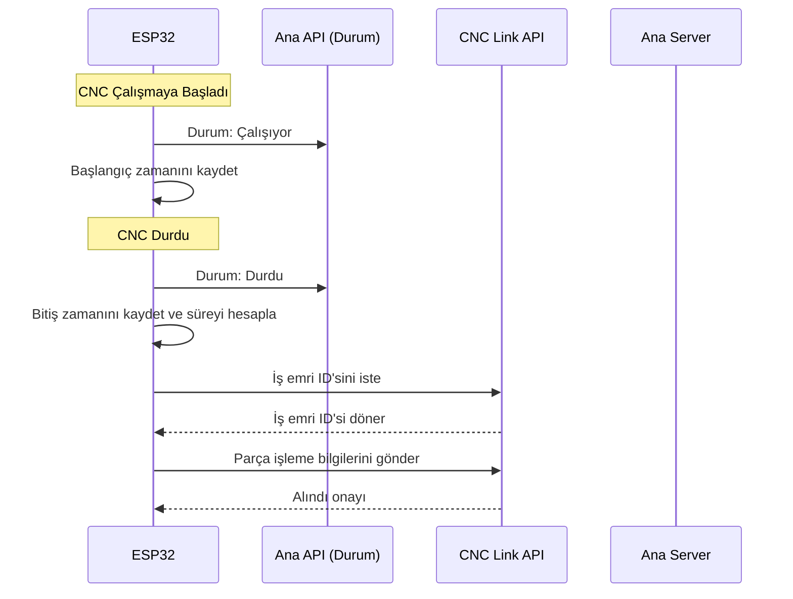

## CNC Panel Modülü - Teknik Dokümantasyon

### 1. Modül Özeti

CNC Panel Modülü, bir CNC makinesinin çalışma durumunu (çalışıyor/durdu) izlemek ve bu durumu Wi-Fi üzerinden merkezi bir sisteme bildirmek amacıyla geliştirilmiş gömülü bir izleme sistemidir. ESP32 mikrodenetleyici tabanlı bu sistem, CNC makinesine bağlanarak gerçek zamanlı olarak makinenin durumunu algılar, değişiklikleri tespit eder ve yalnızca durum değiştiğinde veya belirli aralıklarla ana sunucuya veri gönderir. Böylece üretim takibi, arıza analizi ve uzaktan izleme gibi endüstriyel ihtiyaçlara pratik bir çözüm sunar.

**V2 Güncellemesi:** Mevcut durum izleme sistemine ek olarak, CNC Link API ile parça işleme takibi de eklendi. Bu sayede her işlenen parçanın süresi, başlangıç-bitiş zamanları ve iş emri bilgileri otomatik olarak kaydedilir.

---

### 2. Kullanılan Teknolojiler ve Yöntemler

- **Donanım:** ESP32 mikrodenetleyici (Wi-Fi destekli)
- **Geliştirme Ortamı:** PlatformIO (Arduino Framework)
- **Programlama Dili:** C++ (Arduino kütüphaneleri ile)
- **Ağ:** Wi-Fi üzerinden TCP/IP bağlantısı, HTTP POST ile veri iletimi
- **Kütüphaneler:**
  - `WiFi` (Kablosuz bağlantı yönetimi)
  - `HTTPClient` (HTTP istekleri)
  - `ArduinoJson` (JSON veri formatı)
  - `ESP32Ping` (Ağ bağlantı testi)
- **Yöntemler:**
  - Statik IP veya DHCP ile ağ bağlantısı
  - Durum değişikliği tespiti (debounce ve periyodik kontrol)
  - Sunucuya ping ve HTTP bağlantı testi
  - Test modu (simülasyon için)
  - NTP ile zaman senkronizasyonu
  - Bellek optimizasyonu ve hata yönetimi
  - **[YENİ]** Parça işleme süresi hesaplama ve kaydetme
  - **[YENİ]** İş emri bazlı üretim takibi

---

### 3. Veritabanı ve Veri Yapısı

#### 3.1. Ana Durum İzleme API (Mevcut Sistem)

**Sunucuya Gönderilen Veri Formatı (JSON):**
```json
{
  "tezgah_id": 25,
  "durum": true,
  "timestamp": "2025-04-20T15:30:00Z"
}
```
- `tezgah_id`: CNC makinesine atanmış benzersiz numara
- `durum`: Makinenin çalışma durumu (`true`: çalışıyor, `false`: durdu)
- `timestamp`: ISO 8601 formatında zaman damgası

**API Endpoint:** `http://<SUNUCU_IP>:3000/api/tezgah-durum/tezgah-durum`

#### 3.2. CNC Link API (Yeni Parça Takip Sistemi)

**3.2.1. İş Emri ID Alma (GET İsteği):**
```
GET /api/cnc_link/is-emri-id/25
```

**Yanıt:**
```json
{
  "success": true,
  "is_emri_id": 1234,
  "is_emri_no": "IE-2025-001",
  "is_adi": "DPEO Freze İşlemi",
  "toplam_adet": 100,
  "tamamlanan_adet": 45,
  "kalan_adet": 55,
  "message": "Aktif iş emri bulundu"
}
```

**3.2.2. Parça Tamamlandı Bildirimi (POST İsteği):**
```json
{
  "tezgah_id": 25,
  "is_emri_id": 1234,
  "baslangic_zamani": "2025-01-15T10:30:00Z",
  "bitis_zamani": "2025-01-15T10:45:00Z",
  "isleme_suresi_dakika": 15,
  "timestamp": "2025-01-15T10:45:00Z",
  "esp32_kayit_id": "ESP32_25_1642248300_4567"
}
```

**API Endpoint:** `http://<SUNUCU_IP>:3000/api/cnc_link/parca-tamamlandi`

**Yanıt:**
```json
{
  "success": true,
  "message": "Parça işleme kaydı başarıyla alındı",
  "kayit_id": 5678,
  "data": {
    "tezgah_id": 25,
    "is_emri_id": 1234,
    "tamamlanan_parca_sayisi": 46,
    "toplam_adet": 100,
    "kalan_adet": 54,
    "ortalama_parca_suresi": "14.50",
    "isleme_suresi_dakika": 15
  }
}
```

**3.2.3. Sistem Sağlık Kontrolü (GET İsteği):**
```
GET /api/cnc_link/health
```

**Yanıt:**
```json
{
  "success": true,
  "message": "CNC Link API sağlıklı çalışıyor",
  "timestamp": "2025-01-15T10:45:00Z",
  "database_status": "connected",
  "son_24_saat_kayit_sayisi": 127,
  "version": "1.0.0"
}
```

**3.2.4. Tezgah İstatistikleri (GET İsteği):**
```
GET /api/cnc_link/stats/25?tarih=2025-01-15
```

**Yanıt:**
```json
{
  "success": true,
  "tezgah_id": 25,
  "tarih": "2025-01-15",
  "istatistikler": {
    "gunluk_parca_sayisi": 32,
    "gunluk_toplam_sure_dakika": 480,
    "gunluk_ortalama_sure_dakika": "15.00",
    "en_kisa_sure_dakika": 8,
    "en_uzun_sure_dakika": 25
  }
}
```

#### 3.3. Veritabanı Tabloları

**3.3.1. Yeni Tablo: `parca_isleme_kayitlari`**
```sql
CREATE TABLE parca_isleme_kayitlari (
    id INTEGER PRIMARY KEY AUTOINCREMENT,
    tezgah_id INTEGER NOT NULL,
    is_emri_id INTEGER NOT NULL,
    baslangic_zamani DATETIME NOT NULL,
    bitis_zamani DATETIME NOT NULL,
    isleme_suresi_dakika INTEGER NOT NULL,
    kayit_zamani DATETIME DEFAULT CURRENT_TIMESTAMP,
    esp32_kayit_id VARCHAR(50),
    
    FOREIGN KEY (tezgah_id) REFERENCES tezgahlar(tezgah_id),
    FOREIGN KEY (is_emri_id) REFERENCES is_emirleri(is_emri_id)
);
```

**3.3.2. İş Emirleri Tablosu Güncellemesi:**
```sql
ALTER TABLE is_emirleri ADD COLUMN tamamlanan_parca_sayisi INTEGER DEFAULT 0;
ALTER TABLE is_emirleri ADD COLUMN toplam_isleme_suresi_dakika INTEGER DEFAULT 0;
ALTER TABLE is_emirleri ADD COLUMN ortalama_parca_suresi_dakika DECIMAL(10,2);
```

#### 3.4. ESP32 Üzerindeki Konfigürasyonlar

- Wi-Fi SSID ve şifre
- Statik IP, Gateway, Subnet, DNS ayarları
- CNC durum pini (ör: GPIO 26)
- Test modu parametreleri (çalışma/durma süreleri)
- Kontrol aralıkları (ms cinsinden)
- **[YENİ]** Parça işleme kayıt yapısı
- **[YENİ]** CNC Link API endpoint bilgileri

---

### 4. Teknik Detaylar

#### 4.1. Sistem Akışı



#### 4.2. Temel Fonksiyonlar

**Mevcut Fonksiyonlar:**
- **Wi-Fi Bağlantısı:** Statik IP veya DHCP ile bağlanır, bağlantı koparsa otomatik yeniden bağlanır.
- **Durum Okuma:** CNC'nin durum pini okunur (HIGH: çalışıyor, LOW: durdu).
- **Debounce:** Yanlış pozitifleri önlemek için debounce süresi uygulanır.
- **Durum Gönderimi:** Sadece değişiklik olduğunda veya belirli aralıklarla HTTP POST ile sunucuya veri gönderilir.
- **Test Modu:** Gerçek CNC olmadan, belirlenen sürelerle çalışıyor/durdu simülasyonu yapılır.
- **Zaman Senkronizasyonu:** NTP sunucuları ile saat güncellenir, gönderilen verilerde doğru zaman kullanılır.
- **Ağ Testleri:** Sunucuya ve internete ping atılır, bağlantı durumu loglanır.
- **Bellek Yönetimi:** Düşük bellek durumunda sistem otomatik olarak yeniden başlatılır.

**Yeni Fonksiyonlar:**
- **`parcaIslemeBaslat()`:** CNC çalışmaya başladığında zaman kaydını başlatır
- **`parcaIslemeBitir()`:** CNC durduğunda bitiş zamanını kaydeder ve süreyi hesaplar
- **`isEmriIdAl()`:** Server'dan aktif iş emri ID'sini alır
- **`parcaBilgisiGonder()`:** CNC Link API'sine parça işleme bilgilerini gönderir
- **`bekleyenKayitlariKontrolEt()`:** Offline kayıtları göndermeye çalışır
- **`cncLinkSaglikKontrol()`:** CNC Link API sağlığını kontrol eder

#### 4.3. ESP32 Veri Yapıları

```cpp
struct ParcaIslemeKaydi {
    unsigned long baslangic_zamani;
    unsigned long bitis_zamani;
    int sure_dakika;
    int is_emri_id;
    bool gonderildi;
    String esp32_kayit_id;
};

// Offline kayıt sistemi
ParcaIslemeKaydi bekleyen_kayitlar[10]; // Max 10 kayıt
```

#### 4.4. Konfigürasyon Parametreleri (config.h)

**Mevcut Parametreler:**
- `WIFI_SSID`, `WIFI_PASSWORD`: Wi-Fi ağı bilgileri
- `USE_STATIC_IP`, `STATIC_IP`, `GATEWAY`, `SUBNET`, `DNS1`, `DNS2`: Ağ ayarları
- `SERVER_ADDRESS`: Veri gönderilecek sunucu adresi
- `CNC_STATUS_PIN`: CNC durum pini (ör: 26)
- `CNC_NO`: Makineye atanmış numara
- `TEST_MODE`, `TEST_RUN_TIME`, `TEST_STOP_TIME`: Test modu ve süreleri
- `CHECK_INTERVAL`, `DEBOUNCE_TIME`, `WIFI_RECONNECT_INTERVAL`: Zamanlama parametreleri

**Yeni Parametreler:**
- `CNC_LINK_API_URL`: CNC Link API endpoint'i
- `PARCA_KAYIT_BUFFER_SIZE`: Offline kayıt buffer boyutu
- `PARCA_GONDERIM_TIMEOUT`: Parça bilgisi gönderim timeout'u
- `IS_EMRI_KONTROL_ARALIGI`: İş emri kontrolü aralığı

#### 4.5. Yazılım Mimarisi

- **main.cpp:** Giriş noktası, setup ve loop fonksiyonları ile ana akış yönetimi
- **config.h:** Tüm sabitler ve ayarlar
- **wifi_manager.h:** Wi-Fi bağlantı yönetimi
- **cnc_monitor.h:** CNC durumu okuma, gönderme ve kontrol fonksiyonları
- **[YENİ] cnc_link.h:** Parça işleme takibi ve CNC Link API iletişimi
- **[YENİ] cnc_link.cpp:** CNC Link sistemi implementation

#### 4.6. Güvenlik ve Dayanıklılık

- Bağlantı kopmalarında otomatik yeniden bağlanma
- Sunucuya ulaşamama durumunda tekrar deneme ve loglama
- Bellek taşması veya hata durumunda otomatik reset
- Test ve gerçek mod arasında kolay geçiş
- **[YENİ]** Offline parça kayıt sistemi (internet kesilirse kayıtlar ESP32'de saklanır)
- **[YENİ]** İş emri bulunamama durumu için hata yönetimi
- **[YENİ]** Benzersiz ESP32 kayıt ID'si oluşturma
- **[YENİ]** Dual API sistemi - her iki sistem birbirini etkilemez

#### 4.7. Geliştirme ve Test

- PlatformIO ile kolay derleme ve yükleme
- Testler için ayrı test_main.cpp dosyası ve Unity framework desteği
- Seri port üzerinden ayrıntılı loglama
- **[YENİ]** Parça işleme simülasyonu için test modu
- **[YENİ]** CNC Link API sağlık kontrolü

---

### 5. Raporlama ve Analiz

#### 5.1. Veritabanı Sorguları

**Günlük üretim raporu:**
```sql
SELECT 
    tezgah_id,
    DATE(baslangic_zamani) as tarih,
    COUNT(*) as gunluk_parca_sayisi,
    SUM(isleme_suresi_dakika) as gunluk_calisma_suresi
FROM parca_isleme_kayitlari 
WHERE DATE(baslangic_zamani) = '2025-01-15'
GROUP BY tezgah_id, DATE(baslangic_zamani);
```

**İş emri ilerleme durumu:**
```sql
SELECT 
    ie.id,
    ie.parca_adi,
    ie.adet as hedef_adet,
    ie.tamamlanan_parca_sayisi,
    ie.adet - ie.tamamlanan_parca_sayisi as kalan_adet,
    ie.toplam_isleme_suresi_dakika,
    ie.ortalama_parca_suresi_dakika
FROM is_emirleri ie
WHERE ie.tamamlanan_parca_sayisi > 0;
```

**Tezgah performans analizi:**
```sql
SELECT 
    t.tezgah_tanimi,
    COUNT(pik.id) as toplam_parca,
    AVG(pik.isleme_suresi_dakika) as ortalama_sure,
    SUM(pik.isleme_suresi_dakika) as toplam_sure
FROM tezgahlar t
LEFT JOIN parca_isleme_kayitlari pik ON t.tezgah_id = pik.tezgah_id
WHERE DATE(pik.baslangic_zamani) >= '2025-01-01'
GROUP BY t.tezgah_id
ORDER BY toplam_parca DESC;
```

#### 5.2. Frontend Gösterimi

**İş Emri Detayında:**
```
İş Emri #1234 - DPEO Freze İşlemi
- Hedef Parça: 100 adet
- Tamamlanan: 45 adet (CNC Link'ten otomatik)
- Kalan: 55 adet
- Toplam İşleme Süresi: 652 dakika
- Ortalama Parça Süresi: 14.5 dakika
- İlerleme: %45
```

**Tezgah Performansında:**
```
Tezgah #25 - Günlük Rapor (15.01.2025)
- Üretilen Parça: 32 adet
- Çalışma Süresi: 480 dakika (8 saat)
- Ortalama Parça Süresi: 15 dakika
- Verimlilik: %85
- En Kısa İşleme: 8 dakika
- En Uzun İşleme: 25 dakika
```

---

### 6. Ek Bilgiler ve İleri Seviye Özellikler

- **Çoklu CNC Desteği:** Her makineye farklı `CNC_NO` atanarak çoklu izleme yapılabilir.
- **Sunucuya JSON ile veri gönderimi:** Hafif ve kolay entegre edilebilir.
- **Zaman damgalı kayıt:** Tüm durum değişiklikleri zamanlı olarak kaydedilir.
- **Ağ ve sunucu sağlığı izleme:** Ping ve HTTP testleri ile bağlantı güvenliği sağlanır.
- **Kolay konfigürasyon:** Tüm parametreler tek bir dosyada merkezi olarak yönetilir.
- **[YENİ] Gerçek zamanlı üretim takibi:** Her parçanın işleme süresi otomatik hesaplanır.
- **[YENİ] İş emri bazlı planlama:** Tezgahlara atanan iş emirleri ile parça üretimi takip edilir.
- **[YENİ] Offline çalışma kapasitesi:** İnternet kesilse bile kayıtlar korunur.
- **[YENİ] Dual API sistemi:** Hem durum hem parça takibi aynı anda çalışır.
- **[YENİ] Otomatik iş emri güncelleme:** 30 saniyede bir server'dan güncel iş emri kontrolü.
- **[YENİ] Benzersiz kayıt takibi:** Her parça kaydı ESP32 tarafından benzersiz ID ile işaretlenir.

---

### 7. Sistem Entegrasyonu

CNC Panel modülü artık iki farklı API sistemi ile çalışır:

1. **Ana Durum API:** Tezgah çalışıyor/durdu bilgilerini gerçek zamanlı izler
2. **CNC Link API:** Her parçanın üretim detaylarını kaydeder ve iş emri takibi yapar

Her iki sistem birbirinden bağımsız çalışır ve mevcut sistemi bozmadan yeni özellikler ekler. Bu sayede hem anlık durum izleme hem de detaylı üretim analizi mümkün hale gelir.

---

### 8. Geliştirme Süreci ve Yapılan Değişiklikler

#### 8.1. Backend Geliştirmeleri

**Yeni Dosyalar:**
- `backend/migrations/20250115_create_parca_isleme_kayitlari.js` - Parça işleme kayıtları tablosu
- `backend/migrations/20250115_add_cnc_link_columns_to_is_emirleri.js` - İş emirleri tablo güncellemesi
- `backend/src/controllers/cncLinkController.js` - CNC Link API controller
- `backend/src/routes/cncLinkRoutes.js` - CNC Link API routes

**Güncellenen Dosyalar:**
- `backend/src/index.js` - Yeni route entegrasyonu

**API Endpoint'leri:**
- GET `/api/cnc_link/is-emri-id/:tezgah_id` - Aktif iş emri ID alma
- POST `/api/cnc_link/parca-tamamlandi` - Parça işleme kaydı
- GET `/api/cnc_link/health` - Sistem sağlık kontrolü
- GET `/api/cnc_link/stats/:tezgah_id` - Tezgah istatistikleri

#### 8.2. ESP32 Geliştirmeleri

**Yeni Dosyalar:**
- `CNC_panel/include/cnc_link.h` - CNC Link sistemi header
- `CNC_panel/src/cnc_link.cpp` - CNC Link sistemi implementation

**Güncellenen Dosyalar:**
- `CNC_panel/include/config.h` - CNC Link konfigürasyon parametreleri
- `CNC_panel/include/cnc_monitor.h` - Durum değişimi yakalama ve forward declarations
- `CNC_panel/src/main.cpp` - Dual sistem entegrasyonu

**Yeni Özellikler:**
- Otomatik parça işleme takibi
- Offline kayıt sistemi (10 kayıt buffer)
- İş emri otomatik güncelleme (30s aralık)
- Test modu simülasyonu (2dk aralık)
- Benzersiz ESP32 kayıt ID'si oluşturma
- CNC Link sağlık kontrolü (5dk aralık)

#### 8.3. Test Sonuçları

**Backend API Testleri:**
- ✅ Health Check: `GET /api/cnc_link/health` - Başarılı
- ✅ İş Emri ID: `GET /api/cnc_link/is-emri-id/25` - Beklenen yanıt (aktif iş emri yok)
- ✅ Parça Kaydı: `POST /api/cnc_link/parca-tamamlandi` - Beklenen yanıt (test iş emri yok)

**Veritabanı Migration:**
- ✅ `parca_isleme_kayitlari` tablosu oluşturuldu
- ✅ `is_emirleri` tablosuna yeni alanlar eklendi
- ✅ İndeksler oluşturuldu

**ESP32 Kodlama:**
- ✅ Dual sistem mimarisi kuruldu
- ✅ Mevcut sistem korundu
- ✅ Test modu hazırlandı
- ✅ Offline kayıt sistemi eklendi

### 9. Kullanım Senaryoları

#### 9.1. Normal Çalışma Senaryosu
1. ESP32 başlatılır ve Wi-Fi'ye bağlanır
2. Ana sistem CNC durumunu izlemeye başlar
3. CNC Link sistemi aktif iş emrini server'dan alır
4. CNC çalışmaya başladığında parça işleme kaydı başlar
5. CNC durduğunda parça işleme tamamlanır ve server'a gönderilir
6. İş emri istatistikleri otomatik güncellenir

#### 9.2. Offline Çalışma Senaryosu
1. İnternet bağlantısı kesilir
2. CNC durum bildirimleri başarısız olur
3. Parça işleme kayıtları ESP32 buffer'ında saklanır
4. İnternet geri geldiğinde bekleyen kayıtlar otomatik gönderilir

#### 9.3. Test Modu Senaryosu
1. `TEST_MODE true` yapılır
2. CNC simülasyonu: 10s çalışma, 4s durma
3. Her 2 dakikada test parça kaydı oluşturulur
4. Test iş emri ID (9999) kullanılır

---

Bu dokümantasyon, CNC Panel modülünün tüm teknik detaylarını, kullanılan yöntemleri ve entegrasyon noktalarını kapsamaktadır. Geliştirici veya bakım ekibi için hızlı bir referans ve entegrasyon rehberi olarak kullanılabilir.
