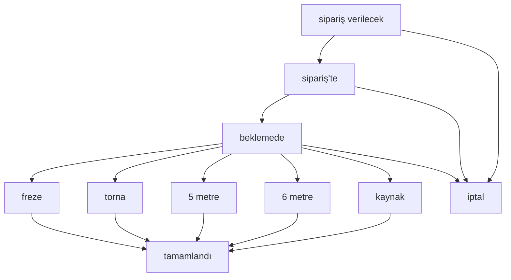

# İş Emirleri Modülü

## 1. Amaç ve Sorumluluklar

İş Emirleri modülü, projenin üretim yönetim sisteminin (MES) çekirdeğini oluşturur. Bir ürünün üretilmesi için gereken tüm süreci baştan sona yönetir ve takip eder. Bu modül, "ne üretilecek, ne kadar, ne zaman, nerede ve nasıl" sorularının cevabını dijital olarak organize eder.

Temel sorumlulukları:

*   **İş Emri Yaşam Döngüsü:** İş emirlerinin oluşturulması, planlanması, tezgahlara atanması, durumlarının (`beklemede`, `tezgahta`, `tamamlandı`, `iptal` vb.) takibi ve arşivlenmesi.
*   **Veri Merkezi Olma:** Üretilecek parçanın, adetinin, kullanılacak malzemenin, teslim tarihinin ve önceliğinin kaydedilmesi.
*   **Otomasyon:** Benzersiz ve sıralı `is_emri_no` (İş Emri Numarası) otomatik olarak üretilir.
*   **Entegrasyon:** Diğer tüm üretim modülleriyle (Tezgahlar, Üretim Planı, Stok, Raporlama) entegre çalışarak veri akışını sağlar.
*   **Dokümantasyon:** Her iş emrine özel sipariş dokümanlarının (teknik resim vb.) eklenmesine olanak tanır.
*   **Fason Yönetimi:** Üretimin bir kısmının dışarıya (fason) yaptırılması durumunda bu süreçleri takip etmek için `fason_is_emirleri` alt modülünü barındırır.

## 2. Veri Yapısı (Veritabanı Modelleri)

Bu modül, birbiriyle ilişkili birden çok tablo kullanır:

*   **`is_emirleri` (Ana Tablo):** Bir iş emrinin tüm statik ve dinamik bilgilerini tutar.
    *   **Model Dosyası:** [`backend/src/models/IsEmri.js`](backend/src/models/IsEmri.js)
    *   **Önemli Alanlar:** `is_emri_id`, `is_emri_no`, `is_adi`, `parca_kodu`, `adet`, `teslim_tarihi`, `durum`, `oncelik`, `hareketler` (JSON).

*   **`is_emri_ozetleri`:** Tamamlanan her iş emrinin ardından performans ve istatistiksel verileri depolayan tablodur.
    *   **Model Dosyası:** [`backend/src/models/IsEmriOzet.js`](backend/src/models/IsEmriOzet.js)
    *   **Önemli Alanlar:** `is_emri_id`, `toplam_calisma_suresi`, `toplam_durus_suresi`, `toplam_uretilen`, `hurda_sayisi`, `verimlilik`.

*   **`tamamlanan_isler`:** Raporlama ve arşivleme amacıyla, tamamlanan işlerin bir kopyasını tutar.
    *   **Model Dosyası:** [`backend/src/models/TamamlananIs.js`](backend/src/models/TamamlananIs.js)

*   **`tezgah_planlanan_isler`:** İş emirlerinin hangi tezgaha hangi sırada planlandığını tutan ara tablodur.
    *   **Model Dosyası:** [`backend/src/models/TezgahPlanlananIsler.js`](backend/src/models/TezgahPlanlananIsler.js)

## 3. API Endpoint'leri ve İş Mantığı

Modülün işlevselliği, ağırlıklı olarak `isEmirleriController.js` ve `tezgahRoutes.js` üzerinden yönetilir.

*   `GET /api/is-emirleri`: Durum, tamamlanma durumu veya tezgaha atanma durumu gibi filtrelere göre iş emirlerini listeler.
*   `POST /api/is-emirleri`: Yeni bir iş emri oluşturur. Otomatik olarak `is_emri_no` üretir ve parçaya ait `setup_sayisi` gibi bilgileri çeker.
*   `PUT /api/is-emirleri/:id`: Mevcut bir iş emrini günceller.
*   `DELETE /api/is-emirleri/:id`: Bir iş emrini siler.
*   `GET /api/is-emirleri/:id`: Tek bir iş emrinin detaylarını getirir.
*   `POST /api/is-emirleri/batch-create`: Excel gibi kaynaklardan gelen listelerle toplu iş emri oluşturur.
*   `POST /api/tezgahlar/:id/is-emri-ata`: Bir iş emrini tezgaha atar ve iş emrinin durumunu günceller. (Bu endpoint `tezgahRoutes` içindedir fakat doğrudan iş emrini etkiler).

## 4. Diğer Modüllerle İlişkileri

*   **Tezgahlar:** İş emirleri, üretim için tezgahlara atanır. Bir iş emri aynı anda sadece bir tezgahta aktif olabilir.
*   **Üretim Planı:** Birden çok iş emri, bir üretim planı altında gruplanabilir. Bu, büyük siparişlerin veya haftalık planların yönetilmesini sağlar.
*   **Parçalar & Stok:** Her iş emri, `parca_kodu` ile Parçalar modülüne bağlıdır. İş emri tamamlandığında üretilen adet kadar parçanın stoğu artırılır.
*   **İşlem Kayıtları:** İş emrinin yaşam döngüsündeki her adım (oluşturma, atama, tamamlama, ara verme) bu modüle loglanır.
*   **Sipariş Dokümanları:** İş emrine özel dosyaların (`.pdf`, `.png` vb.) saklanmasını sağlar.
*   **Raporlar:** İş emri verileri, verimlilik, maliyet, hurda oranı ve planlama doğruluğu gibi birçok raporun ana kaynağıdır.

## 5. Frontend Bileşenleri ve Kullanıcı Arayüzü

### 5.1 Ana Bileşenler
- **İş Emri Listesi:** Filtreleme, sıralama ve durum görüntüleme özellikleri
- **İş Emri Oluşturma Formu:** Yeni iş emri ekleme arayüzü
- **İş Emri Detay Sayfası:** Mevcut iş emrinin düzenlenmesi ve görüntülenmesi
- **İş Emri Özeti Formu:** Tamamlanan işlerin performans verilerinin kaydedilmesi
- **Toplu İş Emri Oluşturma:** Excel dosyalarından toplu import

### 5.2 Durum Yönetimi (Redux)
```javascript
// Redux store yapısı
{
  isEmirleri: {
    list: [],           // Mevcut iş emirleri listesi
    loading: false,     // Yükleme durumu
    error: null,        // Hata mesajları
    selectedIsEmri: {}, // Seçili iş emri detayları
    filters: {}         // Aktif filtreler
  }
}
```

### 5.3 Mobil Desteği
- Mobil cihazlar için optimize edilmiş arayüz: `/mobile/is-emirleri`
- Touch-friendly kontroller ve responsive tasarım
- Üretim sahasında kullanım için özelleştirilmiş layout

## 6. İş Akışı ve Durum Geçişleri

### 6.1 İş Emri Durumları


### 6.2 Otomatik İş Emri Numarası Üretimi
Format: `IE{YY}{MM}{NNNN}` (Örnek: IE25030021)
- YY: Yılın son iki hanesi
- MM: Ay (01-12)
- NNNN: O ay içindeki sıra numarası (0001'den başlar)

### 6.3 Veri Entegrasyonu Akışı
```mermaid
sequelize
    participant F as Frontend
    participant A as API
    participant DB as Database
    participant T as Tezgah
    participant S as Stok

    F->>A: Yeni İş Emri Oluştur
    A->>DB: is_emirleri tablosuna kaydet
    A->>F: İş emri oluşturuldu

    F->>A: İş emrini tezgaha ata
    A->>T: Tezgah durumunu güncelle
    A->>DB: is_emirleri.durum = 'İmalatta'
    A->>F: Atama tamamlandı

    F->>A: İş emrini tamamla
    A->>DB: is_emri_ozetleri tablosuna kaydet
    A->>DB: tamamlanan_isler tablosuna kaydet
    A->>S: Stok miktarını artır
    A->>T: Tezgah durumunu güncelle
    A->>F: Tamamlama başarılı
```

## 7. Kritik Fonksiyonlar ve Algoritması

### 7.1 İş Emri Oluşturma Algoritması
1. **Validasyon:** Parça kodu ve adet kontrolü
2. **Numara Üretimi:** Benzersiz iş emri numarası oluşturma
3. **Parça Bilgisi Çekme:** Setup sayısı ve CNC süresi bilgilerini alma
4. **Üretim Planı Entegrasyonu:** Gerekirse plan ile ilişkilendirme
5. **Varsayılan Değerler:** Malzeme sipariş durumu ve teslim tarihi
6. **Kayıt:** Veritabanına kaydetme ve hareket logu ekleme

### 7.2 Toplu İş Emri Oluşturma
- Excel dosyalarından parça listesi okuma
- Transaction ile veri bütünlüğü sağlama
- Hata durumunda rollback mekanizması
- Batch processing ile performans optimizasyonu

### 7.3 İş Emri Tamamlama Süreci
**Etkilenen Tablolar (6 adet):**
1. `is_emirleri` - Durum güncelleme
2. `is_emri_ozetleri` - Performans verileri
3. `tamamlanan_isler` - Arşiv kaydı
4. `islem_kayitlari` - Audit trail
5. `tezgahlar` - Durum ve iş listesi güncelleme
6. `parcalar` - Stok artırımı

## 8. Performans ve Güvenlik

### 8.1 Veritabanı Optimizasyonu
- Foreign key constraints ile veri bütünlüğü
- JSON alanlar ile esnek veri yapısı (`hareketler`, `durus_detaylari`)
- Index'ler ile hızlı sorgulama
- Transaction desteği ile ACID uyumluluğu

### 8.2 API Performansı
- İş emri listesi: < 500ms yanıt süresi
- İş emri oluşturma: ~200-300ms
- İş emri tamamlama: ~150-250ms
- Toplu operasyonlar için batch processing

### 8.3 Hata Yönetimi
- Frontend ve backend seviyesinde kapsamlı validasyon
- Kullanıcı dostu hata mesajları
- Sistem logları ile detaylı hata takibi
- Graceful error handling ile sistem kararlılığı

## 9. Dosya Yönetimi ve Dokümantasyon

### 9.1 Sipariş Dokümanları
- **Lokasyon:** `backend/uploads/siparis_dokumanlari/`
- **Desteklenen Formatlar:** PDF, PNG, JPG
- **Dosya Boyutu:** Maksimum 100MB
- **Organizasyon:** İş emri ID'si ile kategorize edilmiş dosyalar

### 9.2 Teknik Resimler
- **Lokasyon:** `backend/uploads/teknik_resimler/`
- **Entegrasyon:** Parça modülü ile bağlantılı
- **Versiyonlama:** Zaman damgası ile dosya versiyonlama

## 10. Analiz ve Notlar

### 10.1 Sistem Güçlü Yönleri
- **%100 Veri Bütünlüğü:** Referans tutarlılığı tam olarak korunuyor
- **Kapsamlı Audit Trail:** Her işlem detaylı olarak loglanıyor
- **Esnek Durum Yönetimi:** Farklı üretim süreçlerine uygun durum yapısı
- **Real-time Güncellemeler:** Socket.IO ile anlık veri senkronizasyonu
- **Mobil Desteği:** Üretim sahası kullanımı için optimize edilmiş arayüz

### 10.2 Teknik Özellikler
- **Modüler Mimari:** Diğer modüllerle gevşek bağlantılı entegrasyon
- **Scalability:** SQLite'dan PostgreSQL'e geçiş hazırlığı
- **Performance:** Sub-second response times
- **Maintainability:** Clean code ve comprehensive documentation

### 10.3 İş Süreçleri Analizi
`YAPAYZEKA/is_emri_bitimi_isleri.md` dosyasındaki analiz:
- İş emri tamamlama sürecinin **6 farklı tabloyu** etkileyen karmaşık veri akışı
- **262 adet** tamamlanan iş kaydı ile kanıtlanan sistem stabiliteşi
- **Zero data loss** ile veri güvenliği garantisi
- Sürekli iyileştirme için detaylı performans metrikleri

### 10.4 Gelişim Potansiyeli
- **AI Integration:** Makine öğrenmesi ile süre tahmini
- **IoT Entegrasyonu:** Sensor verisiyle otomatik veri toplama
- **Advanced Analytics:** Predictive maintenance ve optimization
- **ERP Entegrasyonu:** SAP/Oracle ile veri senkronizasyonu

## 11. Kod Örnekleri ve API Kullanımı

### 11.1 Yeni İş Emri Oluşturma
```javascript
POST /api/is-emirleri
{
  "parca_kodu": "KB_FREZE1_015",
  "adet": 100,
  "teslim_tarihi": "2025-08-15",
  "oncelik": "yuksek",
  "malzeme": "Çelik ST-37",
  "aciklama": "Acil sipariş"
}
```

### 11.2 İş Emri Filtreleme
```javascript
GET /api/is-emirleri?durum=beklemede&showCompleted=false&excludeAssigned=true
```

### 11.3 Toplu İş Emri Oluşturma
```javascript
POST /api/is-emirleri/batch-create
{
  "parcaListesi": [
    {"parcaKodu": "PART001", "adet": 50},
    {"parcaKodu": "PART002", "adet": 30}
  ],
  "varsayilanTeslimTarihi": "2025-09-01",
  "planListeAdi": "Ağustos Toplu Üretim"
}
```

Bu modül, ÜRTM Takip sisteminin kalbi konumundadır ve üretim süreçlerinin dijital dönüşümünün temel taşını oluşturmaktadır.

## 14. İş Emirleri Durum Yönetimi Özeti

- **Veri Modeli (Mevcut Durum):**
  - `backend/src/models/IsEmri.js` içinde `durum` alanı STRING ve varsayılanı `beklemede`. Basit bir metin validasyonu var (boş olamaz).
  - Dinamik durum tablosu: `backend/src/models/IsEmriDurum.js` → tablo `is_emri_durumlari`. Alanlar: `durum_kodu`, `durum_adi`, `renk_kodu`, `sira_no`, `aktif`, `sistem_durumu` vb.
  - Migrasyonlar:
    - `backend/migrations/20250727_create_is_emri_durumlari_table.js` dinamik durumlar tablosunu oluşturuyor.
    - `backend/migrations/20250602_update_is_emri_durum_enum.js` ise `is_emirleri.durum` için ENUM denemesi içeriyor (örn: `sipariş verilecek`, `sparişte`, `beklemede`, `freze`, `torna`, `5 metre`, `6 metre`, `kaynak`, `iptal`). Mevcut model dosyası STRING kullandığı için, dinamik tablo ile ENUM yaklaşımı arasında geçiş süreci olduğu görülüyor.

- **Durum Yönetimi API’si:**
  - Controller: `backend/src/controllers/isEmriDurumController.js`
    - `getAll`: Aktif durumları sıralı döner ve her durum için iş emri sayısını ekler (`IsEmri.count({ where: { durum: durum_kodu } })`).
    - `update`: Sistem durumlarında kod değişimini engeller, durum kodu benzersizlik kontrolü yapar, ve kod değişirse ilgili tüm `IsEmri.durum` değerlerini yeni koda kademeli günceller (cascade update).
    - `createDefaults`: Varsayılan durumları oluşturma desteği mevcut.
  - Routes: `backend/src/routes/isEmriDurumRoutes.js` şu an `GET /` ve `POST /create-defaults` uçlarını bağlıyor. Diğer CRUD uçlarının bağlanması planlı/gerekli olabilir.

- **İş Emri Yaşam Döngüsünde Durum Değişimleri (Kod Akışı):**
  - Oluşturma: `backend/src/controllers/isEmirleriController.js`
    - Yeni kayıt sırasında `malzemesi_siparis_edilecekmi` true ise durum `sipariş verilecek` olarak ayarlanıyor (durumun geçerli olduğuna `StatusUtils.isValidDurum` ile bakılıyor); aksi halde varsayılan/final durum kullanılıyor. Hareket kaydına durum düşülüyor.
  - Tezgaha Atama:
    - `backend/src/routes/tezgahRoutes.js` → `POST /api/tezgahlar/:id/is-emri-ata` iş emrini tezgaha ekler, tezgahların listelerini senkronize eder ve iş emri durumunu `tezgahta` yapar; hareketlere log ekler.
    - `backend/src/controllers/tezgahController.js` → `assignIsEmri` benzer şekilde `durum: 'tezgahta'` set eder ve tezgah iş listelerini günceller.
    - `backend/src/controllers/isEmirleriController.js` içinde ayrı bir atama yolunda `durum: 'Imalatta'` kullanımı da var. Bu, `tezgahta` ile isimlendirme tutarsızlığı oluşturuyor.
  - Tamamlama:
    - `backend/src/routes/tezgahRoutes.js` → `POST /api/tezgahlar/:id/is-emri-tamamla` iş emrini `tamamlandı` durumuna alır, tamamlanan iş kaydı (`createTamamlananIs`) oluşturur, tezgah listesinden düşer ve tezgah çalışma durumunu günceller.
    - Özet oluşturma/güncelleme: `backend/src/controllers/isEmriOzetiController.js` iş emri özet metriklerini oluşturur/günceller.
  - IoT/Runtime Sayaçlar:
    - `backend/src/routes/tezgahDurumRoutes.js` tezgah çalışma/durma geçişlerini loglar; `çalışıyor -> durdu` geçişinde ilgili iş emrinin üretilen adetini artırır ve hareketlere yazar.
    - `backend/src/controllers/cncLinkController.js` → `parcaTamamlandi` parça işleme kayıtlarını ekler ve iş emrinin süre/adet metriklerini günceller (durumu değiştirmez).

- **Uygulamada Kullanılan Durum Değerleri (koddaki örnekler):**
  - `sipariş verilecek`, `sparişte` (yazım farklılığı mevcut), `beklemede`, `tezgahta`, `Imalatta`, `tamamlandı`, `iptal`, tezgah/istasyona özgü: `freze`, `torna`, `5 metre`, `6 metre`, `kaynak`.

- **Tutarlılık ve İyileştirme Notları:**
  - Atamada `tezgahta` ve `Imalatta` olmak üzere iki farklı durum adı kullanılıyor. Tekilleştirme önerilir (örn. `tezgahta`).
  - ENUM migrasyonu ile dinamik durum tablosu yaklaşımı çelişiyor. Dinamik yönetim hedefleniyorsa `IsEmri.durum` alanının STRING kalması ve servis katmanında `IsEmriDurum` ile validasyon yapılması uygun; alternatif olarak `IsEmri` → `IsEmriDurum` foreign key’e geçiş planlanabilir.
  - `sparişte` yazım hatası olan durum kodu normalize edilmeli (`siparişte` veya karar verilen standart ne ise).
  - `isEmriDurumRoutes`’da CRUD uçlarının tamamı bağlanmamış görünüyor; `POST /`, `PUT /:id`, `DELETE /:id`, `POST /reorder` gibi uçlar eklenmeli.
  - Durum değişiklikleri için tek bir yardımcı servis fonksiyonu (ör. `StatusUtils.setIsEmriDurumu(isEmri, yeniDurum, { log: true })`) kullanılarak log tutarlılığı sağlanabilir.

- **Frontend Entegrasyonu (özet):**
  - Kanban/listeler dinamik durumları `GET /api/is-emri-durumlari` ile çekip renk ve sıra bilgisiyle sütunları/render’ı üretebilir.
  - Formlarda durum dropdown’ı dinamik olarak bu uçtan doldurulmalı; sistem durumları UI’da sabit/korumalı gösterilebilir.


## 12. İş Emri Durum Yönetimi (Yeni Özellik)

### 12.1 Durum Yönetimi Sistemi
**Model:** `backend/src/models/IsEmriDurum.js`
**Controller:** `backend/src/controllers/isEmriDurumController.js`  
**Routes:** `backend/src/routes/isEmriDurumRoutes.js` → `/api/is-emri-durumlari`

#### Backend API Özellikleri:
- **GET /api/is-emri-durumlari** - Tüm durumları listele (iş sayısı ile birlikte)
- **POST /api/is-emri-durumlari** - Yeni durum oluştur
- **PUT /api/is-emri-durumlari/:id** - Durum güncelle
- **DELETE /api/is-emri-durumlari/:id** - Durum sil (güvenli silme)
- **POST /api/is-emri-durumlari/reorder** - Durumları yeniden sırala
- **POST /api/is-emri-durumlari/create-defaults** - Varsayılan durumları oluştur

#### Durum Veri Yapısı:
```javascript
{
  durum_id: INTEGER (Primary Key),
  durum_kodu: STRING (Unique, "beklemede", "freze", vb.),
  durum_adi: STRING ("Beklemede", "Freze", vb.),
  durum_aciklamasi: TEXT (Opsiyonel açıklama),
  renk_kodu: STRING (Hex renk kodu #1976d2),
  sira_no: INTEGER (Görüntüleme sırası),
  aktif: BOOLEAN (Durum aktif mi?),
  sistem_durumu: BOOLEAN (Varsayılan durum mu? - silinemez)
}
```

### 12.2 Frontend Bileşenleri

#### Desktop Durum Yönetimi
**Dosya:** `frontend/src/components/IsEmriDurumYonetimi.jsx`
**Entegrasyon:** İş Emirleri sayfasında "Durum Yönetimi" sekmesi olarak

**Özellikler:**
- Drag & Drop ile durum sıralaması
- Renk seçimi (19 farklı renk seçeneği)
- Aktiflik durumu toggle'ı
- Güvenli silme (iş emri varsa silinemez)
- Sistem durumlarının korunması
- Responsive tablo tasarımı

#### Mobil Durum Yönetimi
**Dosya:** `frontend/src/components/mobile/IsEmriDurumYonetimiMobile.jsx`
**Entegrasyon:** Mobil iş emirleri sayfasında ayarlar ikonu ile erişim

**Özellikler:**
- Touch-friendly card tasarımı
- Drag & Drop ile yeniden sıralama
- Floating Action Button ile hızlı ekleme
- Mobil-optimized form dialogs
- Full-screen deneyim

### 12.3 Sistem Durumları
Varsayılan olarak sistem aşağıdaki durumları içerir:

| Sıra | Durum Kodu | Durum Adı | Renk | Açıklama |
|------|------------|-----------|------|----------|
| 1 | sipariş verilecek | Sipariş Verilecek | #f44336 | Malzeme siparişi verilecek |
| 2 | sparişte | Siparişte | #ff9800 | Malzeme siparişte |
| 3 | beklemede | Beklemede | #2196f3 | Üretim için beklemede |
| 4 | freze | Freze | #4caf50 | Freze tezgahında |
| 5 | torna | Torna | #9c27b0 | Torna tezgahında |
| 6 | 5 metre | 5 Metre | #00bcd4 | 5 metre tezgahında |
| 7 | 6 metre | 6 Metre | #607d8b | 6 metre tezgahında |
| 8 | kaynak | Kaynak | #795548 | Kaynak tezgahında |
| 9 | tamamlandı | Tamamlandı | #8bc34a | İş tamamlandı |
| 10 | iptal | İptal | #9e9e9e | İş iptal edildi |

### 12.4 Güvenlik ve Veri Bütünlüğü
- Sistem durumları (`sistem_durumu: true`) silinemez ve durum kodu değiştirilemez
- İş emri bulunan durumlar silinemez
- Durum kodu benzersizlik kontrolü
- Cascade update: Durum kodu değiştiğinde mevcut iş emirleri güncellenir
- Transaction desteği ile veri bütünlüğü

## 13. Yapılacaklar Yol Haritası

### 13.1 Kısa Vadeli (1-2 Hafta) ✅ TAMAMLANDI
- [x] **İş Emri Durum Yönetimi Backend API'si**
  - [x] IsEmriDurum modeli oluşturma
  - [x] CRUD operasyonları
  - [x] Güvenli silme mantığı
  - [x] Sıralama API'si
  - [x] Varsayılan durum oluşturma

- [x] **Desktop Durum Yönetimi Arayüzü**
  - [x] Tablo-based görünüm
  - [x] Drag & Drop sıralama
  - [x] Renk seçici
  - [x] Form validasyonları
  - [x] İş Emirleri sayfasına entegrasyon

- [x] **Mobil Durum Yönetimi**
  - [x] Card-based responsive tasarım
  - [x] Touch-friendly kontroller
  - [x] Full-screen deneyim
  - [x] Mobil iş emirleri sayfasına entegrasyon

### 13.2 Orta Vadeli (2-4 Hafta) 🔄 DEVAM EDİYOR
- [ ] **Database Migration**
  - [ ] is_emri_durumlari tablosunun production'a deploy edilmesi
  - [ ] Mevcut iş emirlerinin yeni durum sistemine entegrasyonu
  - [ ] Backup ve rollback planının hazırlanması

- [ ] **İş Emri Durum Entegrasyonu**
  - [ ] IsEmri modelinin IsEmriDurum ile ilişkilendirilmesi
  - [ ] İş emri formlarında dinamik durum dropdown'ı
  - [ ] Kanban görünümünde dinamik sütunlar
  - [ ] Durum değişikliği loglarının geliştirilmesi

- [ ] **İş Akışı Kuralları**
  - [ ] Durum geçiş kuralları tanımlama
  - [ ] Otomatik durum değişiklik tetikleyicileri
  - [ ] Duruma özel aksiyon butonları
  - [ ] E-mail bildirimleri ve uyarılar

### 13.3 Uzun Vadeli (1-3 Ay) 📋 PLANLANMIŞ
- [ ] **Gelişmiş Durum Yönetimi**
  - [ ] Durum geçiş matrisi (hangi durumdan hangi duruma geçilebilir)
  - [ ] Duruma özel form alanları
  - [ ] Durum bazlı yetkilendirme sistemi
  - [ ] SLA (Service Level Agreement) tanımları

- [ ] **Analytics ve Raporlama**
  - [ ] Durum bazlı KPI dashboard'u
  - [ ] Durum değişiklik hızı analizi
  - [ ] Bottleneck tespiti
  - [ ] Durum bazlı performans metrikleri

- [ ] **Workflow Automation**
  - [ ] Koşullu durum geçişleri
  - [ ] Zamanlayıcı-based otomatik geçişler
  - [ ] Entegrasyon API'leri (ERP, CRM)
  - [ ] Bulk durum güncellemeleri

### 13.4 Gelecek Özellikler (3+ Ay) 🔮 ARAŞTIRMA
- [ ] **AI-Powered Durum Tahmini**
  - [ ] Makine öğrenmesi ile durum süresi tahmini
  - [ ] Anomali tespiti
  - [ ] Predictive workflow optimization

- [ ] **IoT Entegrasyonu**
  - [ ] Tezgah sensörleri ile otomatik durum güncelleme
  - [ ] RFID/QR kod entegrasyonu
  - [ ] Real-time machine monitoring

- [ ] **Advanced UI/UX**
  - [ ] Gantt chart görünümü
  - [ ] Timeline view
  - [ ] Interactive workflow designer
  - [ ] VR/AR destekli üretim takibi

### 13.5 Teknik Borç ve İyileştirmeler
- [ ] **Performance Optimization**
  - [ ] Database indexleme optimizasyonu
  - [ ] Redis cache entegrasyonu
  - [ ] API response time iyileştirmeleri

- [ ] **Testing & Quality**
  - [ ] Unit test coverage artırımı
  - [ ] Integration test senaryoları
  - [ ] E2E test automation

- [ ] **Documentation**
  - [ ] API documentation (Swagger/OpenAPI)
  - [ ] User manual güncellemeleri
  - [ ] Developer guide

Bu modül, ÜRTM Takip sisteminin kalbi konumundadır ve üretim süreçlerinin dijital dönüşümünün temel taşını oluşturmaktadır.