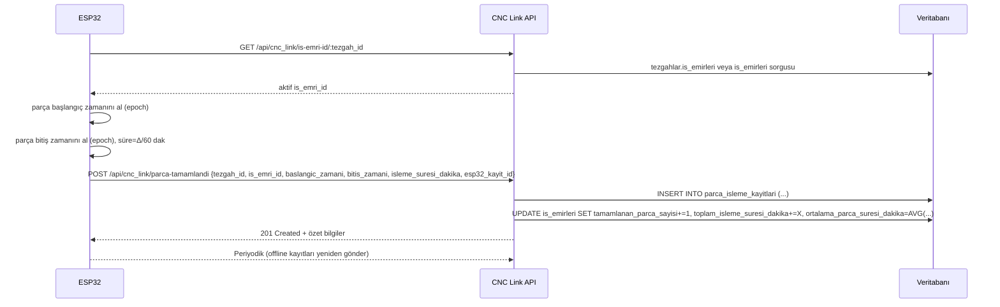

## Özet

Parça işlem kayıt sistemi; ESP32 cihazının tezgah durumu ve parça tamamlama olaylarını ölçüp süre hesaplaması yapması, bu verileri API üzerinden sunucuya iletmesi ve sunucunun veritabanındaki `parca_isleme_kayitlari` tablosuna kaydedip ilgili iş emrinde özet alanları güncellemesi akışından oluşur. API, iş emri tespiti, parça tamamlama, sağlık ve istatistik uç noktaları sağlar. Veriler; `tezgahlar` ve `is_emirleri` tabloları ile birebir ilişkili şekilde saklanır ve günlük/iş emri bazlı analitikler üretilebilir.

---

## İçerik

### Veri Akışı (Uçtan Uca)
- **ESP32**: Parça başlangıç ve bitiş zamanlarını epoch cinsinden tutar, dakika bazında süreyi hesaplar, `is_emri_id` ile ilişkilendirir ve benzersiz `esp32_kayit_id` üretir.
- **HTTP API**: `POST /api/cnc_link/parca-tamamlandi` isteği ile JSON veri sunucuya iletilir.
- **Sunucu**: Girdi doğrulaması yapar, `tezgahlar` ve `is_emirleri` varlığını kontrol eder, `parca_isleme_kayitlari` tablosuna yeni satır ekler ve `is_emirleri` üzerinde tamamlanan adet ve süre özetlerini günceller.
- **Raporlama**: `GET /api/cnc_link/stats/:tezgah_id` ile günlük adet/süre istatistikleri sağlanır. `GET /api/cnc_link/health` temel sağlık bilgisini verir.

### ESP32 Tarafı (CNC_panel)
- Veri yapısı: `ParcaIslemeKaydi { baslangic_epoch_saniye, bitis_epoch_saniye, sure_dakika, is_emri_id, gonderildi, esp32_kayit_id }`.
- Başlat/Bitir: `parcaIslemeBaslat()` ve `parcaIslemeBitir()` işlemleri süreyi hesaplar; <1 dk ise 1 dk olarak normalize eder.
- Gönderim: `parcaBilgisiGonder()` fonksiyonu `CNC_LINK_API_URL + /api/cnc_link/parca-tamamlandi` adresine JSON gönderir. Başarısızlıkta kayıtlar buffer’da saklanır ve periyodik olarak yeniden gönderilir.

Örnek istek gövdesi:

```json
{
  "tezgah_id": 25,
  "is_emri_id": 1234,
  "baslangic_zamani": "2025-01-15T08:30:00.000Z",
  "bitis_zamani": "2025-01-15T08:45:00.000Z",
  "isleme_suresi_dakika": 15,
  "timestamp": "2025-01-15T08:45:02.000Z",
  "esp32_kayit_id": "ESP32_25_1234567_9876"
}
```

### API Uç Noktaları (backend/src/routes/cncLinkRoutes.js)
- `GET /api/cnc_link/is-emri-id/:tezgah_id`: Tezgahtaki aktif iş emrini döndürür. Önce `tezgahlar.is_emirleri` JSON listesi kullanılır, yoksa tablo sorgusuna düşer.
- `POST /api/cnc_link/parca-tamamlandi`: Parça işlem kaydını alır, tabloya yazar, iş emri özetlerini günceller.
- `GET /api/cnc_link/health`: API ve veritabanı sağlık kontrolü, son 24 saat kayıt sayısı.
- `GET /api/cnc_link/stats/:tezgah_id?tarih=YYYY-MM-DD`: Günlük adet, toplam süre, ortalama, min, max süreleri döner.

### Veritabanı Şeması

Tablo: `parca_isleme_kayitlari`

```sql
CREATE TABLE parca_isleme_kayitlari (
    id INTEGER PRIMARY KEY AUTOINCREMENT,
    tezgah_id INTEGER NOT NULL REFERENCES tezgahlar(tezgah_id) ON UPDATE CASCADE ON DELETE RESTRICT,
    is_emri_id INTEGER NOT NULL REFERENCES is_emirleri(is_emri_id) ON UPDATE CASCADE ON DELETE RESTRICT,
    baslangic_zamani DATETIME NOT NULL,
    bitis_zamani DATETIME NOT NULL,
    isleme_suresi_dakika INTEGER NOT NULL,
    kayit_zamani DATETIME NOT NULL DEFAULT CURRENT_TIMESTAMP,
    esp32_kayit_id VARCHAR(50),
    created_at DATETIME NOT NULL DEFAULT CURRENT_TIMESTAMP,
    updated_at DATETIME NOT NULL DEFAULT CURRENT_TIMESTAMP
);
```

İlişkili alanlar (iş emri özetleri için): `is_emirleri`

```sql
ALTER TABLE is_emirleri ADD COLUMN IF NOT EXISTS tamamlanan_parca_sayisi INTEGER DEFAULT 0;
ALTER TABLE is_emirleri ADD COLUMN IF NOT EXISTS toplam_isleme_suresi_dakika INTEGER DEFAULT 0;
ALTER TABLE is_emirleri ADD COLUMN IF NOT EXISTS ortalama_parca_suresi_dakika DECIMAL(10,2);
```

Önerilen indeksler:
- `CREATE INDEX IF NOT EXISTS idx_pik_tezgah_id ON parca_isleme_kayitlari(tezgah_id);`
- `CREATE INDEX IF NOT EXISTS idx_pik_is_emri_id ON parca_isleme_kayitlari(is_emri_id);`
- `CREATE INDEX IF NOT EXISTS idx_pik_baslangic ON parca_isleme_kayitlari(baslangic_zamani);`
- (İdempotensi için) `CREATE UNIQUE INDEX IF NOT EXISTS u_pik_esp32_id ON parca_isleme_kayitlari(esp32_kayit_id);`

### İlişkiler ve Bağlam
- Her `parca_isleme_kayitlari` satırı; bir `tezgahlar.tezgah_id` ve bir `is_emirleri.is_emri_id` ile ilişkilidir.
- ESP32 `is_emri_id`’yi cihazda tuttuğu aktifteki iş emrine göre belirler. Sunucu ayrıca `GET /is-emri-id/:tezgah_id` ile aktif işi bildirir.
- Parça kaydı yazıldıktan sonra `is_emirleri` üzerinde:
  - `tamamlanan_parca_sayisi += 1`
  - `toplam_isleme_suresi_dakika += isleme_suresi_dakika`
  - `ortalama_parca_suresi_dakika = AVG(parca_isleme_kayitlari.isleme_suresi_dakika WHERE is_emri_id=...)`

### İş Kuralları ve Hesaplamalar
- Süre hesaplama ESP32 tarafında saniye bazında yapılır ve dakikaya çevrilir; 1 dakikanın altı 1’e yuvarlanır.
- Sunucu, gelen `baslangic_zamani` ve `bitis_zamani` için ISO/UTC tarihleri kabul eder; `kayit_zamani` boşsa sunucu saati kullanılır.
- Tezgah ve iş emri doğrulaması başarısızsa kayıt yapılmaz (404/400).
- Günlük istatistikler `DATE(baslangic_zamani) = :tarih` filtresiyle hesaplanır.

### Raporlama / İstatistik (Örnek Yanıt)

```json
{
  "success": true,
  "tezgah_id": 25,
  "tarih": "2025-01-15",
  "istatistikler": {
    "gunluk_parca_sayisi": 32,
    "gunluk_toplam_sure_dakika": 480,
    "gunluk_ortalama_sure_dakika": "15.00",
    "en_kisa_sure_dakika": 8,
    "en_uzun_sure_dakika": 25
  }
}
```

### Hata Yönetimi ve Dayanıklılık
- ESP32 çevrimdışı ise kayıtlar buffer’da saklanır; bağlantı sağlanınca toplu gönderim denenir.
- API zaman aşımlarında (ESP32 tarafı `PARCA_GONDERIM_TIMEOUT`) tekrar deneme stratejisi uygulanır.
- İdempotensi için `esp32_kayit_id` benzersiz olmalı; sunucuda unique indeks önerilir (aynı kaydın iki kez yazılmasını önler).

### Güvenlik ve Doğrulama
- Girdi doğrulaması: `tezgah_id`, `is_emri_id`, `baslangic_zamani`, `bitis_zamani`, `isleme_suresi_dakika` zorunludur.
- Yalnızca tanımlı `tezgah_id` ve `is_emri_id` için kayıt kabul edilir.

---

## Kapsamlı Rapor

### Mimari ve Sorumluluklar
- **ESP32 (CNC_panel)**: Zaman damgalarını ve süreyi cihaz üstünde hesaplar; ağ geçici hatalarında kuyruklama yapar.
- **Backend API**: Doğrulama, veri bütünlüğü, kalıcı kayıt ve özet alan güncellemelerinden sorumludur.
- **Veritabanı**: Detay kayıtlarını `parca_isleme_kayitlari`’nda tutar; `is_emirleri` üzerinde özet metrikleri saklar.

### Sıra Diyagramı (Mermaid)



### Sunucu Mantığı (Önemli Noktalar)
- İşlem atomikliği için `parca_tamamlandi` içinde transaction kullanılır; herhangi bir adımda hata olursa rollback yapılır.
- Ortalama süre, her eklemeden sonra `AVG(isleme_suresi_dakika)` ile hesaplanır; `ortalama_parca_suresi_dakika` iki ondalıklı string olarak güncellenir.
- Sağlık denetimi, son 24 saatteki kayıt sayısı üzerinden hızlı bir kontrol sağlar.

### Şema ve Kısıtlar (Detay)
- `tezgah_id`, `is_emri_id` zorunlu ve FK kısıtlıdır; silme `RESTRICT` seçilidir (tarihçe kaybını engeller).
- Zaman alanları `DATETIME` olarak saklanır; istemciden ISO/UTC beklenir. `kayit_zamani` varsayılan sunucu zamanıdır.
- `esp32_kayit_id` istemci üretimidir; idempotensi ve çakışma önlemek için benzersiz indeks önerilir.

### İndeksleme ve Performans
- Okuma desenlerine göre `tezgah_id`, `is_emri_id`, `baslangic_zamani` üzerinde indeks performans sağlar (istatistik ve listelemeler için).
- Günlük raporlar için `DATE(baslangic_zamani)` kullanımı; ihtiyaç halinde `generated column` (örn. `baslangic_tarihi`) ile desteklenebilir.

### Hatalar ve Yanıt Kodları
- 200: Aktif iş emri bulunamadı (is_emri_id=0) durumu için `GET is-emri-id`.
- 201: Başarılı parça kaydı.
- 400: Zorunlu alan eksik.
- 404: `tezgah_id` veya `is_emri_id` bulunamadı.
- 500: Beklenmeyen sunucu hatası (transaction rollback).

### İyileştirme Önerileri
- `esp32_kayit_id` için UNIQUE indeks ve sunucuda çift-kayıt koruması.
- Saat senkronizasyonu (NTP) zorunlu kılınmalı; aksi halde süre tutarsızlığı olabilir.
- Büyük hacimli gönderimler için toplu (batch) endpoint ve sıkıştırma.
- İleri analitikler için `tezgah_id, is_emri_id, baslangic_zamani` birleşik indeks.


