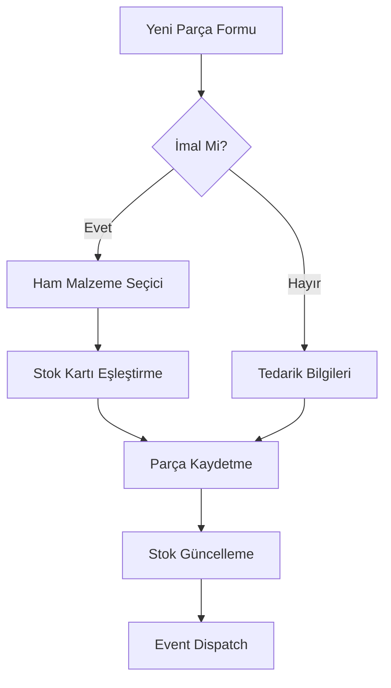
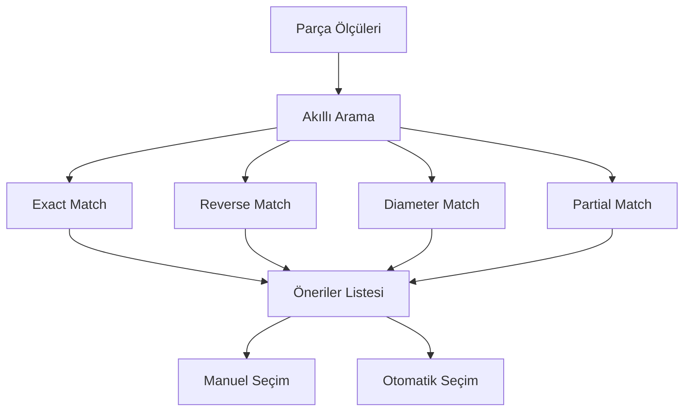
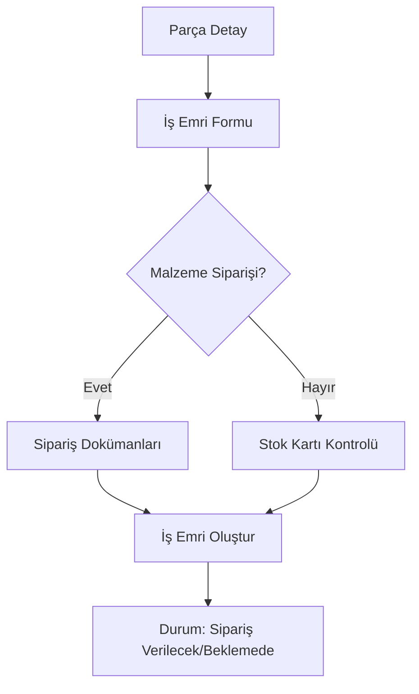

# Parçalar & Stok Modülü

## Genel Bakış

**Parçalar & Stok** modülü, ÜRTM Takip sisteminin kalbi olan üretim parçalarının yönetimini ve stok takibini sağlar. Bu modül, parça katalogları, stok seviyeleri, ham malzeme ilişkilendirmeleri ve üretim süreçlerinin temel veri yapısını oluşturur.

## Teknik Mimari

### Backend Bileşenleri

#### Veri Modeli (`backend/src/models/Parca.js`)
- **167 satırlık** kapsamlı parça modeli
- **Temel Alanlar**:
  - `parcaKodu` (Primary Key) - Benzersiz parça tanımlayıcısı
  - `parcaAdi` - Parça açıklaması/adı
  - `stokAdeti` - Mevcut stok miktarı
  - `kritik_stok` - Kritik stok seviyesi
  - `tedarikBedeli` - Parça maliyeti
  - `imalMi` - İmal/tedarik durumu
  - `stok_karti_id` - Ham malzeme stok kartı referansı

- **Üretim Alanları**:
  - `setupSayisi` - CNC setup sayısı
  - `cncIslemeSuresi` - Dakika cinsinden işleme süresi
  - `fasonMaliyeti` - Dış kaynak maliyeti
  - `sirketIciMaliyeti` - İç üretim maliyeti
  - `siyah` - Özel işlem durumu

- **Dosya Yönetimi**:
  - `teknik_resim_path` - Teknik çizim dosya yolu
  - `foto_path` - Parça fotoğraf yolu

#### Controller (`backend/src/controllers/parcaController.js`)
- **933 satırlık** kapsamlı controller
- **Ana Fonksiyonaliteler**:
  - **CRUD İşlemleri**: Create, Read, Update, Delete
  - **Sayfalama ve Filtreleme**: Gelişmiş arama algoritmaları
  - **Bulk Operations**: Toplu parça işlemleri
  - **Ham Malzeme Eşleştirme**: Akıllı stok kartı önerileri
  - **Excel Import/Export**: Veri aktarım fonksiyonları

- **Akıllı Ham Malzeme Algoritması**:
  ```javascript
  async function akıllıHamMalzemeEşleştirme(parcaKodu, ölçüler) {
    // Exact match: Tam boyut eşleşmesi
    // Reverse match: Ters boyut eşleşmesi (50x30 -> 30x50)
    // Diameter match: Çap bazlı eşleşme
    // Partial match: Kısmi eşleşme
  }
  ```

#### API Routes (`backend/src/routes/parcaRoutes.js`)
- **RESTful API Endpoints**:
  - `GET /api/parcalar` - Sayfalama ile parça listesi
  - `GET /api/parcalar/:kod` - Tek parça detayı
  - `POST /api/parcalar` - Yeni parça oluşturma
  - `PUT /api/parcalar/:kod` - Parça güncelleme
  - `DELETE /api/parcalar/:kod` - Parça silme
  - `GET /api/parcalar/ara/ham-malzeme` - Ham malzeme arama

### Frontend Bileşenleri

#### Ana Sayfa (`frontend/src/pages/Parcalar.jsx`)
- **917 satırlık** ana parça yönetim sayfası
- **Özellikler**:
  - **Server-side Pagination**: 30 parça/sayfa
  - **Gerçek Zamanlı Arama**: Debounced search
  - **İmal/Tedarik Filtresi**: Parça tipi filtreleme
  - **Kritik Stok Uyarıları**: Görsel stok durumu göstergeleri
  - **Dosya Yükleme**: Drag & drop teknik resim/fotoğraf
  - **Stok Kartı Entegrasyonu**: Ham malzeme bağlantıları

- **Veri Tablosu Kolonları**:
  - Dosyalar (Fotoğraf + Teknik Resim)
  - Parça Kodu
  - Stok Durumu (Kritik seviye uyarıları ile)
  - İmal/Tedarik Durumu
  - Ham Malzeme Stok Kartı Bilgisi
  - Maliyet Bilgileri (Fason + Şirket İçi)
  - Üretim Süre Bilgileri

#### Parça Detay Sayfası (`frontend/src/pages/ParcaDetay.jsx`)
- **1442 satırlık** kapsamlı detay sayfası
- **Sekmeli Yapı**:
  - **Temel Bilgiler**: Kod, ad, stok, kritik seviye
  - **Üretim**: Setup, CNC süresi, stok kartı ilişkisi
  - **Maliyet**: Fason ve şirket içi maliyetler

- **İş Emri Entegrasyonu**:
  ```javascript
  // İş emri oluşturma formu
  {
    miktar: number,
    teslimTarihi: date,
    malzemesi_siparis_edilecekmi: boolean,
    stok_karti_id: reference,
    uretim_plani_id: reference
  }
  ```

- **Stok Kartı Görüntüleme**: Ham malzeme detayları
- **Teknik Resim Viewer**: PDF/CAD dosya görüntüleme
- **Üretim Geçmişi**: Parça üretim kayıtları

#### Parça Düzenleme Formu (`frontend/src/components/ParcaDuzenleFormu.jsx`)
- **624 satırlık** komplex düzenleme formu
- **Form Alanları**:
  - Temel bilgiler (kod, ad, kategori)
  - Stok yönetimi (adet, kritik seviye)
  - İmal bilgileri (setup, CNC süresi)
  - Maliyet bilgileri (fason, şirket içi)
  - Dosya yükleme (teknik resim, fotoğraf)

- **Stok Kartı Seçici Entegrasyonu**:
  - Akıllı ham malzeme önerileri
  - Gerçek zamanlı stok kartı arama
  - Backward compatibility için eski alanlar

#### Stok Kartı Seçici (`frontend/src/components/StokKartiSecici.jsx`)
- **380 satırlık** gelişmiş seçici komponenti
- **Akıllı Arama Algoritması**:
  - **Exact Match**: 50x30 -> 50x30
  - **Reverse Match**: 50x30 -> 30x50  
  - **Diameter Match**: Çap25 -> Çap25
  - **Partial Match**: Kısmi eşleşmeler

- **Yeni Stok Kartı Oluşturma**: Modal içinde hızlı oluşturma
- **Debounced Search**: 500ms gecikme ile arama

#### Mobil Destek (`frontend/src/pages/mobile/ParcalarMobile.jsx`)
- **620 satırlık** mobil optimizasyonu
- **Infinite Scroll**: Lazy loading ile performans
- **Touch Optimized**: Dokunmatik arayüz
- **Responsive Cards**: Mobil kart tasarımı
- **Advanced Sorting**: Çok kriterli sıralama

### Stok Kartları Alt Modülü

#### Stok Kartları Sayfası (`frontend/src/pages/StokKartlari.jsx`)
- **534 satırlık** DataGrid tabanlı yönetim
- **Özellikler**:
  - **Server-side Pagination**: Performanslı sayfalama
  - **Advanced Filtering**: Malzeme cinsi, firma, kritik stok
  - **Real-time Statistics**: Canlı istatistik kartları
  - **Bulk Operations**: Toplu stok işlemleri

#### Custom Hook (`frontend/src/hooks/useStokKartlari.js`)
- **229 satırlık** React hook
- **State Management**: Merkezi stok kartı state yönetimi
- **API Integration**: Service layer entegrasyonu
- **Filter & Pagination**: Akıllı filtreleme mantığı

#### Stok Kartı Formu (`frontend/src/components/StokKartlari/StokKartiForm.jsx`)
- **421 satırlık** Formik tabanlı form
- **Validation**: Yup schema ile doğrulama
- **Autocomplete**: Malzeme cinsi ve firma önerileri
- **Real-time Preview**: Boyut önizleme

#### Service Layer (`frontend/src/services/stokKartlariService.js`)
- **107 satırlık** API abstraction layer
- **Endpoints**:
  - CRUD operations
  - İstatistikler
  - Kritik stoklar
  - Dropdown veriler
  - Gelişmiş arama

## Veri İlişkileri

### Ham Malzeme Bağlantısı
```sql
Parca (stok_karti_id) -> StokKarti (id)
```

**İlişki Özellikleri**:
- **Optional**: Parça stok kartı olmadan da var olabilir
- **Intelligent Matching**: Akıllı eşleştirme algoritmaları
- **Backward Compatibility**: Eski ham malzeme alanları korunur
- **Real-time Sync**: Parça güncellemelerinde stok kartı senkronizasyonu

### Parça Kayıtları
```sql
Parca (parcaKodu) -> ParcaKayitlari (parca_kodu)
```

### İş Emri İlişkisi
```sql
Parca (parcaKodu) -> IsEmirleri (parca_kodu)
```

## İş Akışları

### 1. Yeni Parça Ekleme Akışı


### 2. Ham Malzeme Eşleştirme Akışı


### 3. İş Emri Oluşturma Akışı


## Event Sistemi

### Custom Events
```javascript
// Parça güncellendiğinde
window.dispatchEvent(new CustomEvent('parcaUpdated', {
  detail: { updatedParca, parcaKodu }
}));

// Stok kartı güncellendiğinde  
window.dispatchEvent(new CustomEvent('stokKartiUpdated', {
  detail: { updatedStokKarti, action, stokKartiId }
}));
```

### Cross-Component Communication
- **Parça-Stok Senkronizasyonu**: Otomatik veri güncelleme
- **Real-time Updates**: WebSocket desteği
- **Cache Invalidation**: Değişikliklerde cache temizleme

## Dosya Yönetimi

### Upload Sistemi
- **Teknik Resim**: PDF, DWG, DXF formatları
- **Fotoğraf**: Tüm resim formatları
- **Max Size**: 100MB büyük üretim dosyaları için
- **Path Structure**: `/uploads/fotograflar/`, `/uploads/teknik_resimler/`

### File Utilities (`frontend/src/utils/imageUtils.js`)
```javascript
const getFotoPath = (foto_path) => {
  // Path normalization logic
}

const getTeknikResimPath = (teknik_resim_path) => {
  // Technical drawing path logic
}

const getFileType = (filePath) => {
  // File type detection for icons
}
```

## Kritik Stok Yönetimi

### Stok Durumu Hesaplama
```javascript
const getStokDurumu = (miktar, kritikStok) => {
  if (miktar === 0) return { color: 'error', label: 'Stokta Yok' };
  if (miktar <= kritikStok) return { color: 'warning', label: 'Az Stok' };
  return { color: 'success', label: 'Stokta Var' };
}
```

### Görsel Uyarılar
- **Kırmızı Kenarlık**: Stokta olmayan parçalar
- **Warning Icons**: Kritik seviyedeki parçalar
- **Renk Kodlaması**: Chip bileşenleri ile durum gösterimi

## Performans Optimizasyonları

### Frontend
- **Lazy Loading**: Görüntü lazy loading
- **Debounced Search**: 500-800ms gecikme
- **Virtual Scrolling**: Büyük liste performansı
- **Memoization**: React.memo kullanımı
- **Server-side Pagination**: Büyük veri setleri için

### Backend
- **Database Indexing**: parcaKodu, stokAdeti indexleri
- **Query Optimization**: JOIN optimizasyonları
- **Bulk Operations**: Toplu işlem desteği
- **Caching**: Sık kullanılan veriler için cache

## Güvenlik Özellikleri

### Veri Validasyonu
- **Backend**: Joi schema validation
- **Frontend**: Formik + Yup validation
- **SQL Injection**: Parameterized queries
- **File Upload**: Dosya tipi ve boyut kontrolü

### Authorization
- **API Protection**: JWT token kontrolü
- **Role-based Access**: Kullanıcı yetki seviyeleri
- **Audit Trail**: Değişiklik logları

## Entegrasyonlar

### İş Emirleri Modülü
- Parça bazlı iş emri oluşturma
- Ham malzeme sipariş yönetimi
- Üretim planı entegrasyonu

### Fason Modülü
- Parça bazlı fason işleri
- Maliyet hesaplamaları
- Teknik resim paylaşımı

### Raporlar Modülü
- Stok durum raporları
- Kritik stok analizleri
- Parça performans raporları

## Mobil Optimizasyon

### Responsive Design
- **Breakpoints**: xs, sm, md, lg, xl
- **Touch Interface**: Dokunmatik optimizasyon
- **Offline Support**: Kısmi offline çalışma
- **Performance**: Mobil performans optimizasyonları

### PWA Features
- **Caching**: Service worker cache
- **Background Sync**: Arka plan senkronizasyon
- **Push Notifications**: Kritik stok bildirimleri

## Gelecek Geliştirmeler

### Planlanmış Özellikler
1. **QR Code Integration**: Parça QR kod sistemi
2. **Barcode Scanner**: Mobil barkod okuyucu
3. **AI-Powered Suggestions**: Yapay zeka önerileri
4. **Advanced Analytics**: Detaylı parça analitiği
5. **IoT Integration**: Akıllı depo sensörleri

### Teknik İyileştirmeler
1. **GraphQL API**: Daha esnek API yapısı
2. **Real-time Collaboration**: Çoklu kullanıcı desteği
3. **Advanced Search**: Elasticsearch entegrasyonu
4. **Machine Learning**: Stok tahmini algoritmaları

## Veri Migrasyonu

### Excel Import/Export
- **Bulk Import**: Toplu parça aktarımı
- **Data Validation**: İçe aktarım validasyonu
- **Error Handling**: Hata yönetimi ve raporlama
- **Template Support**: Excel şablon desteği

### Database Migrations
- **Schema Updates**: Veritabanı şema güncellemeleri
- **Data Transformation**: Veri format dönüşümleri
- **Rollback Support**: Geri alma desteği

Bu modül, ÜRTM Takip sisteminin en kritik ve karmaşık modüllerinden biri olup, tüm üretim süreçlerinin temelini oluşturmaktadır. Ham malzeme yönetiminden ready-to-ship ürünlere kadar tüm parça yaşam döngüsünü kapsamaktadır.