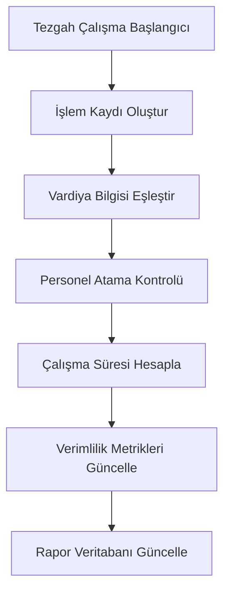
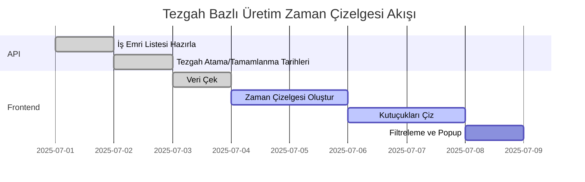

# RAPORLAR MODÜLÜ - Teknik Dokümantasyon

## Genel Bakış

Raporlar modülü, üretim süreçlerinin performansını analiz etmek, karar verme süreçlerini desteklemek ve operasyonel verimliliği artırmak için kapsamlı raporlama ve görselleştirme araçları sunar. Bu modül, özellikle vardiya bazlı tezgah performans analizine odaklanarak, üretim sahasındaki kaynak kullanımını optimize etmeye yardımcı olur.

## Vardiya Bazlı Tezgah Çalışma Raporları

### İş Gereksinimleri

**Mevcut Vardiya Yapısı:**
- **Gündüz Vardiyası**: 08:00 - 17:00 (9 saat)
- **Gece Vardiyası**: 22:00 - 06:00 (8 saat)
- **Hafta Sonu Vardiyası**: Cumartesi günleri (9 saat)

**Rapor Hedefleri:**
1. Her tezgahın vardiya bazlı çalışma sürelerini analiz etmek
2. Vardiyalar arası performans karşılaştırması yapmak
3. Tezgah kullanım oranlarını görselleştirmek
4. Üretim verimliliğini vardiya bazında değerlendirmek
5. Kaynak planlaması için veri sağlamak

## Mimari Yapı ve Veri Modeli

### Backend Bileşenleri

#### Veri Kaynakları

**1. Tezgah Çalışma Verileri**
```sql
-- Tezgah durumu ve çalışma kayıtları
SELECT 
    t.tezgah_id,
    t.tezgah_tanimi,
    ik.baslangic_zamani,
    ik.bitis_zamani,
    ik.durum,
    v.vardiya_adi,
    v.baslangic_saati,
    v.bitis_saati
FROM tezgahlar t
JOIN islem_kayitlari ik ON t.tezgah_id = ik.tezgah_id
JOIN vardiya_atamalari va ON ik.personel_id = va.personel_id
JOIN vardiyalar v ON va.vardiya_id = v.id
WHERE ik.tarih BETWEEN ? AND ?
```

**2. Vardiya Performans Metrikleri**
- **Çalışma Süresi**: Tezgahın aktif olduğu toplam süre
- **Duruş Süresi**: Arıza, bakım, mola süreleri
- **Verimlilik Oranı**: (Çalışma Süresi / Toplam Vardiya Süresi) * 100
- **İş Emri Tamamlama**: Vardiya içinde tamamlanan iş emirleri
- **Üretim Miktarı**: Vardiya içinde üretilen parça adedi

#### API Endpoint'leri

**Vardiya Bazlı Tezgah Raporları (`/api/raporlar/vardiya-tezgah`)**

```javascript
// Temel vardiya-tezgah raporu
GET /api/raporlar/vardiya-tezgah
Query Parameters:
- baslangic_tarihi: YYYY-MM-DD
- bitis_tarihi: YYYY-MM-DD
- vardiya_id: number (opsiyonel)
- tezgah_id: number (opsiyonel)
- rapor_tipi: 'ozet' | 'detay' | 'karsilastirma'

Response:
{
  "rapor_tarihi": "2025-01-20",
  "toplam_tezgah": 12,
  "vardiya_verileri": [
    {
      "vardiya_id": 1,
      "vardiya_adi": "Gündüz Vardiyası",
      "baslangic_saati": "08:00:00",
      "bitis_saati": "17:00:00",
      "toplam_sure": 540, // dakika
      "tezgah_performanslari": [
        {
          "tezgah_id": 1,
          "tezgah_tanimi": "CNC-001",
          "calisma_suresi": 480, // dakika
          "durus_suresi": 60,
          "verimlilik_orani": 88.9,
          "tamamlanan_is_emirleri": 5,
          "uretilen_miktar": 150,
          "ariza_sayisi": 1,
          "bakim_suresi": 30
        }
      ]
    }
  ]
}
```

**Vardiya Karşılaştırma Raporu (`/api/raporlar/vardiya-karsilastirma`)**

```javascript
GET /api/raporlar/vardiya-karsilastirma
Query Parameters:
- baslangic_tarihi: YYYY-MM-DD
- bitis_tarihi: YYYY-MM-DD
- metrik: 'verimlilik' | 'uretim' | 'durus'

Response:
{
  "karsilastirma_verileri": {
    "gunluk_vardiya": {
      "ortalama_verimlilik": 85.2,
      "toplam_uretim": 1250,
      "ortalama_durus": 45
    },
    "gece_vardiyasi": {
      "ortalama_verimlilik": 78.5,
      "toplam_uretim": 980,
      "ortalama_durus": 52
    },
    "hafta_sonu": {
      "ortalama_verimlilik": 82.1,
      "toplam_uretim": 1100,
      "ortalama_durus": 38
    }
  }
}
```

**Tezgah Detay Raporu (`/api/raporlar/tezgah-detay`)**

```javascript
GET /api/raporlar/tezgah-detay/:tezgah_id
Query Parameters:
- baslangic_tarihi: YYYY-MM-DD
- bitis_tarihi: YYYY-MM-DD

Response:
{
  "tezgah_bilgisi": {
    "tezgah_id": 1,
    "tezgah_tanimi": "CNC-001",
    "tezgah_tipi": "CNC"
  },
  "vardiya_performanslari": [
    {
      "tarih": "2025-01-20",
      "vardiya_adi": "Gündüz Vardiyası",
      "calisma_suresi": 480,
      "verimlilik_orani": 88.9,
      "is_emirleri": [
        {
          "is_emri_no": "IE25010001",
          "parca_kodu": "PART001",
          "baslangic": "08:30",
          "bitis": "12:15",
          "durum": "tamamlandi"
        }
      ]
    }
  ]
}
```

### Frontend Bileşenleri

#### 1. Vardiya Rapor Dashboard (`VardiyaRaporDashboard.jsx`)

**Sorumluluk**: Ana rapor görüntüleme ve filtreleme arayüzü

**Temel Özellikler:**
- **Tarih Aralığı Seçici**: Başlangıç ve bitiş tarihi seçimi
- **Vardiya Filtresi**: Belirli vardiya seçimi
- **Tezgah Filtresi**: Belirli tezgah(lar) seçimi
- **Rapor Tipi Seçici**: Özet, Detay, Karşılaştırma
- **Export Fonksiyonları**: PDF, Excel, CSV

```javascript
// Component yapısı
const VardiyaRaporDashboard = () => {
  const [filters, setFilters] = useState({
    baslangicTarihi: dayjs().subtract(7, 'day'),
    bitisTarihi: dayjs(),
    vardiyaId: null,
    tezgahId: null,
    raporTipi: 'ozet'
  });

  const [raporData, setRaporData] = useState(null);
  const [loading, setLoading] = useState(false);

  return (
    <Box>
      <VardiyaRaporFiltreler 
        filters={filters}
        onFiltersChange={setFilters}
      />
      <VardiyaRaporGorsellestime 
        data={raporData}
        raporTipi={filters.raporTipi}
      />
    </Box>
  );
};
```

#### 2. Vardiya Rapor Görselleştirme (`VardiyaRaporGorsellestime.jsx`)

**Sorumluluk**: Grafik ve tablo görselleştirmeleri

**Görselleştirme Tipleri:**

**A. Vardiya Verimlilik Karşılaştırması**
```javascript
// Bar Chart - Vardiyalar arası verimlilik
<BarChart
  data={[
    { vardiya: 'Gündüz', verimlilik: 85.2, renk: '#1976d2' },
    { vardiya: 'Gece', verimlilik: 78.5, renk: '#f44336' },
    { vardiya: 'Hafta Sonu', verimlilik: 82.1, renk: '#ff9800' }
  ]}
  xAxis="vardiya"
  yAxis="verimlilik"
  title="Vardiya Bazlı Verimlilik Karşılaştırması"
/>
```

**B. Tezgah Çalışma Süreleri Heatmap**
```javascript
// Heatmap - Tezgah x Vardiya çalışma süreleri
<HeatmapChart
  data={tezgahVardiyaMatrix}
  xAxis="vardiya"
  yAxis="tezgah"
  value="calisma_suresi"
  colorScale={['#ffebee', '#c62828']}
  title="Tezgah-Vardiya Çalışma Süreleri"
/>
```

**C. Zaman Serisi Analizi**
```javascript
// Line Chart - Günlük verimlilik trendi
<LineChart
  data={gunlukVerimlilik}
  xAxis="tarih"
  yAxis="verimlilik"
  series={['gunluk_vardiya', 'gece_vardiyasi', 'hafta_sonu']}
  title="Günlük Verimlilik Trendi"
/>
```

**D. Tezgah Durum Dağılımı**
```javascript
// Pie Chart - Tezgah durumları
<PieChart
  data={[
    { durum: 'Çalışıyor', deger: 65, renk: '#4caf50' },
    { durum: 'Duruş', deger: 20, renk: '#ff9800' },
    { durum: 'Arıza', deger: 10, renk: '#f44336' },
    { durum: 'Bakım', deger: 5, renk: '#9c27b0' }
  ]}
  title="Tezgah Durum Dağılımı"
/>
```

#### 3. Detaylı Tezgah Raporu (`TezgahDetayRaporu.jsx`)

**Sorumluluk**: Tek tezgah için detaylı analiz

**Özellikler:**
- **Vardiya Bazlı Performans Tablosu**
- **İş Emri Geçmişi**
- **Arıza ve Bakım Kayıtları**
- **Verimlilik Trend Analizi**

```javascript
const TezgahDetayRaporu = ({ tezgahId }) => {
  return (
    <Grid container spacing={3}>
      <Grid item xs={12} md={6}>
        <TezgahPerformansKarti tezgahId={tezgahId} />
      </Grid>
      <Grid item xs={12} md={6}>
        <VardiyaKarsilastirmaKarti tezgahId={tezgahId} />
      </Grid>
      <Grid item xs={12}>
        <IsEmriGecmisiTablosu tezgahId={tezgahId} />
      </Grid>
    </Grid>
  );
};
```

## Veri Akışı ve İş Süreçleri

### 1. Veri Toplama Süreci



### 2. Rapor Oluşturma Algoritması

```javascript
// Vardiya bazlı tezgah performansı hesaplama
const calculateVardiyaPerformance = (tezgahId, vardiyaId, tarihAraligi) => {
  // 1. İşlem kayıtlarını getir
  const islemKayitlari = getIslemKayitlari(tezgahId, tarihAraligi);
  
  // 2. Vardiya saatleri ile eşleştir
  const vardiyaKayitlari = filterByVardiya(islemKayitlari, vardiyaId);
  
  // 3. Çalışma sürelerini hesapla
  const calismaSuresi = calculateWorkingTime(vardiyaKayitlari);
  const durusSuresi = calculateDowntime(vardiyaKayitlari);
  
  // 4. Verimlilik oranını hesapla
  const verimlilikOrani = (calismaSuresi / vardiyaSuresi) * 100;
  
  // 5. İş emri tamamlama sayısını hesapla
  const tamamlananIsEmirleri = countCompletedOrders(vardiyaKayitlari);
  
  return {
    calismaSuresi,
    durusSuresi,
    verimlilikOrani,
    tamamlananIsEmirleri
  };
};
```

### 3. Real-time Veri Güncelleme

```javascript
// WebSocket ile anlık veri güncelleme
const useRealTimeVardiyaData = () => {
  const [vardiyaData, setVardiyaData] = useState({});
  
  useEffect(() => {
    const socket = io('/vardiya-reports');
    
    socket.on('tezgah-durum-guncelleme', (data) => {
      setVardiyaData(prev => ({
        ...prev,
        [data.tezgahId]: {
          ...prev[data.tezgahId],
          ...data
        }
      }));
    });
    
    return () => socket.disconnect();
  }, []);
  
  return vardiyaData;
};
```

## Performans ve Optimizasyon

### 1. Veritabanı Optimizasyonu

**İndeksleme Stratejisi:**
```sql
-- Rapor sorgularını hızlandırmak için indeksler
CREATE INDEX idx_islem_kayitlari_tarih_tezgah ON islem_kayitlari(tarih, tezgah_id);
CREATE INDEX idx_vardiya_atamalari_tarih ON vardiya_atamalari(tarih);
CREATE INDEX idx_tezgahlar_aktif ON tezgahlar(aktif) WHERE aktif = true;
```

**Materialized Views:**
```sql
-- Günlük vardiya performans özeti
CREATE MATERIALIZED VIEW gunluk_vardiya_performans AS
SELECT 
    DATE(ik.tarih) as tarih,
    v.vardiya_id,
    v.vardiya_adi,
    t.tezgah_id,
    t.tezgah_tanimi,
    SUM(ik.calisma_suresi) as toplam_calisma,
    SUM(ik.durus_suresi) as toplam_durus,
    COUNT(ie.is_emri_id) as tamamlanan_is_emirleri
FROM islem_kayitlari ik
JOIN tezgahlar t ON ik.tezgah_id = t.tezgah_id
JOIN vardiya_atamalari va ON ik.personel_id = va.personel_id
JOIN vardiyalar v ON va.vardiya_id = v.id
LEFT JOIN is_emirleri ie ON ik.is_emri_id = ie.is_emri_id
GROUP BY DATE(ik.tarih), v.vardiya_id, t.tezgah_id;
```

### 2. Frontend Performansı

**Veri Önbellekleme:**
```javascript
// React Query ile veri önbellekleme
const useVardiyaRaporData = (filters) => {
  return useQuery({
    queryKey: ['vardiya-rapor', filters],
    queryFn: () => fetchVardiyaRaporData(filters),
    staleTime: 5 * 60 * 1000, // 5 dakika
    cacheTime: 10 * 60 * 1000, // 10 dakika
    refetchOnWindowFocus: false
  });
};
```

**Lazy Loading:**
```javascript
// Büyük veri setleri için sayfalama
const VardiyaRaporTablosu = ({ data }) => {
  const [page, setPage] = useState(0);
  const [rowsPerPage, setRowsPerPage] = useState(25);
  
  const paginatedData = useMemo(() => {
    const start = page * rowsPerPage;
    return data.slice(start, start + rowsPerPage);
  }, [data, page, rowsPerPage]);
  
  return (
    <TableContainer>
      <Table>
        {/* Tablo içeriği */}
      </Table>
      <TablePagination
        component="div"
        count={data.length}
        page={page}
        onPageChange={(e, newPage) => setPage(newPage)}
        rowsPerPage={rowsPerPage}
        onRowsPerPageChange={(e) => setRowsPerPage(parseInt(e.target.value))}
      />
    </TableContainer>
  );
};
```

## Güvenlik ve Yetkilendirme

### 1. Rapor Erişim Kontrolü

**Rol Tabanlı Erişim:**
- **Üretim Müdürü**: Tüm raporlara erişim
- **Vardiya Amiri**: Kendi vardiyası raporlarına erişim
- **Tezgah Operatörü**: Kendi tezgahı raporlarına erişim
- **Planlama**: Özet raporlara erişim

```javascript
// Yetki kontrolü middleware
const checkReportAccess = (req, res, next) => {
  const { user } = req;
  const { vardiya_id, tezgah_id } = req.query;
  
  if (user.role === 'uretim_muduru') {
    return next(); // Tam erişim
  }
  
  if (user.role === 'vardiya_amiri' && user.vardiya_id === vardiya_id) {
    return next(); // Vardiya bazlı erişim
  }
  
  if (user.role === 'tezgah_operatoru' && user.tezgah_id === tezgah_id) {
    return next(); // Tezgah bazlı erişim
  }
  
  return res.status(403).json({ error: 'Yetkisiz erişim' });
};
```

### 2. Veri Güvenliği

**Hassas Veri Maskeleme:**
```javascript
// Maaş ve kişisel bilgilerin maskelenmesi
const maskSensitiveData = (data, userRole) => {
  if (userRole !== 'uretim_muduru') {
    return data.map(item => ({
      ...item,
      personel_maas: '***',
      personel_telefon: item.personel_telefon?.replace(/(\d{4})\d{3}(\d{4})/, '$1***$2')
    }));
  }
  return data;
};
```

## Geliştirme Yol Haritası

### Faz 1: Temel Rapor Altyapısı (2-3 Hafta)

**Hedefler:**
- [ ] Temel API endpoint'lerinin oluşturulması
- [ ] Vardiya-tezgah veri modelinin kurulması
- [ ] Basit rapor görüntüleme arayüzü
- [ ] Tarih aralığı filtreleme

**Teknik Görevler:**
1. **Backend Geliştirme:**
   - `raporlarController.js` oluşturma
   - Vardiya-tezgah rapor API'leri
   - Veritabanı sorgu optimizasyonu
   - Temel veri doğrulama

2. **Frontend Geliştirme:**
   - `VardiyaRaporDashboard.jsx` bileşeni
   - Temel filtreleme arayüzü
   - Basit tablo görünümü
   - Loading ve error handling

3. **Veri Entegrasyonu:**
   - İşlem kayıtları ile vardiya eşleştirmesi
   - Tezgah durumu takibi
   - Temel performans metrikleri

### Faz 2: Görselleştirme ve Analiz (3-4 Hafta)

**Hedefler:**
- [ ] Grafik ve chart entegrasyonu
- [ ] Vardiya karşılaştırma raporları
- [ ] Tezgah performans analizi
- [ ] Export fonksiyonları

**Teknik Görevler:**
1. **Görselleştirme:**
   - Chart.js veya Recharts entegrasyonu
   - Bar, Line, Pie chart'lar
   - Heatmap görselleştirmesi
   - Responsive chart tasarımı

2. **Analiz Algoritmaları:**
   - Verimlilik hesaplama algoritmaları
   - Trend analizi
   - Karşılaştırmalı analiz
   - İstatistiksel hesaplamalar

3. **Export Özellikleri:**
   - PDF rapor oluşturma
   - Excel export
   - CSV veri indirme
   - Rapor şablonları

### Faz 3: Gelişmiş Özellikler (4-5 Hafta)

**Hedefler:**
- [ ] Real-time veri güncelleme
- [ ] Otomatik rapor oluşturma
- [ ] Alarm ve bildirim sistemi
- [ ] Mobil uyumluluk

**Teknik Görevler:**
1. **Real-time Özellikler:**
   - WebSocket entegrasyonu
   - Anlık veri güncelleme
   - Live dashboard
   - Push notifications

2. **Otomasyon:**
   - Zamanlanmış rapor oluşturma
   - E-posta ile rapor gönderimi
   - Otomatik alarm sistemi
   - Performans eşik değerleri

3. **Mobil Optimizasyon:**
   - Responsive tasarım iyileştirmesi
   - Touch-friendly arayüz
   - Mobil chart optimizasyonu
   - Offline veri görüntüleme

### Faz 4: Optimizasyon ve Ölçeklendirme (2-3 Hafta)

**Hedefler:**
- [ ] Performans optimizasyonu
- [ ] Büyük veri seti desteği
- [ ] Gelişmiş filtreleme
- [ ] Kullanıcı deneyimi iyileştirmesi

**Teknik Görevler:**
1. **Performans:**
   - Veritabanı indeks optimizasyonu
   - Query caching
   - Frontend lazy loading
   - Memory usage optimization

2. **Ölçeklendirme:**
   - Pagination desteği
   - Veri arşivleme
   - Background job processing
   - Load balancing hazırlığı

3. **UX İyileştirmesi:**
   - Kullanıcı geri bildirimlerine göre iyileştirmeler
   - A/B testing
   - Accessibility iyileştirmeleri
   - Performance monitoring

## Başarı Metrikleri

### Teknik Metrikler
- **API Response Time**: < 500ms
- **Chart Render Time**: < 2 saniye
- **Data Accuracy**: %99.9
- **System Uptime**: %99.5

### İş Metrikleri
- **Rapor Kullanım Oranı**: Günlük aktif kullanıcı sayısı
- **Karar Verme Hızı**: Rapor bazlı karar verme süresinde %30 azalma
- **Operasyonel Verimlilik**: Vardiya bazlı verimlilik artışı
- **Maliyet Tasarrufu**: Kaynak optimizasyonu ile %15 maliyet azalması

## Sonuç

Vardiya bazlı tezgah çalışma raporları, üretim süreçlerinin optimizasyonu için kritik bir araçtır. Bu kapsamlı rapor sistemi, hem operasyonel hem de stratejik karar verme süreçlerini destekleyerek üretim verimliliğinin artırılmasına katkı sağlayacaktır.

Modüler yapısı sayesinde aşamalı olarak geliştirilebilir ve işletmenin büyüyen ihtiyaçlarına göre ölçeklendirilebilir. Real-time veri işleme ve görselleştirme yetenekleri ile modern bir üretim yönetim sisteminin temel taşlarından birini oluşturmaktadır.

---

## Tezgah Bazlı Üretim Raporu (Zaman Çizelgesi)

### Amaç ve Arayüz Tasarımı
- Bu rapor sekmesi, üretim planlaması ve izlenebilirlik için tezgah bazında iş emri akışını görsel olarak sunar.
- Her tezgah yukarıdan aşağıya satır olarak listelenir.
- Soldan sağa doğru zaman ekseni (gün/saat bazında) yer alır.
- Her tezgahın aktif iş emri, atama tarihinden tamamlanma tarihine kadar bir kutucuk (bar) ile gösterilir.
- Kutucuk üzerinde iş emri no, parça kodu, iş adı gibi bilgiler yer alır.
- Zaman ekseni yakınlaştırılıp/uzaklaştırılabilir.
- Renkler: Aktif iş emirleri, tamamlananlar ve gecikenler için farklı renklerde gösterilir.
- Kullanıcı kutucuğun üzerine geldiğinde detaylı popup (iş emri, süre, operatör vs) açılır.
- Filtreleme: Tezgah, tarih aralığı, iş emri tipi, durum gibi filtreler uygulanabilir.

### Teknik Mimari ve Veri Akışı
- Frontend, API'den her tezgah için iş emri atama ve tamamlanma tarihlerini, iş emri detaylarıyla birlikte çeker.
- Zaman çizelgesi componenti, bu verileri satır (tezgah) ve bar (iş emri) olarak işler.
- Zaman ekseni dinamik olarak oluşturulur, yakınlaştırma/uzaklaştırma desteği ile kullanıcıya esnek görünüm sunar.
- Renk kodlaması ve hover popup için iş emri durumu ve detayları kullanılır.

#### Veri Akış Şeması



### Yapılanlar (Özet)
- Frontend'de "Tezgah Bazlı Üretim Raporu" sekmesi ve Gantt benzeri zaman çizelgesi componenti eklendi.
- API endpointi ile tezgah bazlı iş emri atama/tamamlanma tarihleri ve detayları çekiliyor.
- Her iş emri bar olarak, iş emri no, parça kodu, iş adı ile gösteriliyor.
- Zaman ekseni gün+vardiya bazında, zoom ve sticky özellikli.
- Renk kodlaması ve hover ile detay popup mevcut.
- Hafta içi/hafta sonu vardiya görünümü dinamik.
- Temel filtreleme mevcut.

### Yapılacaklar (TODO List)
- [x] Frontend'de "Tezgah Bazlı Üretim Raporu" sekmesi ekle
- [x] Tezgahları satır, zamanı sütun olarak gösteren zaman çizelgesi (Gantt benzeri) componenti hazırla
- [x] API: Her tezgah için iş emri atama ve tamamlanma tarihlerini dönen endpoint yaz
- [x] Her iş emrini kutucuk/bar olarak çiz (iş emri no, parça kodu, iş adı vs ile)
- [x] Zaman ekseni ve yakınlaştırma/uzaklaştırma desteği ekle
- [x] Renk kodlaması: aktif, tamamlanan, geciken iş emirleri
- [x] Hover ile detay popup göster
- [x] Filtreleme seçenekleri ekle (tezgah, tarih, iş emri tipi, durum)
- [ ] Test ve kullanıcı geri bildirimi al