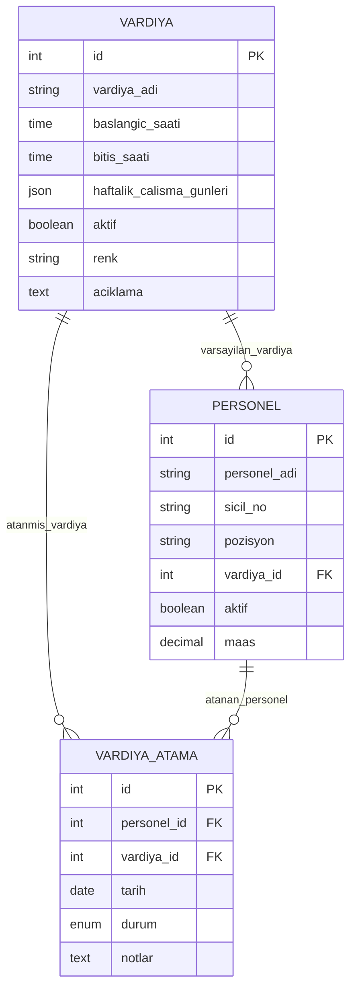
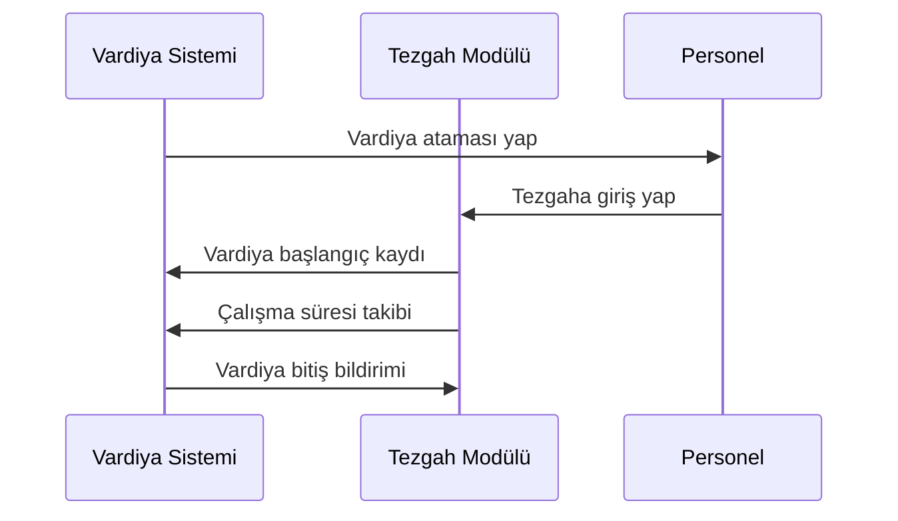
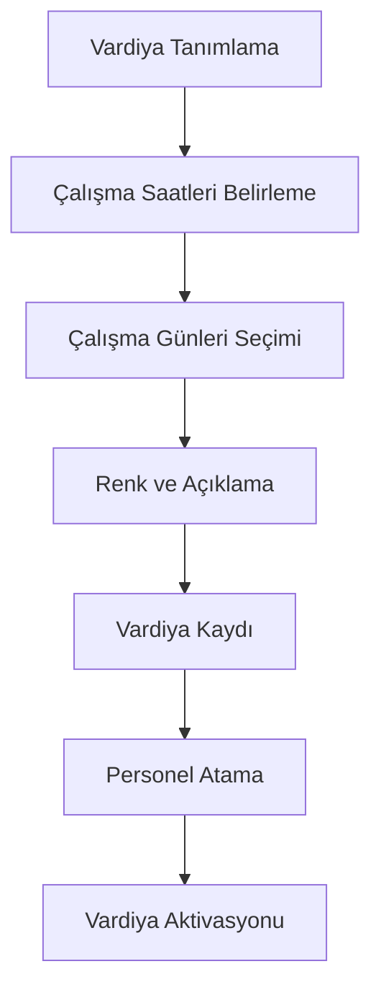
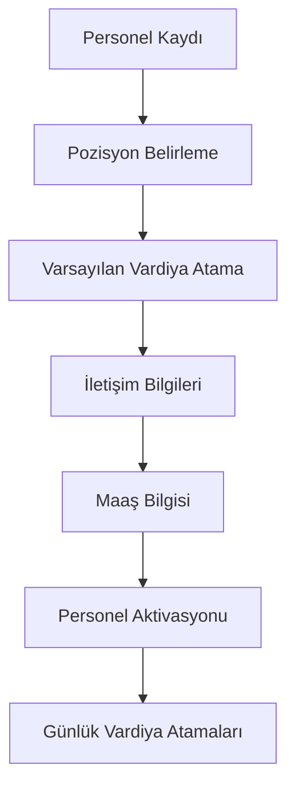

# VARDİYA YÖNETİMİ MODÜLÜ - Teknik Dokümantasyon

## Genel Bakış

Vardiya Yönetimi modülü, üretim sahasında çalışan personelin vardiya sistemini organize etmek, personel atamalarını yönetmek ve çalışma saatlerini takip etmek için tasarlanmıştır. Bu modül, vardiya tanımlarından personel atamalarına, çalışma takviminden raporlamaya kadar tüm vardiya süreçlerini kapsamlı bir şekilde yönetir.

Modül, üretim süreçlerinin kesintisiz devam etmesi için gerekli olan insan kaynağı planlamasının dijital altyapısını sağlar ve diğer üretim modülleriyle (Tezgahlar, İş Emirleri) entegre çalışarak operasyonel verimliliği artırır.

## Mimari Yapı ve Veri Modeli

### Backend Bileşenleri

#### Ana Veri Modelleri

**1. Vardiya Modeli (`Vardiya.js`)**
- **Tablo Adı**: `vardiyalar`
- **Temel Veri Yapısı**:
  - `id` (INTEGER, Primary Key): Benzersiz vardiya kimliği
  - `vardiya_adi` (STRING): Vardiya adı (örn: "Gündüz Vardiyası", "Gece Vardiyası")
  - `baslangic_saati` (TIME): Vardiya başlangıç saati (HH:mm:ss formatında)
  - `bitis_saati` (TIME): Vardiya bitiş saati (HH:mm:ss formatında)
  - `haftalik_calisma_gunleri` (JSON): Çalışma günleri dizisi [1-7] (Pazartesi=1, Pazar=7)
  - `aktif` (BOOLEAN): Vardiya aktif durumu
  - `aciklama` (TEXT): Vardiya açıklaması
  - `renk` (STRING): Görsel arayüzde kullanılan renk kodu (#hex formatında)
  - `olusturma_tarihi`, `guncelleme_tarihi`: Zaman damgaları

**2. Personel Modeli (`Personel.js`)**
- **Tablo Adı**: `personeller`
- **Temel Veri Yapısı**:
  - `id` (INTEGER, Primary Key): Benzersiz personel kimliği
  - `personel_adi` (STRING): Personel adı soyadı
  - `sicil_no` (STRING): Personel sicil numarası
  - `pozisyon` (STRING): İş pozisyonu/unvanı
  - `telefon` (STRING): İletişim telefonu
  - `email` (STRING): E-posta adresi
  - `vardiya_id` (INTEGER, Foreign Key): Varsayılan vardiya ataması
  - `aktif` (BOOLEAN): Personel aktif durumu
  - `maas` (DECIMAL): Maaş bilgisi
  - `olusturma_tarihi`, `guncelleme_tarihi`: Zaman damgaları

**3. Vardiya Atama Modeli (`VardiyaAtama.js`)**
- **Tablo Adı**: `vardiya_atamalari`
- **Temel Veri Yapısı**:
  - `id` (INTEGER, Primary Key): Benzersiz atama kimliği
  - `personel_id` (INTEGER, Foreign Key): Atanan personel
  - `vardiya_id` (INTEGER, Foreign Key): Atanan vardiya
  - `tarih` (DATE): Atama tarihi
  - `baslangic_saati` (TIME): Özel başlangıç saati (opsiyonel)
  - `bitis_saati` (TIME): Özel bitiş saati (opsiyonel)
  - `durum` (ENUM): Atama durumu ('planlandi', 'aktif', 'tamamlandi', 'iptal')
  - `notlar` (TEXT): Atama notları
  - `olusturma_tarihi`, `guncelleme_tarihi`: Zaman damgaları

#### İlişki Yapısı



### API Endpoint'leri ve İş Mantığı

#### Vardiya Yönetimi API'leri (`vardiyaRoutes.js`)

**Temel CRUD Operasyonları:**
- `GET /api/vardiyalar`: Tüm vardiyaları listeler
  - Query parametreleri: `aktif` (boolean), `with_personel` (boolean)
  - Personel sayısı ile birlikte listeleme desteği
- `GET /api/vardiyalar/:id`: Tek vardiya detayı
- `POST /api/vardiyalar`: Yeni vardiya oluşturma
- `PUT /api/vardiyalar/:id`: Vardiya güncelleme
- `DELETE /api/vardiyalar/:id`: Vardiya silme (personel ataması kontrolü ile)

**Özel Endpoint'ler:**
- `GET /api/vardiyalar/:id/istatistikler`: Vardiya bazlı istatistikler
  - Personel sayısı, atama durumları, tamamlanma oranları

#### Personel Yönetimi API'leri (`personelRoutes.js`)

**Temel CRUD Operasyonları:**
- `GET /api/personel`: Personel listesi (vardiya bilgileri ile)
- `GET /api/personel/:id`: Personel detayı
- `POST /api/personel`: Yeni personel ekleme
- `PUT /api/personel/:id`: Personel güncelleme
- `DELETE /api/personel/:id`: Personel silme

#### Vardiya Atama API'leri (`vardiyaAtamaRoutes.js`)

**Atama Yönetimi:**
- `GET /api/vardiya-atamalari`: Atama listesi (filtreleme desteği)
- `POST /api/vardiya-atamalari`: Yeni atama oluşturma
- `PUT /api/vardiya-atamalari/:id`: Atama güncelleme
- `DELETE /api/vardiya-atamalari/:id`: Atama iptal etme

## Frontend Mimarisi

### Ana Bileşen Yapısı

#### 1. Vardiya Yönetimi Ana Sayfası (`VardiyaYonetimiAna.jsx`)

- **Sorumluluk**: Vardiya yönetimi modülünün ana giriş noktası
- **Yapı**: Sekmeli (Tab) arayüz ile alt modüllere erişim
- **Sekmeler**:
  - **Vardiyalar**: Vardiya tanımları ve yönetimi
  - **Personel**: Personel kayıtları ve yönetimi
  - **Atamalar**: Vardiya atamaları (geliştirilme aşamasında)
  - **Takvim**: Vardiya takvimi görünümü (geliştirilme aşamasında)
  - **Raporlar**: Vardiya raporları (geliştirilme aşamasında)

#### 2. Vardiya Listesi (`VardiyaListesi.jsx`)

- **Sorumluluk**: Vardiya tanımlarının listelenmesi ve yönetimi
- **Temel Özellikler**:
  - **Kapsamlı Tablo Görünümü**: Vardiya adı, çalışma saatleri, süre, günleri, personel sayısı
  - **Renk Kodlaması**: Her vardiya için görsel renk desteği
  - **Dinamik Form**: Yeni vardiya ekleme ve düzenleme
  - **Esnek Zaman Aralıkları**: Her vardiya için özelleştirilebilir başlangıç ve bitiş saatleri
  - **Gece Vardiyası Desteği**: Gece yarısını geçen vardiyalar için özel işleme
  - **Zaman Çakışması Kontrolü**: Vardiya saatleri çakışma uyarısı ve onay sistemi
  - **Anlık Süre Hesaplama**: Kullanıcı saat seçerken anlık vardiya süresi gösterimi
  - **Çalışma Günleri Seçimi**: Haftalık çalışma günlerini belirleme
  - **Zaman Seçici**: Material-UI TimePicker ile saat seçimi
  - **Gelişmiş Validasyon**: Form doğrulama, minimum süre kontrolü ve hata yönetimi

**Form Özellikleri:**
```javascript
// Vardiya form veri yapısı
{
  vardiya_adi: '',
  baslangic_saati: dayjs object,
  bitis_saati: dayjs object,
  haftalik_calisma_gunleri: [1,2,3,4,5], // Pazartesi-Cuma
  aktif: true,
  aciklama: '',
  renk: '#1976d2'
}
```

#### 3. Personel Listesi (`PersonelListesi.jsx`)

- **Sorumluluk**: Personel kayıtlarının yönetimi
- **Temel Özellikler**:
  - **Detaylı Personel Tablosu**: Ad, sicil no, pozisyon, vardiya, iletişim bilgileri
  - **Vardiya Entegrasyonu**: Personel-vardiya ilişkisi görselleştirmesi
  - **Pozisyon Yönetimi**: Önceden tanımlı pozisyon listesi
  - **İletişim Bilgileri**: Telefon ve e-posta yönetimi
  - **Maaş Bilgisi**: Personel maaş kaydı (opsiyonel)

**Desteklenen Pozisyonlar:**
- CNC Operatörü, Torna Operatörü, Freze Operatörü
- Kaynak Operatörü, Montaj Operatörü, Kalite Kontrol
- Usta, Vardiya Amiri, Teknisyen, Diğer

#### 4. Vardiya Yönetimi Ana Konteyner (`VardiyaYonetimi.jsx`)

- **Sorumluluk**: Alt bileşenlerin koordinasyonu
- **Özellikler**:
  - **Tab Yönetimi**: Farklı vardiya işlevleri arasında geçiş
  - **Mesaj Sistemi**: Başarı/hata mesajlarının merkezi yönetimi
  - **Loading Durumu**: Asenkron işlemler için yükleme göstergesi
  - **Responsive Tasarım**: Mobil ve masaüstü uyumluluğu

### Kullanıcı Arayüzü Özellikleri

#### Görsel Tasarım Elementleri

**Renk Sistemi:**
- Vardiya renkleri: 8 farklı önceden tanımlı renk paleti
- Durum göstergeleri: Aktif (yeşil), Pasif (gri), Hata (kırmızı)
- Material-UI tema entegrasyonu

**İkonografi:**
- `Schedule`: Vardiya ve zaman göstergeleri
- `People`: Personel sayısı ve atamalar
- `Assignment`: Görev ve atama durumları
- `Assessment`: Raporlama ve analiz
- `CalendarMonth`: Takvim görünümleri

#### Etkileşim Desenleri

**Form Yönetimi:**
- Real-time validasyon
- Otomatik kaydetme önerileri
- Hata mesajları ve başarı bildirimleri
- Responsive form layout'u

**Tablo İşlemleri:**
- Satır bazlı düzenleme/silme
- Toplu işlem desteği (gelecek özellik)
- Sıralama ve filtreleme
- Sayfalama desteği

## Entegrasyonlar ve İş Akışları

### 1. Tezgahlar Modülü ile Entegrasyon

**Vardiya-Tezgah İlişkisi:**
- Tezgah operatörlerinin vardiya atamaları
- Vardiya değişimlerinde tezgah devir-teslim süreçleri
- Vardiya bazlı tezgah performans takibi

**Veri Akışı:**


### 2. İş Emirleri Modülü ile Entegrasyon

**Vardiya-İş Emri Koordinasyonu:**
- İş emirlerinin vardiya bazlı planlanması
- Vardiya değişimlerinde iş emri devir-teslimi
- Vardiya performansının iş emri tamamlama süresine etkisi

**Planlama Algoritması:**
- Vardiya kapasitesi hesaplama
- İş emri süre tahminleri ile vardiya planlaması
- Kritik iş emirlerinin vardiya önceliklendirilmesi

### 3. Raporlama Modülü ile Entegrasyon

**Vardiya Bazlı Metrikler:**
- Vardiya verimliliği analizi
- Personel performans karşılaştırması
- Vardiya maliyeti hesaplamaları
- Devamsızlık ve gecikme raporları

## Veri Akışı ve İş Süreçleri

### 1. Vardiya Tanımlama Süreci



### 2. Personel Atama Süreci



### 3. Günlük Vardiya Yönetimi

**Vardiya Başlangıcı:**
1. Personel giriş kaydı
2. Tezgah/iş istasyonu ataması
3. Aktif iş emirlerinin devir-teslimi
4. Vardiya hedeflerinin belirlenmesi

**Vardiya Süreci:**
1. Çalışma süresi takibi
2. Mola ve ara verme kayıtları
3. Üretim performansı izleme
4. Arıza ve sorun bildirimleri

**Vardiya Bitişi:**
1. Üretim sonuçlarının kaydı
2. Tezgah durumu raporu
3. Devir-teslim notları
4. Vardiya özet raporu

## Performans ve Optimizasyon

### 1. Veritabanı Optimizasyonu

**İndeksleme Stratejisi:**
- `vardiyalar.baslangic_saati` - Vardiya sıralama
- `personeller.vardiya_id` - Personel-vardiya ilişkisi
- `vardiya_atamalari.tarih` - Tarih bazlı sorgular
- `vardiya_atamalari.durum` - Durum filtreleme

**Query Optimizasyonu:**
- Eager loading ile N+1 problem çözümü
- Pagination ile büyük veri setleri yönetimi
- Cached queries ile sık kullanılan veriler

### 2. Frontend Performansı

**Component Optimizasyonu:**
- React.memo ile gereksiz re-render'ların önlenmesi
- useMemo ve useCallback hook'ları ile hesaplama optimizasyonu
- Lazy loading ile büyük bileşenlerin yüklenmesi

**State Yönetimi:**
- Local state ile global state dengelenmesi
- Debounced search ile API çağrı optimizasyonu
- Optimistic updates ile kullanıcı deneyimi iyileştirmesi

## Güvenlik ve Yetkilendirme

### 1. Veri Güvenliği

**Personel Bilgileri:**
- Kişisel verilerin şifrelenmesi
- GDPR uyumlu veri saklama
- Erişim logları ve audit trail

**Vardiya Bilgileri:**
- Yetkisiz değişikliklerin önlenmesi
- Vardiya geçmişi korunması
- Kritik değişikliklerin onay süreci

### 2. Kullanıcı Yetkileri

**Rol Tabanlı Erişim:**
- **Vardiya Amiri**: Tam yetki (CRUD)
- **İK Personeli**: Personel yönetimi
- **Operatör**: Sadece görüntüleme
- **Yönetici**: Raporlama ve analiz

## Gelecek Geliştirmeler

### 1. Kısa Vadeli Özellikler

**Vardiya Takvimi:**
- Aylık/haftalık vardiya görünümü
- Drag-drop ile atama değişiklikleri
- Tatil ve özel gün yönetimi

**Mobil Uygulama:**
- Personel giriş-çıkış kayıtları
- Vardiya bildirimler
- Offline çalışma desteği

### 2. Uzun Vadeli Özellikler

**AI Destekli Planlama:**
- Geçmiş verilerle optimal vardiya planlaması
- Personel performans tahminleri
- Otomatik vardiya optimizasyonu

**IoT Entegrasyonu:**
- RFID ile otomatik giriş-çıkış
- Biometric kimlik doğrulama
- Real-time lokasyon takibi

**Advanced Analytics:**
- Predictive analytics ile personel ihtiyaç tahmini
- Vardiya maliyeti optimizasyonu
- Performans benchmarking

## Sonuç

Vardiya Yönetimi modülü, üretim süreçlerinin insan kaynağı boyutunu kapsamlı bir şekilde yöneten kritik bir sistemdir. Modüler yapısı, güçlü veri modeli ve kullanıcı dostu arayüzü ile üretim verimliliğinin artırılmasında önemli bir rol oynamaktadır.

Sistemin mevcut durumu, temel vardiya yönetimi ihtiyaçlarını karşılarken, gelecek geliştirmeler ile daha da güçlü bir insan kaynakları yönetim platformuna dönüşme potansiyeline sahiptir. Özellikle diğer üretim modülleri ile entegrasyonu, sistemin bütünsel değerini önemli ölçüde artırmaktadır.