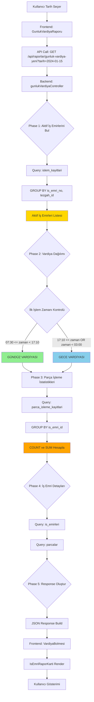

# Workflow: Günlük Vardiya Raporu - Veri Akışı ve Mantıksal Akış

## 🔄 Veri Akış Diyagramı



---

## 🧩 Mantıksal Akış Şeması

### 1. Frontend Akışı

```
┌─────────────────────────────────────────────────────────────┐
│                    GunlukVardiyaRaporu.jsx                 │
│                                                             │
│  1. Kullanıcı tarih seçer (DatePicker)                       │
│  2. useEffect tetiklenir                                    │
│  3. API call: getGunlukVardiyaRaporu(tarih)                 │
│  4. Loading state                                          │
│  5. Response beklenir                                       │
│  6. Data geldikçe render                                    │
│     - TezgahVardiyaKarti (her tezgah için)                  │
│       - VardiyaBolmesi (gündüz)                             │
│         - VardiyaOzeti                                      │
│         - IsEmriRaporKarti (her iş emri için)              │
│       - VardiyaBolmesi (gece)                               │
│         - VardiyaOzeti                                      │
│         - IsEmriRaporKarti (her iş emri için)              │
└─────────────────────────────────────────────────────────────┘
```

### 2. Backend Akışı

```
┌─────────────────────────────────────────────────────────────┐
│              gunlukVardiyaController.getGunlukVardiyaRaporuYeni │
│                                                             │
│  INPUT: req.query.tarih                                     │
│                                                             │
│  ┌──────────────────────────────────────────────────────┐  │
│  │ Phase 1: Aktif İş Emirlerini Bul                    │  │
│  │                                                      │  │
│  │ queries.getAktifIsEmirleriByTarih(tarih)            │  │
│  │   ↓                                                 │  │
│  │ SQL: SELECT DISTINCT is_emri_no, tezgah_id          │  │
│  │      FROM islem_kayitlari                          │  │
│  │      WHERE DATE(islem_tarihi) = :tarih             │  │
│  │      AND islem_yeri = 'tezgah'                     │  │
│  │      GROUP BY is_emri_no, tezgah_id                │  │
│  │   ↓                                                 │  │
│  │ OUTPUT: [{ is_emri_no, tezgah_id, ilk_islem_zamani }]│  │
│  └──────────────────────────────────────────────────────┘  │
│                         ↓                                   │
│  ┌──────────────────────────────────────────────────────┐  │
│  │ Phase 2: Vardiya Dağılımı                           │  │
│  │                                                      │  │
│  │ service.isEmirleriVardiyaAyır(aktifIsEmirleri)       │  │
│  │   ↓                                                 │  │
│  │ ALGORITMA:                                          │  │
│  │   For each aktifIsEmri:                            │  │
│  │     zaman = ilk_islem_zamani.getHours() + Minutes() │  │
│  │     IF 07:30 <= zaman < 17:10:                     │  │
│  │       → gunduz_vardiya.push(is_emri_no)            │  │
│  │     ELSE IF 17:10 <= zaman OR zaman < 03:00:       │  │
│  │       → gece_vardiya.push(is_emri_no)               │  │
│  │   ↓                                                 │  │
│  │ OUTPUT: { gunduz_vardiya: [], gece_vardiya: [] }    │  │
│  └──────────────────────────────────────────────────────┘  │
│                         ↓                                   │
│  ┌──────────────────────────────────────────────────────┐  │
│  │ Phase 3: Parça İşleme İstatistikleri                │  │
│  │                                                      │  │
│  │ service.getParcaIslemeIstatistikleri(isEmriIds)     │  │
│  │   ↓                                                 │  │
│  │ SQL: SELECT is_emri_id,                            │  │
│  │          COUNT(*) as islem_sayisi,                  │  │
│  │          SUM(isleme_suresi_dakika) as toplam_sure  │  │
│  │      FROM parca_isleme_kayitlari                   │  │
│  │      WHERE is_emri_id IN (:isEmriIds)              │  │
│  │      AND DATE(baslangic_zamani) = :tarih           │  │
│  │      GROUP BY is_emri_id                           │  │
│  │   ↓                                                 │  │
│  │ OUTPUT: Map<is_emri_id, {islem_sayisi, toplam_sure}>│  │
│  └──────────────────────────────────────────────────────┘  │
│                         ↓                                   │
│  ┌──────────────────────────────────────────────────────┐  │
│  │ Phase 4: İş Emri Detayları                         │  │
│  │                                                      │  │
│  │ queries.getIsEmriDetaylari(isEmriNos)               │  │
│  │   ↓                                                 │  │
│  │ SQL: SELECT is_emri_no, is_adi, parca_kodu,        │  │
│  │          adet, durum, ...                           │  │
│  │      FROM is_emirleri                              │  │
│  │      WHERE is_emri_no IN (:isEmriNos)               │  │
│  │   ↓                                                 │  │
│  │ queries.getParcaDetaylari(parcaKodlari)             │  │
│  │   ↓                                                 │  │
│  │ SQL: SELECT parca_kodu, parca_adi, resim_yolu       │  │
│  │      FROM parcalar                                 │  │
│  │      WHERE parca_kodu IN (:parcaKodlari)            │  │
│  │   ↓                                                 │  │
│  │ OUTPUT: İş emri ve parça detayları                  │  │
│  └──────────────────────────────────────────────────────┘  │
│                         ↓                                   │
│  ┌──────────────────────────────────────────────────────┐  │
│  │ Phase 5: Response Oluştur                          │  │
│  │                                                      │  │
│  │ helpers.buildVardiyaResponse(data)                  │  │
│  │   ↓                                                 │  │
│  │ JSON: {                                             │  │
│  │   success: true,                                    │  │
│  │   tarih: '2024-01-15',                              │  │
│  │   gunduz_vardiya: {                                 │  │
│  │     baslangic: '07:30',                             │  │
│  │     bitis: '17:10',                                 │  │
│  │     toplam_islem_sayisi: 45,                        │  │
│  │     toplam_isleme_suresi: 960,                      │  │
│  │     is_emirleri: [...]                              │  │
│  │   },                                                │  │
│  │   gece_vardiya: { ... }                             │  │
│  │ }                                                    │  │
│  └──────────────────────────────────────────────────────┘  │
│                         ↓                                   │
│  res.json(response)                                        │
└─────────────────────────────────────────────────────────────┘
```

---

## 📊 Veri Transformasyonu

### Step 1: Raw Data (islem_kayitlari)
```javascript
[
  { is_emri_no: 'IE-001', tezgah_id: 5, islem_tarihi: '2024-01-15T08:30:00', islem_yeri: 'tezgah' },
  { is_emri_no: 'IE-001', tezgah_id: 5, islem_tarihi: '2024-01-15T09:15:00', islem_yeri: 'tezgah' },
  { is_emri_no: 'IE-002', tezgah_id: 3, islem_tarihi: '2024-01-15T18:45:00', islem_yeri: 'tezgah' },
  { is_emri_no: 'IE-003', tezgah_id: 7, islem_tarihi: '2024-01-16T02:30:00', islem_yeri: 'tezgah' }
]
```

### Step 2: Grouped & Min Time
```javascript
[
  { is_emri_no: 'IE-001', tezgah_id: 5, ilk_islem_zamani: '2024-01-15T08:30:00' },
  { is_emri_no: 'IE-002', tezgah_id: 3, ilk_islem_zamani: '2024-01-15T18:45:00' },
  { is_emri_no: 'IE-003', tezgah_id: 7, ilk_islem_zamani: '2024-01-16T02:30:00' }
]
```

### Step 3: Vardiya Classification
```javascript
{
  gunduz_vardiya: ['IE-001'],  // 08:30 → Gündüz
  gece_vardiya: ['IE-002', 'IE-003']  // 18:45 ve 02:30 → Gece
}
```

### Step 4: Statistics (parca_isleme_kayitlari)
```javascript
{
  'IE-001': { islem_sayisi: 15, toplam_sure: 320 },
  'IE-002': { islem_sayisi: 8, toplam_sure: 180 },
  'IE-003': { islem_sayisi: 5, toplam_sure: 120 }
}
```

### Step 5: Final Response
```javascript
{
  success: true,
  tarih: '2024-01-15',
  gunduz_vardiya: {
    baslangic: '07:30',
    bitis: '17:10',
    toplam_islem_sayisi: 15,
    toplam_isleme_suresi: 320,
    is_emirleri: [
      {
        is_emri_no: 'IE-001',
        is_adi: 'Parça X Üretimi',
        parca_kodu: 'P-001',
        tezgah_id: 5,
        islem_sayisi: 15,
        toplam_isleme_suresi_dakika: 320,
        istenen_adet: 100,
        tamamlanan_adet: 45,
        durum: 'aktif',
        ilerleme: 45
      }
    ]
  },
  gece_vardiya: {
    baslangic: '17:10',
    bitis: '03:00',
    toplam_islem_sayisi: 13,
    toplam_isleme_suresi: 300,
    is_emirleri: [
      { /* IE-002 */ },
      { /* IE-003 */ }
    ]
  }
}
```

---

## 🎨 Frontend Render Akışı

```
┌─────────────────────────────────────────────────────────────┐
│                    GunlukVardiyaRaporu.jsx                 │
│                                                             │
│  <Container>                                                │
│    <DatePicker value={tarih} onChange={handleTarihChange} />│
│    {loading ? <CircularProgress /> : renderRapor()}        │
│  </Container>                                               │
└─────────────────────────────────────────────────────────────┘
                            ↓
┌─────────────────────────────────────────────────────────────┐
│                     renderRapor()                          │
│                                                             │
│  <Grid container spacing={2}>                              │
│    {rapor.map(tezgah => (                                   │
│      <Grid item key={tezgah.tezgah_id}>                    │
│        <TezgahVardiyaKarti                                  │
│          tezgah={tezgah}                                   │
│          gunduzVardiya={tezgah.gunduz_vardiya}             │
│          geceVardiya={tezgah.gece_vardiya}                 │
│        />                                                  │
│      </Grid>                                               │
│    ))}                                                      │
│  </Grid>                                                   │
└─────────────────────────────────────────────────────────────┘
                            ↓
┌─────────────────────────────────────────────────────────────┐
│                    TezgahVardiyaKarti.jsx                  │
│                                                             │
│  <Card>                                                    │
│    <CardHeader title={tezgah.tezgah_tanimi} />             │
│    <CardContent>                                           │
│      {/* Gündüz Vardiyası */}                              │
│      <Typography variant="h6">Gündüz Vardiyası</Typography>│
│      <VardiyaBolmesi                                       │
│        vardiyaTipi="gunduz"                                │
│        {...gunduzVardiya}                                  │
│      />                                                    │
│                                                             │
│      {/* Gece Vardiyası */}                                │
│      <Typography variant="h6">Gece Vardiyası</Typography>  │
│      <VardiyaBolmesi                                       │
│        vardiyaTipi="gece"                                  │
│        {...geceVardiya}                                    │
│      />                                                    │
│    </CardContent>                                          │
│  </Card>                                                   │
└─────────────────────────────────────────────────────────────┘
                            ↓
┌─────────────────────────────────────────────────────────────┐
│                     VardiyaBolmesi.jsx                      │
│                                                             │
│  <Box>                                                      │
│    {/* Özet Bilgiler */}                                   │
│    <VardiyaOzeti                                            │
│      baslangic={baslangic}                                  │
│      bitis={bitis}                                          │
│      toplamIslemSayisi={toplam_islem_sayisi}                │
│      toplamIslemeSuresi={toplam_isleme_suresi}              │
│    />                                                      │
│                                                             │
│    {/* İş Emri Kartları */}                                │
│    <Grid container spacing={1}>                            │
│      {isEmirleri.map(isEmri => (                           │
│        <Grid item xs={12} sm={6} md={4}>                  │
│          <IsEmriRaporKarti                                  │
│            key={isEmri.is_emri_no}                         │
│            {...isEmri}                                     │
│          />                                                │
│        </Grid>                                             │
│      ))}                                                    │
│    </Grid>                                                 │
│  </Box>                                                    │
└─────────────────────────────────────────────────────────────┘
                            ↓
┌─────────────────────────────────────────────────────────────┐
│                   IsEmriRaporKarti.jsx                       │
│                                                             │
│  <Card>                                                    │
│    <CardMedia                                               │
│      component="img"                                       │
│      image={parca_resmi}                                   │
│      alt={parca_kodu}                                      │
│    />                                                      │
│    <CardContent>                                           │
│      <Typography variant="h6">{is_adi}</Typography>       │
│      <Typography>{is_emri_no}</Typography>                 │
│                                                             │
│      {/* YENİ: İşlem Sayısı ve Süre */}                    │
│      <Box sx={{ display: 'flex', gap: 1, my: 1 }}>        │
│        <Chip                                                │
│          icon={<WorkIcon />}                               │
│          label={`${islem_sayisi} işlem`}                   │
│          size="small"                                      │
│        />                                                   │
│        <Chip                                                │
│          icon={<TimeIcon />}                               │
│          label={`${toplam_isleme_suresi_dakika} dk`}       │
│          size="small"                                      │
│        />                                                   ││
│      </Box>                                                 │
│                                                             │
│      {/* İlerleme Çubuğu */}                               │
│      <LinearProgress                                        │
│        variant="determinate"                               │
│        value={ilerleme}                                    │
│        color={ilerlemeColor}                               │
│      />                                                    │
│      <Typography variant="caption">                        │
│        {tamamlanan_adet} / {istenen_adet}                 │
│      </Typography>                                         │
│                                                             │
│      {/* Durum Çipi */}                                    │
│      <Chip label={durum} color={durumColor} size="small" />│
│    </CardContent>                                          │
│  </Card>                                                   │
└─────────────────────────────────────────────────────────────┘
```

---

## 🔧 Edge Case Handling

### Case 1: Gece Yarısı Geçişi
```javascript
// Gece vardiyası 17:10'da başlar, ertesi gün 03:00'te biter
// 2024-01-15 tarihli rapor için:

// DOĞRU:
baslangic = new Date('2024-01-15T17:10:00')
bitis = new Date('2024-01-16T03:00:00')  // Ertesi gün!

// YANLIŞ:
bitis = new Date('2024-01-15T03:00:00')  // Aynı gün (03:00 sabah)
```

### Case 2: İşlem Yok
```javascript
// Tarih: 2024-01-01 (Resmi tatil)
// Beklenen: Boş rapor, ama hata vermemeli

Response: {
  success: true,
  tarih: '2024-01-01',
  gunduz_vardiya: {
    baslangic: '07:30',
    bitis: '17:10',
    toplam_islem_sayisi: 0,
    toplam_isleme_suresi: 0,
    is_emirleri: []
  },
  gece_vardiya: {
    baslangic: '17:10',
    bitis: '03:00',
    toplam_islem_sayisi: 0,
    toplam_isleme_suresi: 0,
    is_emirleri: []
  }
}
```

### Case 3: Fason İş Emirleri
```javascript
// islem_yeri = 'fason' olan kayıtlar raporda gösterilmemeli

// SQL Filtre:
WHERE islem_yeri = 'tezgah'  -- Sadece tezgah işlemleri
```

### Case 4: Parça İşleme Kaydı Yok
```javascript
// İş emri var ama parca_isleme_kayitlari'nda kayıt yok

// Varsayılan değerler:
{
  islem_sayisi: 0,
  toplam_isleme_suresi_dakika: 0
}

// Frontend'de gösterim:
"İşlem kaydı yok" mesajı veya 0 değerleri
```

---

## 📈 Performans Optimizasyonu

### 1. Database Indexes
```sql
-- islem_kayitlari tablosu
CREATE INDEX idx_ik_tarih_tezgah ON islem_kayitlari(DATE(islem_tarihi), tezgah_id);
CREATE INDEX idx_ik_is_emri_tarih ON islem_kayitlari(is_emri_no, DATE(islem_tarihi));

-- parca_isleme_kayitlari tablosu
CREATE INDEX idx_pik_is_emri_baslangic ON parca_isleme_kayitlari(is_emri_id, DATE(baslangic_zamani));
```

### 2. Query Optimization
```javascript
// ❌ KÖTÜ: N+1 Query Problem
for (const isEmri of isEmirleri) {
  const kayitlar = await ParcaIslemeKayitlari.findAll({
    where: { is_emri_id: isEmri.id }
  });
}

// ✅ İYİ: Single Query with GROUP BY
const kayitlar = await ParcaIslemeKayitlari.findAll({
  where: {
    is_emri_id: { [Op.in]: isEmriIds }
  },
  attributes: [
    'is_emri_id',
    [sequelize.fn('COUNT', '*'), 'islem_sayisi'],
    [sequelize.fn('SUM', sequelize.col('isleme_suresi_dakika')), 'toplam_sure']
  ],
  group: ['is_emri_id']
});
```

### 3. Caching Strategy
```javascript
// Redis cache ile günlük raporları cache'le
const cacheKey = `gunluk_vardiya:${tarih}`;
let cachedData = await redis.get(cacheKey);

if (cachedData) {
  return JSON.parse(cachedData);
}

// Cache miss: Veritabanından çek
const data = await fetchVardiyaRaporu(tarih);
await redis.setex(cacheKey, 3600, JSON.stringify(data)); // 1 saat
return data;
```

---

## 🧪 Test Akışı

### Unit Tests
```javascript
describe('Vardiya Dağılımı', () => {
  test('07:30 işlemi → Gündüz vardiyası', () => {
    const result = isEmirleriVardiyaAyır([
      { ilk_islem_zamani: '2024-01-15T08:30:00' }
    ]);
    expect(result.gunduz_vardiya).toHaveLength(1);
    expect(result.gece_vardiya).toHaveLength(0);
  });

  test('18:45 işlemi → Gece vardiyası', () => {
    const result = isEmirleriVardiyaAyır([
      { ilk_islem_zamani: '2024-01-15T18:45:00' }
    ]);
    expect(result.gunduz_vardiya).toHaveLength(0);
    expect(result.gece_vardiya).toHaveLength(1);
  });
});
```

### Integration Tests
```javascript
describe('API Endpoint', () => {
  test('GET /api/raporlar/gunluk-vardiya-yeni?tarih=2024-01-15', async () => {
    const response = await request(app)
      .get('/api/raporlar/gunluk-vardiya-yeni')
      .query({ tarih: '2024-01-15' })
      .expect(200);

    expect(response.body.success).toBe(true);
    expect(response.body.gunduz_vardiya).toBeDefined();
    expect(response.body.gece_vardiya).toBeDefined();
  });
});
```

---

**Workflow Durumu:** ✅ Tamamlandı
**Oluşturulma Tarihi:** 2025-01-08
**Sürüm:** 1.0
