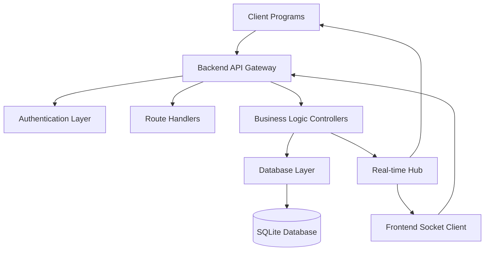
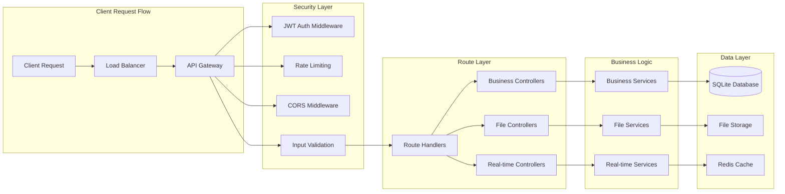
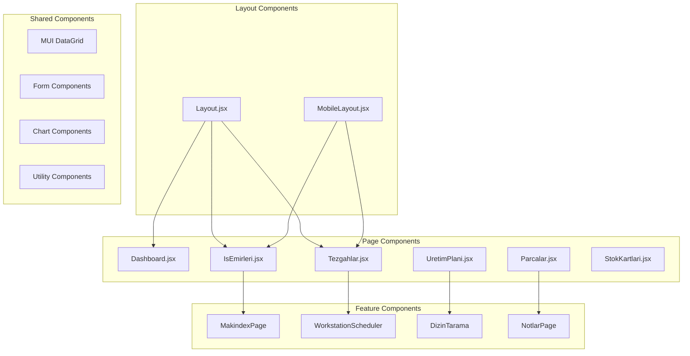
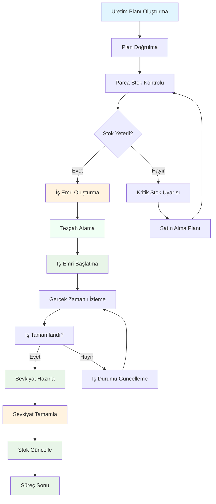
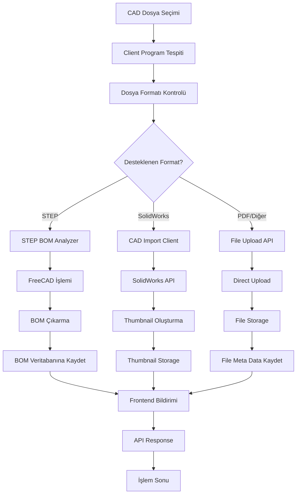
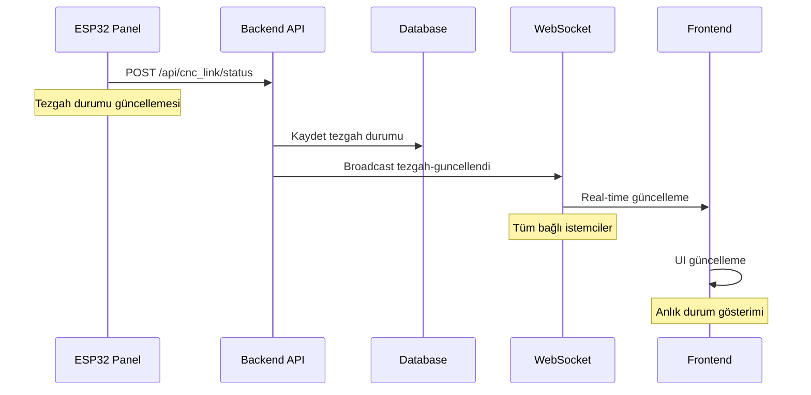
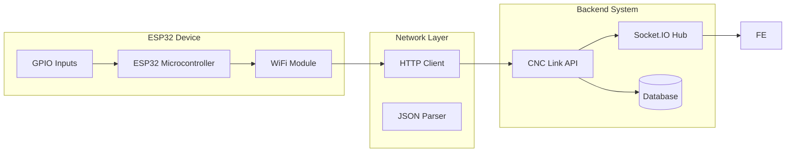
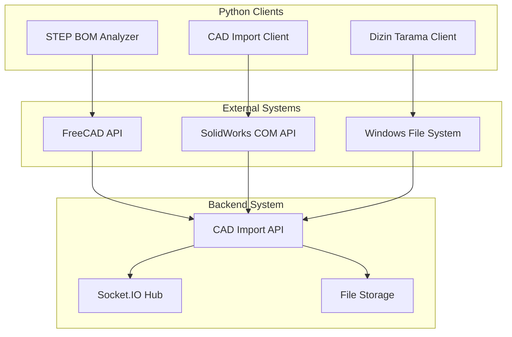

# 🏗️ ÜRTM Takip Sistemi - Kapsamlı Mimar ve Bağımlılık Analizi

## 📊 Analiz Genel Bakışı

Bu analiz, ÜRTM Takip Sistemi'nin tüm mimari yapısını, bileşenlerinin birbiriyle ilişkilerini ve sistemin karmaşıklığını ortaya koymak amacıyla hazırlanmıştır. Sistem, endüstriyel üretim takibi için geliştirilmiş full-stack bir çözümdür.

**Proje Büyüklüğü:**
- **Backend**: ~36,000 satır kod, 180+ dosya
- **Frontend**: ~88,000 satır kod, 255+ dosya
- **Client Programları**: ~20,000+ satır kod, 4 platform
- **API Endpoint'leri**: 60+ REST endpoint
- **Veritabanı**: 32 tablo, karmaşık ilişkiler

---

## 🎯 Sistem Mimarisi Genel Görünüm

### 📋 Dört Katmanlı Mimari

```
┌─────────────────────────────────────────────────────────────────────────────┐
│                          🖥️ CLIENT PROGRAMLARI                        │
├─────────────────────────────────────────────────────────────────────────────┤
│  ┌─────────────────┐  ┌──────────────────┐  ┌─────────────────────┐  ┌──────────────────┐     │
│  │   ESP32 CNC     │  │  STEP BOM        │  │   CAD Import      │  │  Dizin Tarama   │     │
│  │   Panel         │  │  Analyzer        │  │   Client          │  │  Client          │     │
│  │                 │  │                  │  │                   │  │                   │     │
│  │  Status: Real-  │  │  STEP Processing │  │  SolidWorks Auto    │  │  Directory Scan   │     │
│  │  Time Updates    │  │  & BOM Extraction │  │  & Thumbnail Gen.   │  │  & File Upload    │     │
│  └─────────────────┘  └──────────────────┘  └─────────────────────┘  └──────────────────┘     │
└─────────────────────────────────────────────────────────────────────────────┘
                                    │ HTTP/JSON & WebSocket
                                    ▼
┌─────────────────────────────────────────────────────────────────────────────┐
│                        🌐 WEB APPLICATION (Frontend + Backend)             │
├─────────────────────────────────────────────────────────────────────────────┤
│  ┌─────────────────────────────────────────────────────────────────────────┐ │
│  │                     Frontend (React + MUI)                                │ │
│  │  ┌─────────────────┐  ┌─────────────────┐  ┌─────────────────────┐      │ │
│  │  │  Dashboard      │  │  İş Emirleri    │  │  Üretim Planı      │      │ │
│  │  │  & Analytics   │  │  & Management   │  │  & Optimization   │      │ │
│  │  └─────────────────┘  └─────────────────┘  └─────────────────────┘      │ │
│  │  ┌───────────────────────────────────────────────────────────────────┐   │ │
│  │  │  State Management: Redux Toolkit                                   │   │ │
│  │  │  UI Framework: Material-UI + Custom Themes                     │   │ │
│  │  │  Device Detection: Mobile/Desktop Responsive Design              │   │ │
│  │  │  Real-time Updates: Socket.IO Client                               │   │ │
│  │  └───────────────────────────────────────────────────────────────────┘   │ │
│  └─────────────────────────────────────────────────────────────────────────┘ │
│                                    │ HTTP API + WebSocket
│                                    ▼
│  ┌─────────────────────────────────────────────────────────────────────────┐ │
│  │                     Backend (Node.js + Express)                           │ │
│  │  ┌─────────────────┐  ┌─────────────────┐  ┌─────────────────────┐      │ │
│  │  │  API Gateway    │  │  Business Logic  │  │  Real-time Hub     │      │ │
│  │  │  (60+ endpoints)│  │  (Controllers)   │  │  (Socket.IO)       │      │ │
│  │  └─────────────────┘  └─────────────────┘  └─────────────────────┘      │ │
│  │  ┌───────────────────────────────────────────────────────────────────┐   │ │
│  │  │  Security Layer: JWT Authentication + Rate Limiting               │   │ │
│  │  │  Data Validation: Joi Input Validation                              │   │ │
│  │  │  File Management: Multer Upload + Static File Serving           │   │ │
│  │  │  Logging: Winston Structured Logging                             │   │ │
│  │  └───────────────────────────────────────────────────────────────────┘   │ │
│  └─────────────────────────────────────────────────────────────────────────┘ │
└─────────────────────────────────────────────────────────────────────────────┘
                                    │
                                    ▼
┌─────────────────────────────────────────────────────────────────────────────┐
│                      🗄️ DATABASE LAYER (SQLite + Sequelize)                   │
│  ┌─────────────────┐  ┌─────────────────┐  ┌─────────────────────┐      │
│  │  Business Data   │  │  User Auth       │  │  File & Media       │      │
│  │  (İş Emirleri,  │  │  (Users, Tokens) │  │  (Uploads,        │      │
│  │  Parçalar, ...)  │  │                 │  │  Thumbnails)        │      │
│  └─────────────────┘  └─────────────────┘  └─────────────────────┘      │
│  ┌───────────────────────────────────────────────────────────────────┐   │
│  │  32 Tables Total • Complex Relationships • Migrations • Indexing  │   │
│  └───────────────────────────────────────────────────────────────────┘   │
└─────────────────────────────────────────────────────────────────────────────┘
```

---

## 🔗 Bileşenler Arası İlişkiler

### 📊 API Katmanı İlişkileri



### 🏭 Veritabanı İlişki Haritası

```mermaid
erDiagram
    USERS ||--o{ USER_SESSIONS } : has
    USERS ||--o{ API_KEYS } : uses
    USERS ||--o{ USER_PREFERENCES } : has

    IS_EMIRLERI ||--o{ IS_EMRI_DURUM } : has
    IS_EMIRLERI ||--o{ PARCA_KAYITLARI } : tracks
    IS_EMIRLERI ||--o{ ISELEM_KAYITLARI } : logs
    IS_EMIRLERI ||--o{ URETIM_PLANLARI } : from
    IS_EMIRLERI ||--o{ TEZGAHLAR } : assigned_to

    TEZGAHLAR ||--o{ TEZGAH_DURUM_LOG } : logs
    TEZGAHLAR ||--o{ MAKINALAR } : includes

    PARcalar ||--o{ PARCA_KAYITLARI } : affects
    PARcalar ||--o{ BOM_ITEMS } : included_in
    PARcalar ||--o{ SEVKIYAT_KALEMLERI } : included_in

    URETIM_PLANLARI ||--o{ URETIM_PLAN_DETAY } : has
    URETIM_PLANLARI ||--o{ MAKINA_GROUP_PARTS } : includes

    BOMS ||--o{ BOM_ITEMS } : contains
    BOMS ||--o{ MAKINA_GROUPS } : categorized_by

    SEVKIYAT ||--o{ SEVKIYAT_KALEMLERI } : contains
    SEVKIYAT ||--o{ SEVKIYAT_RESIMLERI } : has

    NOTLAR ||--o{ KATEGORILER } : categorized_by
    FASONLAR ||--o{ FASON_GRUPLARI } : belongs_to
```

---

## 🔌 API Endpoint Mimarisi

### 📡 API Gateway Yapısı



### 📱 Frontend Component Mimarisi



---

## 🔄 Veri Akış Şemaları

### 📊 Üretim Süreci Akışı



### 🔌 CAD Dosya İşleme Akışı



### 📡 Real-time İletişim Akışı



---

## 🖥️ Client Programları Entegrasyon Mimarisi

### 🔌 ESP32 CNC Panel Entegrasyonu



### 🔬 Python CAD Programları Entegrasyonu



---

## 📊 Etki Analizi Haritası

### 🔴 Kritik Etki Alanları

| Değişiklik Alanı | Etkilen Bileşenler | Etki Seviyesi | Açıklama |
|-------------------|---------------------|---------------|----------|
| **Veritabanı Şeması** | Tüm sistem | 🔴 Kritik | Tablo ilişkileri değişirse tüm API'ler, frontend ve client'lar etkilenir |
| **Core API'ler** | Frontend + Client'lar | 🔴 Kritik | `/api/is-emirleri` gibi ana endpoint'ler tüm UI'leri etkiler |
| **Socket.IO Konfigurasyonu** | Real-time özellikler | 🔴 Kritik | Anlık güncellemeler bozulur |
| **Authentication Sistemi** | Tüm protected alanlar | 🔴 Kritik | Güvenlik açığı oluşur |

### 🟡 Orta Etki Alanları

| Değişiklik Alanı | Etkilen Bileşenler | Etki Seviyesi | Açıklama |
|-------------------|---------------------|---------------|----------|
| **Redux Store Yapısı** | Frontend state yönetimi | 🟡 Orta | State management bozulur |
| **Business Logic Katmanı** | API controller'ları | 🟡 Orta | İş kuralları etkilenir |
| **File Upload Sistemi** | CAD entegrasyonu | 🟡 Orta | Dosya işlemleri engellenir |
| **Database Modelleri** | API katmanı | 🟡 Orta | Veri işlemleri hata verir |

### 🟢 Düşük Etki Alanları

| Değişiklik Alanı | Etkilen Bileşenler | Etki Seviyesi | Açıklama |
|-------------------|---------------------|---------------|----------|
| **UI Component'leri** | Spesifik sayfalar | 🟢 Düşük | Sadece o sayfa etkilenir |
| **CSS Theme'leri** | Görünüm | 🟢 Düşük | Sadece görsel etkilenir |
| **Log Level'ları** | Debugging | 🟢 Düşük | Sadece geliştirme etkilenir |
| **Validation Kuralları** | Input doğrulma | 🟢 Düşük | Sadece veri kalitesini etkiler |

---

## 🎯 Değişiklik Etki Matrisi

### 📋 Sistem Bileşeni Değişiklikleri ve Etkileri

| Bileşen | Değişiklik Türü | Etkilen Alanlar | Etki Süresi | Geriye Dönüş | Test Gerekliliği |
|---------|----------------|----------------|--------------|-------------|-------------------|
| **Database Schema** | Tablo yapısı değişikliği | Tüm sistem | 1-2 gün | Migration gerekir | Migration test |
| **Core API** | Endpoint değişikliği | Frontend + Client'lar | 1-3 gün | API versiyonlama | Integration test |
| **Socket.IO** | Event yapısı değişikliği | Real-time özellikler | 2-5 gün | Event uyumsuzluğu | Real-time test |
| **Redux Store** | State yapısı değişikliği | Frontend | 1-2 hafta | State reset | Regression test |
| **Frontend Routes** | URL yapısı değişikliği | Navigation | 1 hafta | Link bozulur | Navigation test |
| **Client Protocol** | İletişim protokolü | Client programları | 2-4 hafta | Erişim kesilir | Integration test |

---

## 🚨 Risk Analizi ve Öneriler

### 🔴 Yüksek Risk Alanları

1. **Veritabanı Şeması Değişiklikleri**
   - **Risk**: Tüm sistem çökme riski
   - **Önlem**: Version kontrolü + migration planı
   - **Test**: Geriye dönüş senaryoları

2. **Core API'lerde Breaking Changes**
   - **Risk**: Tüm kullanıcı etkilenir
   - **Önlem**: API versioning + backward compatibility
   - **Test**: Entegrasyon test paketi

3. **Authentication Sistemi Değişiklikleri**
   - **Risk**: Güvenlik açığı
   - **Önlem**: Kademeli geçiş + güvenlik denetimi
   - **Test**: Penetration testing

### 🟡 Orta Risk Alanları

1. **Redux Store Restructuring**
   - **Risk**: State management bozulması
   - **Önlem**: Incremental migration + state persistence
   - **Test**: State consistency testleri

2. **File Upload Sistemi Değişiklikleri**
   - **Risk**: CAD entegrasyonu bozulması
   - **Önlem**: Backward compatibility + gradual migration
   - **Test**: File processing testleri

### 🟢 Düşük Risk Alanları

1. **UI Component Değişiklikleri**
   - **Risk**: Sadece görsel etkiler
   - **Önlem**: Component versioning + A/B test
   - **Test**: Visual regression testleri

2. **Log Format Değişiklikleri**
   - **Risk**: Monitoring zorluğu
   - **Önlem**: Log parser güncellemesi
   - **Test**: Log parsing testleri

---

## 📋 Kapsam ve Bakım Stratejileri

### 🔍 İzleme ve Gözlem

1. **Real-time Monitoring**
   - API response süreleri
   - Database query performansı
   - WebSocket bağlantı durumu

2. **Change Impact Tracking**
   - Code dependency analizi
   - API usage istatistikleri
   - Error rate monitoring

3. **Performance Monitoring**
   - Bundle size analizleri
   - Memory kullanımı
   - CPU utilization

### 🛠️ Değişiklik Yönetimi

1. **Pre-deployment Checklist**
   - Etki analizi tamamlanması
   - Test senaryoları çalıştırılması
   - Rollback planı hazırlanması

2. **Canary Deployment**
   - Kritik olmayan kullanıcılar için test
   - Performans ve stabilite izleme
   - Kademeli yayına planı

3. **Feature Flags**
   - Yeni özellikleri kademeli açma
   - Anında devre edebilme yeteneği
   - A/B test desteği

---

## 🎯 Sonuç ve Öneriler

### 📊 Proje Karmaşıklığı Değerlendirmesi

**Mimari Skoru**: 8/10 (Çok Karmaşık)
- ✅ **Fazla Katmanlı**: 4 ana katman
- ✅ **Fazla Bağımlı**: 60+ API, 32 veritabanı tablosu
- ✅ **Farklı Platformlar**: Web, mobil, embedded, desktop
- ⚠️ **Teknik Borç**: Yüksek karmaşıklık, bakım zorluğu yüksek

### 🔧 Stratejik Öneriler

1. **Dokümantasyon Güncellemesi**
   - Bu analiz raporunu proje dokümantasyonuna ekle
   - Etki matrisini sürekli güncelle
   - Değişiklik prosedürlerini standardize et

2. **İmpact Analysis Tool'u Geliştirme**
   - Otomatik bağımlılık analizi tool'u oluştur
   - Code dependency mapping yap
   - Risk skorlama sistemi kur

3. **Change Management Süreci**
   - Değişiklik talep formu standardize et
   - Etki analiz zorunlu hale getir
   - Onay mekanizması kur

### 📈 Uzun Vadeli Planlama

1. **Kısa Vadeli (1-3 ay)**
   - Etki analiz otomasyonu
   - Risk skorlama sistemi
   - Change management süreçleri

2. **Orta Vadeli (3-12 ay)**
   - Mimari refactoring
   - Teknik borç yönetimi
   - Bakım otomasyonları

3. **Uzun Vadeli (1+ yıl)**
   - Sistem modernizasyonu
   - Platform geçişleri
   - Enterprise özellikleri

---

## 🔗 Referans ve Bağlantılar

### 📚 İlgili Dokümanlar
- [📖 Gen Bakış](docs/README.md) - Sistem genel tanıtımı
- [📡 API Dokümantasyonu](docs/API_Documentation.md) - 60+ API endpoint'i
- [🎨 Frontend Component'leri](docs/Frontend_Component_Documentation.md) - 255+ React component'i
- [🖥️ Client Programları](docs/Client_Programs_Documentation.md) - 4 platform client programı

### 🔗 Proje Dosya Yapısı
```
URTMtakip/
├── backend/                 # Backend kodu (Node.js)
├── frontend/                # Frontend kodu (React)
├── CNC_panel/              # ESP32 programı
├── STEP_BOM_Analyzer/      # Python STEP analizi
├── CAD_Import_Client/      # Python CAD istemcileri
├── DizinTarama_Client/     # Python dizin tarayıcı
└── docs/                   # Dokümantasyon (7 ana doküman)
```

---

**Önemli Not:** Bu analiz raporu, projedeki değişikliklerin etkilerini anlamak için bir referans dokümanı olarak kullanılmalıdır. Her değişiklik yapılmadan önce bu raporu inceleyerek potansiyel etkileri değerlendirilmelidir.

*Rapor Tarihi: 2024-11-02 | Analiz Edilen Proje: ÜRTM Takip Sistemi | Kapsam: Tam Sistem Mimarisi*