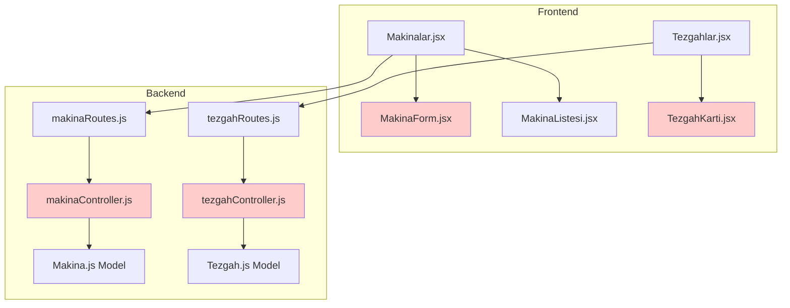
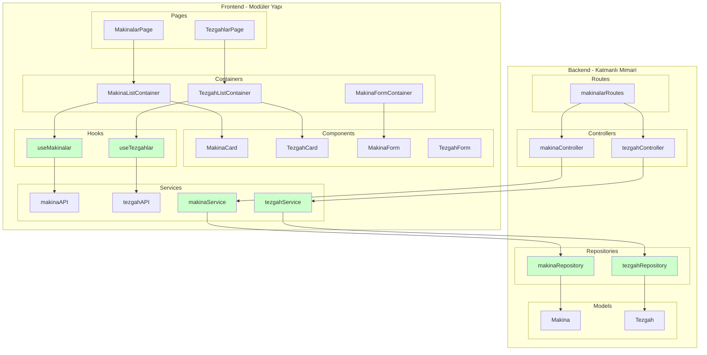
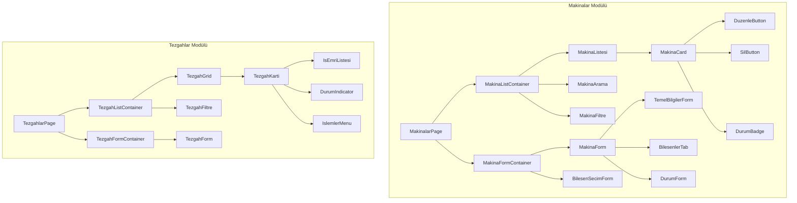
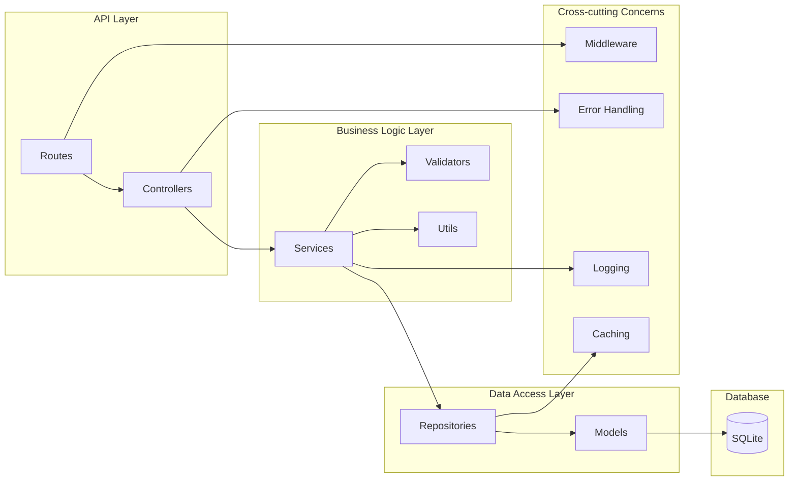
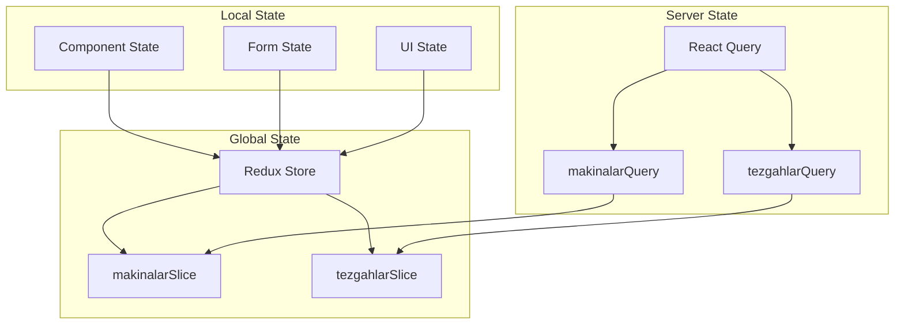
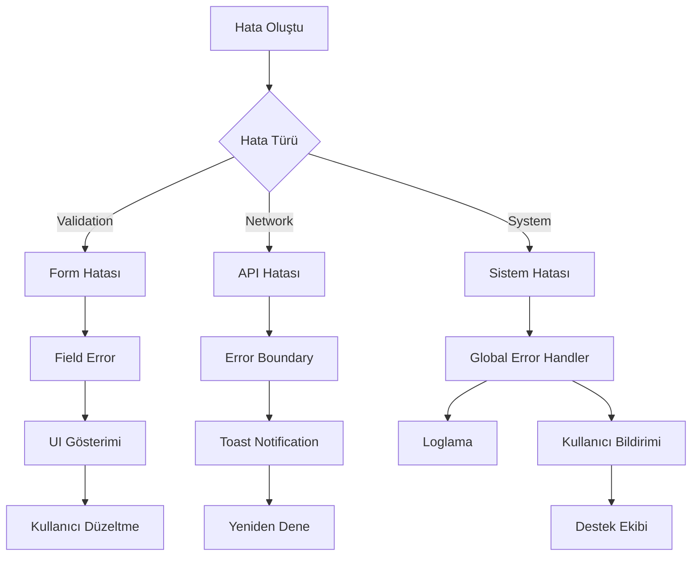
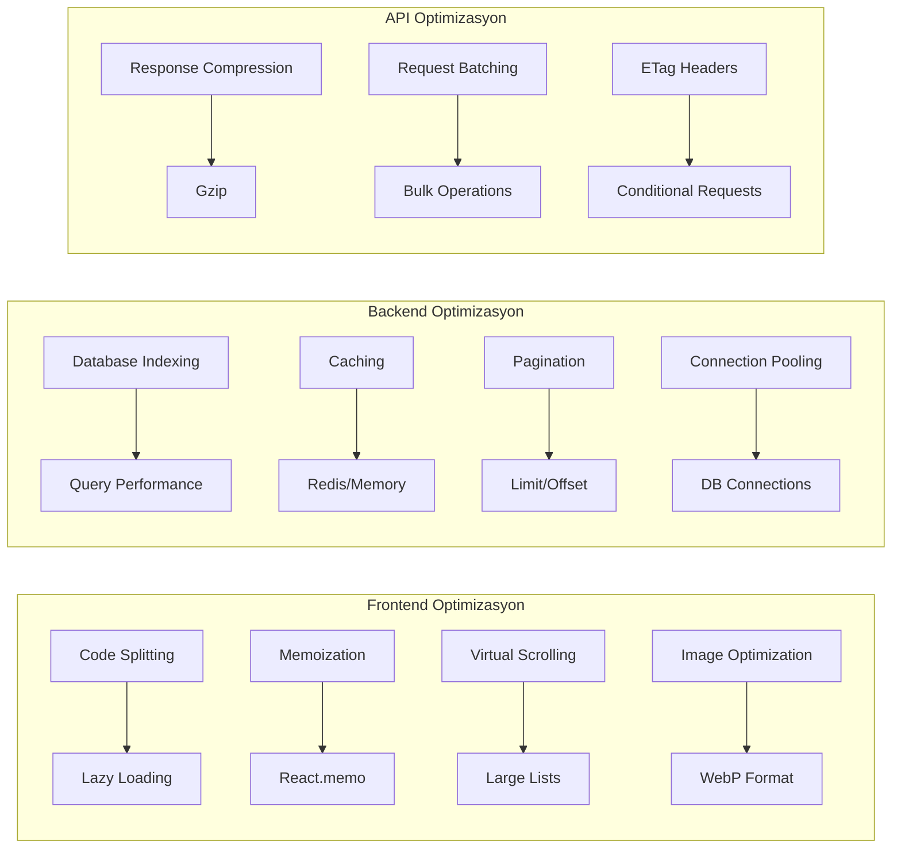

# Makinalar Modülü Mimari Diyagramları

## 1. Mevcut Mimari vs Yeni Mimari

### 1.1. Mevcut Mimari



### 1.2. Yeni Modüler Mimari



## 2. Veri Akış Diyagramı

```mermaid
sequenceDiagram
    participant U as User
    participant P as Page
    participant C as Container
    participant H as Hook
    participant S as Service
    participant API as API
    participant Ctrl as Controller
    participantSvc as Service
    participant Repo as Repository
    participant DB as Database
    
    U->>P: Makinaları listele
    P->>C: Veri iste
    C->>H: useMakinalar()
    H->>S: makinaAPI.getAll()
    S->>API: GET /api/makinalar
    API->>Ctrl: makinaController.list()
    Ctrl->>Svc: makinaService.getAll()
    Svc->>Repo: makinaRepository.findAll()
    Repo->>DB: SELECT * FROM makinalar
    DB-->>Repo: Makina verileri
    Repo-->>Svc: İşlenmiş veriler
    Svc-->>Ctrl: Response
    Ctrl-->>API: JSON Response
    API-->>S: Veriler
    S-->>H: Normalized veri
    H-->>C: State güncelleme
    C-->>P: Render
    P-->>U: UI göster
```

## 3. Bileşen Hiyerarşisi



## 4. Backend Katmanları



## 5. State Management Akışı



## 6. Hata Yönetimi Akışı



## 7. Optimizasyon Stratejileri



## 8. Test Stratejisi

```mermaid
graph TB
    subgraph "Frontend Tests"
        A[Unit Tests] --> B[Component Tests]
        A --> C[Hook Tests]
        D[Integration Tests] --> E[API Integration]
        D --> F[State Management]
        G[E2E Tests] --> H[User Workflows]
    end
    
    subgraph "Backend Tests"
        I[Unit Tests] --> J[Service Tests]
        I --> K[Repository Tests]
        L[Integration Tests] --> M[API Tests]
        L --> N[Database Tests]
        O[Contract Tests] --> P[API Contracts]
    end
    
    subgraph "Test Tools"
        Q[Jest] --> R[Frontend Unit]
        S[React Testing Library] --> T[Component Tests]
        U[Supertest] --> V[API Tests]
        W[SQLite Memory] --> X[DB Tests]
    end