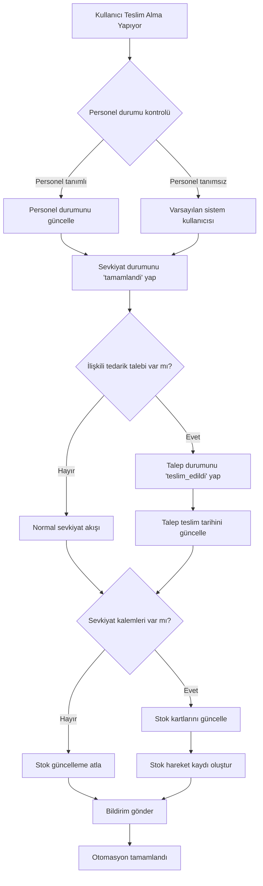

# Sevkiyat Teslim Alma Otomasyonu - Veri Akış Diagramı ve Implementasyon Planı

## 1. Mevcut Veri Modeli Analizi

### Sevkiyat Tablosu (sevkiyatlar)
- **id**: Primary key
- **sevkiyat_no**: Unique sevkiyat numarası
- **durum**: ENUM('beklemede', 'yolda', 'tamamlandi')
- **tarih**: Sevkiyat tarihi
- **firma_id**: Firma relation
- **lokasyon_id**: Lokasyon relation
- **nereden_lokasyon_id**: Başlangıç lokasyonu
- **nereye_lokasyon_id**: Hedef lokasyon
- **tedarik_talebi_id**: Tedarik talebi relation (nullable)
- **olusturan_kullanici**: Oluşturan kullanıcı
- **aciklama**: Açıklama

### SevkiyatKalem Tablosu (sevkiyat_kalemleri)
- **id**: Primary key
- **sevkiyat_id**: Sevkiyat foreign key
- **kalem_tipi**: ENUM('stok_karti', 'parca')
- **stok_karti_id**: Stok kartı relation (nullable)
- **parca_kodu**: Parça kodu (nullable)
- **miktar**: Miktar (DECIMAL)
- **resimler**: Resim listesi (JSON)

### TedarikTalebi Tablosu (tedarik_talepleri)
- **id**: Primary key
- **durum**: ENUM('beklemede', 'onaylandi', 'reddedildi', 'sipariste', 'teslim_edildi')
- **talep_kodu**: Otomatik talep kodu
- **kaynak_tipi**: Talep kaynağı ('is_emri', 'parca', 'stok_karti', 'manuel')
- **firma_id**: Firma relation
- **teslim_tarihi**: Teslim tarihi

### Personel Modeli
- **id**: Primary key
- **personel_adi**: Personel adı
- **vardiya_id**: Vardiya relation
- **aktif**: Aktif durumu (boolean)

## 2. Mevcut Teslim Alma Akışı

### Frontend Formları
- **SevkiyatForm.jsx**: Sevkiyat oluşturma/düzenleme formu
- **SevkiyatResimModal.jsx**: Resim yönetimi modalı
- **Mobile versiyonlar**: Mobil uyumlu formlar

### API Endpoint'ler
- **POST /api/sevkiyat**: Yeni sevkiyat oluşturma
- **PUT /api/sevkiyat/:id**: Sevkiyat güncelleme
- **POST /api/sevkiyat/:id/tamamla**: Sevkiyat tamamlama
- **PUT /api/sevkiyat/:id/durum**: Durum güncelleme

### Mevcut Durum Güncelleme Mantığı
```javascript
// Sevkiyat tamamlama endpoint'i (/api/sevkiyat/:id/tamamla)
1. Sevkiyat durumunu 'tamamlandi' yap
2. İlişkili tedarik talebi varsa:
   - Talep durumunu 'teslim_edildi' güncelle
   - Teslim tarihini güncelle
3. Sevkiyat kalemleri için:
   - Stok kartlarını güncelle (miktar artışı)
   - Stok hareket kaydı oluştur
```

## 3. Önerilen Otomasyon Akışı

### Senaryo: Sevkiyat Teslim Alındığında



## 4. Gerekli API Endpoint'ler

### 4.1. Sevkiyat Teslim Alma Endpoint'i
```javascript
POST /api/sevkiyat/:id/teslim-al
{
  "teslim_alan_personel_id": number,     // Teslim alan personel ID
  "teslim_tarihi": datetime,             // Teslim tarihi (optional, default: now)
  "irsaliye_no": string,                 // İrsaliye numarası (optional)
  "notlar": string,                      // Teslim notları (optional)
  "resimler": string[]                   // Teslim resimleri (optional)
}
```

### 4.2. Personel Durum Güncelleme Endpoint'i
```javascript
PUT /api/personel/:id/durum
{
  "durum": "teslim_alimda" | "müsait" | "meşgul",
  "not": string
}
```

### 4.3. Talep Otomatik Güncelleme Service
```javascript
// Backend service fonksiyonu
async function otomatikTalepGuncelle(sevkiyatId, teslimBilgileri) {
  // 1. Sevkiyatı bul
  // 2. İlişkili tedarik talebi varsa güncelle
  // 3. Stok kartlarını güncelle
  // 4. Hareket kayıtları oluştur
  // 5. Bildirimleri gönder
}
```

## 5. Veri Tabanı Değişiklikleri

### 5.1. Yeni Tablolar

#### personel_durum_log
```sql
CREATE TABLE personel_durum_log (
  id INTEGER PRIMARY KEY AUTOINCREMENT,
  personel_id INTEGER NOT NULL,
  eski_durum VARCHAR(50),
  yeni_durum VARCHAR(50) NOT NULL,
  aciklama TEXT,
  degisiklik_tarihi DATETIME DEFAULT CURRENT_TIMESTAMP,
  degistiren_kullanici VARCHAR(100),
  FOREIGN KEY (personel_id) REFERENCES personeller(id)
);
```

#### sevkiyat_teslim_bilgileri
```sql
CREATE TABLE sevkiyat_teslim_bilgileri (
  id INTEGER PRIMARY KEY AUTOINCREMENT,
  sevkiyat_id INTEGER NOT NULL UNIQUE,
  teslim_alan_personel_id INTEGER,
  teslim_tarihi DATETIME,
  irsaliye_no VARCHAR(100),
  teslim_notlari TEXT,
  olusturma_tarihi DATETIME DEFAULT CURRENT_TIMESTAMP,
  guncelleme_tarihi DATETIME,
  FOREIGN KEY (sevkiyat_id) REFERENCES sevkiyatlar(id),
  FOREIGN KEY (teslim_alan_personel_id) REFERENCES personeller(id)
);
```

### 5.2. Mevcut Tablolara Ek Alanlar

#### personeller tablosu
```sql
ALTER TABLE personeller ADD COLUMN mevcut_durum VARCHAR(50) DEFAULT 'müsait';
ALTER TABLE personeller ADD COLUMN son_guncelleme DATETIME;
```

## 6. Frontend Değişiklikleri

### 6.1. Yeni Bileşenler

#### TeslimAlmaForm.jsx
- Personel seçimi
- İrsaliye bilgileri
- Resim yükleme
- Onay mekanizması

#### PersonelDurumSelector.jsx
- Personel durum görüntüleme
- Hızlı durum güncelleme
- Aktif/passif toggle

### 6.2. Mevcut Bileşenlere Eklemeler

#### SevkiyatListesi.jsx
- "Teslim Al" butonu
- Durum bazlı filtreleme
- Teslim bilgileri gösterimi

## 7. Implementasyon Sırası

### Phase 1: Backend (Öncelikli)
1. **Veritabanı Migrasyonları**
   - Yeni tabloları oluştur
   - Mevcut tablolara alan ekle

2. **Service Katmanı**
   - ShipmentAutomationService geliştir
   - PersonelDurumService oluştur
   - StokHareketService entegrasyonu

3. **API Endpoint'ler**
   - POST /api/sevkiyat/:id/teslim-al
   - PUT /api/personel/:id/durum
   - GET /api/personel/durum-raporu

### Phase 2: Frontend
1. **Temel Bileşenler**
   - TeslimAlmaForm component'i
   - Personel durumu yönetimi

2. **Mevcut Bileşenleri Güncelle**
   - Sevkiyat listesi entegrasyonu
   - Mobile uyumluluk

3. **User Experience**
   - Loading states
   - Error handling
   - Success bildirimleri

### Phase 3: Optimizasyon
1. **Bildirim Sistemi**
   - Real-time güncellemeler
   - E-posta bildirimleri

2. **Raporlama**
   - Teslim alma raporları
   - Personel verimlilik analizi

3. **Mobile Uygulama**
   - QR kod okuyucu
   - Hızlı teslim alma

## 8. Hata Yönetimi

### 8.1. Olası Hata Senaryoları
1. **Personel bulunamadı**: Varsayılan sistem kullanıcısı
2. **Stok güncellenemedi**: Log tut, manuel işlem için uyar
3. **Tedarik talebi güncellenemedi**: Retry mekanizması
4. **Resim yükleme hatası**: Teslimat işlemine devam et

### 8.2. Validasyon Kuralları
- Sevkiyat durumu 'tamamlandi' değilse teslim alınamaz
- Personel aktif değilse uyarı göster
- İrsaliye numarası unique olmalı
- Teslim tarihi bugünden sonraki olamaz

## 9. Test Senaryoları

### 9.1. Happy Path
1. Personel seç
2. Sevkiyatı teslim al
3. Stok güncellendiğini kontrol et
4. Talep durumunu kontrol et
5. Bildirim geldiğini doğrula

### 9.2. Edge Cases
1. Personel atanmamış sevkiyat
2. İlişkili talep olmayan sevkiyat
3. Stok kartı bulunmayan kalem
4. Çoklu kalem teslimatı

## 10. Deployment

### 10.1. Veritabanı
- Migration script'i hazırla
- Test verisi ekle
- Backup stratejisi

### 10.2. Backend
- Yeni endpoint'leri test et
- Service katmanını validate et
- Log mekanizmasını kontrol et

### 10.3. Frontend
- Component testleri
- API entegrasyon testleri
- User acceptance testleri