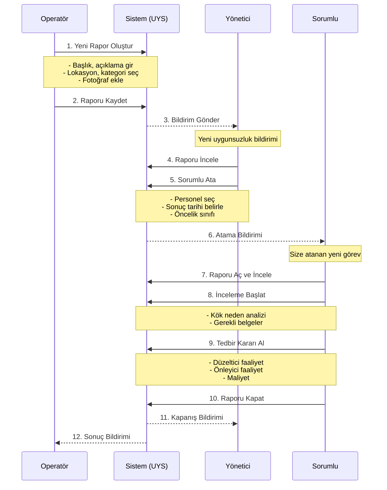
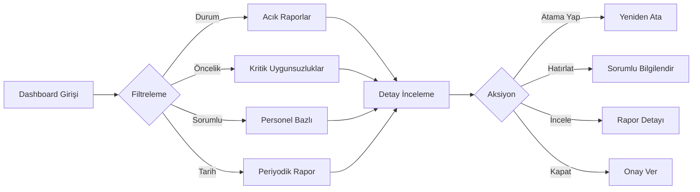
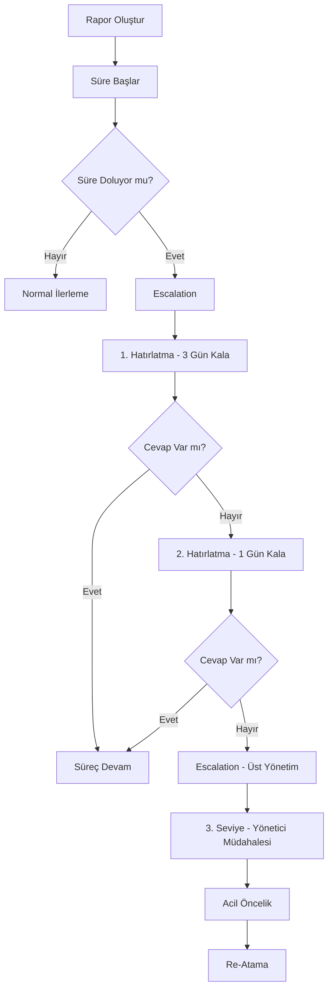
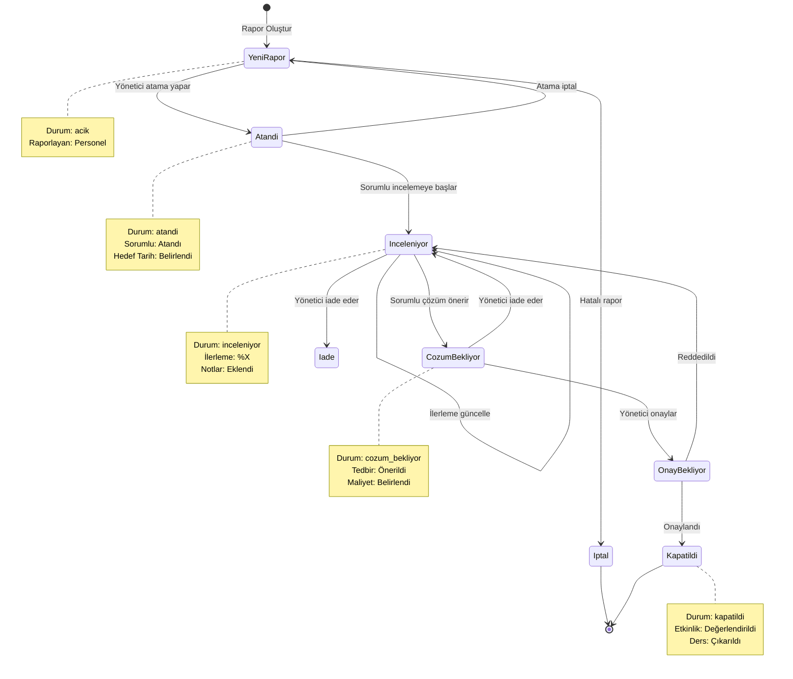
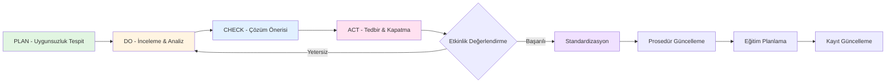

# Uygunsuzluk Raporları Yönetim Sistemi (UYS)

> **Proje**: ÜRTM Takip - Üretim Takip Sistemi
> **Modül**: Uygunsuzluk Raporları Yönetimi
> **Sürüm**: 1.0
> **Tarih**: 2026-01-28

---

## 📋 İçindekiler

1. [Sistem Tanımı](#sistem-tanımı)
2. [Kullanım Senaryoları](#kullanım-senaryoları)
3. [Sistem Özellikleri](#sistem-özellikleri)
4. [İş Akış Şemaları](#iş-akış-şemaları)
5. [Veri Yapısı](#veri-yapısı)
6. [Entegrasyonlar](#entegrasyonlar)

---

## Sistem Tanımı

### Nedir?

Uygunsuzluk Raporları Yönetim Sistemi (UYS), işletme içerisinde personeller tarafından tespit edilen uygunsuzlukların (iş güvenliği, kalite, çevre, prosedür ihlali vb.) kayıt altına alınması, sorumlu kişilere atanması, incelenmesi ve sonuçlandırılmasını sağlayan **PDCA (Plan-Do-Check-Act)** döngüsüne dayalı bir yönetim sistemi modülüdür.

### Amaç

1. **Gözlem Uygulaması**: Personelin sahadaki uygunsuzlukları bildirmesi
2. **Sorumluluk Ataması**: Her uygunsuzluk için yetkilendirilmiş sorumlu belirleme
3. **Takip Mekanizması**: Açılan uygunsuzlukların kapatılmasını garantiye altına alma
4. **Kayıt Altına Alma**: Tüm süreç dokumentasyonu ve geçmişe dönük sorgulama
5. **İstatistik ve Raporlama**: Management review için veri analitiği

### Kapsam

| Alan | Açıklama |
|------|----------|
| **İş Güvenliği** | Tehlikeli durumlar, EKK ihlalleri, KKD eksiklikleri |
| **Kalite** | Ürün hataları, prosedür sapmaları, spesifikasyon uyuşmazlıkları |
| **Çevre** | Atık yönetimi, emisyon, enerji tüketimi uygunsuzlukları |
| **Süreç** | Prosedür ihlalleri, verimlilik kayıpları, ekipman arızaları |
| **Diğer** | Personel şikayetleri, öneriler, iyileştirme alanları |

---

## Kullanım Senaryoları

### 🔄 Temel İş Akışı

```
┌─────────────────────────────────────────────────────────────────────────────┐
│                    UYGUNSUZLUK YAŞAM DÖNGÜSÜ                              │
├─────────────────────────────────────────────────────────────────────────────┤
│                                                                             │
│  ┌─────────┐    ┌──────────┐    ┌───────────┐    ┌───────────┐            │
│  │TESPİT   │───►│ATAMA     │───►│İNCELEME  │───►│ÇÖZÜM/KAPAT│            │
│  │         │    │          │    │           │    │           │            │
│  │Personel │    │Yönetici  │    │Sorumlu   │    │Sorumlu   │            │
│  │         │    │          │    │           │    │           │            │
│  └─────────┘    └──────────┘    └───────────┘    └───────────┘            │
│       │              │                │                │                   │
│       ▼              ▼                ▼                ▼                   │
│   Rapor Oluştur   Atama Yap     İnceleme Başla   Tedbir Kararı             │
│   Fotoğraf Ekle   Öncelik Belir  Süreç Başlat    Faaliyet Planla           │
│   Kategori Seç   Bildir Gönder  Gerekirse İtir   Kapat & Onayla           │
│                                                                             │
└─────────────────────────────────────────────────────────────────────────────┘
```

### 📱 Senaryo 1: Operatör Uygunsuzluk Bildirimi



### 📊 Senaryo 2: Yönetici Dashboard İzleme



### 🔔 Senaryo 3: Hatırlatma ve Escalation



---

## Sistem Özellikleri

### 🎯 Çekirdek Özellikler

#### 1. Rapor Oluşturma

| Özellik | Açıklama |
|---------|----------|
| **Çoklu Resim Yükleme** | Maksimum 10 adet fotoğraf |
| **Konum Etiketleme** | Tezgah, departman, atölye seçimi |
| **Kategori Sınıflandırma** | İş Güvenliği, Kalite, Çevre, Süreç, Diğer |
| **Öncelik Seviyesi** | Düşük, Orta, Yüksek, Acil |
| **Aciklama Alanı** | Detaylı açıklama (maks. 2000 karakter) |
| **Otomatik Tarih** | Tespit tarihi ve saat |
| **Raporlayan Personel** | Otomatik olarak oturum açan personel |

#### 2. Atama ve Sorumluluk

| Özellik | Açıklama |
|---------|----------|
| **Sorumlu Atama** | Tek veya çoklu sorumlu atama |
| **Atama Tarihi** | Atama yapılma tarihi |
| **Hedef Tarih** | İstenilen sonuç tarihi |
| **Atama Notu** | Atama nedeni ve beklenti |
| **Bildirim Gönderme** | E-posta/SMS bildirimi |
| **Atama Geçmişi** | Kim kime ne zaman atanmış |

#### 3. İnceleme ve Takip

| Özellik | Açıklama |
|---------|----------|
| **Durum Takibi** | Açık → Atandı → İnceleniyor → Çözüldü → Kapatıldı |
| **İnceleme Notları** | Sorumlu notları (zaman damgalı) |
| **İlerleme Güncelleme** | Yüzde tamamlanma oranı |
| **Ek Dosya Yükleme** | İnceleme sırasında belge ekleme |
| **Kök Neden Analizi** | 5N veya Fishbone diagram |
| **İtir Mekanizması** | Çözüm onaylanmadıysa iade |

#### 4. Çözüm ve Kapatma

| Özellik | Açıklama |
|---------|----------|
| **Tedbir Türü** | Düzeltici, Önleyici, Her İkisi |
| **Faaliyet Planı** | Yapılacak işlemler listesi |
| **Maliyet** | Tedbir maliyeti (TL) |
| **Etkinlik Değerlendirmesi** | 1-5 arası puan |
| **Kapanış Onayı** | Yönetici onayı ile kapatma |
| **Ders Çıkarımı** | Tekrar önleme için notlar |

#### 5. İstatistik ve Raporlama

| Özellik | Açıklama |
|---------|----------|
| **Dashboard** | Özet istatistikler ve grafikler |
| **Personel Bazlı** | En aktif raporlayanlar |
| **Kategori Dağılımı** | Tür bazlı kırılım |
| **Trend Analizi** | Aylık/yıllık değişim |
| **Ortalama Kapanma Süresi** | MTTR (Mean Time To Resolve) |
| **Tekrar Eden Uygunsuzluklar** | Aynı konu tekrar bildirildi mi |

### 🔔 Bildirim Sistemi

| Durum | Bildirim Türü | Alıcı |
|-------|---------------|-------|
| Yeni rapor oluşturuldu | E-posta | Yönetici |
| Sorumlu atandı | E-posta/SMS | Sorumlu |
| Sonuç tarihi yaklaşıyor | Hatırlatma | Sorumlu + Yönetici |
| Süre doldu | Escalation | Üst yönetim |
| Rapor kapatıldı | Bilgilendirme | Raporlayan + Sorumlu |

### 🔍 Arama ve Filtreleme

| Filtre | Seçenekler |
|--------|-----------|
| Durum | Tümü, Açık, Atandı, İnceleniyor, Çözüldü, Kapatıldı |
| Kategori | Tümü, İş Güvenliği, Kalite, Çevre, Süreç, Diğer |
| Öncelik | Tümü, Düşük, Orta, Yüksek, Acil |
| Sorumlu | Tüm personel listesi |
| Tarih | Son 7 gün, Son 30 gün, Son 90 gün, Özel aralık |
| Durum | Açık, Kapalı, Tümü |

---

## İş Akış Şemaları

### 📊 Durum Geçişi Diyagramı



### 🔄 PDCA Döngüsü Entegrasyonu



---

## Veri Yapısı

### 📊 Veritabanı Tablo Tasarımı

#### Ana Tablo: `uygunsuzluk_raporlari`

| Alan | Tip | Zorunlu | Açıklama |
|------|-----|---------|----------|
| `id` | INTEGER | ✅ | Primary Key, Auto Increment |
| `rapor_no` | STRING | ✅ | Benzersiz rapor numarası (UYS-2026-0001) |
| `baslik` | STRING | ✅ | Rapor başlığı (1-200 karakter) |
| `aciklama` | TEXT | ✅ | Detaylı açıklama (maks. 2000) |
| `kategori` | STRING | ✅ | is_guvenligi, kalite, cevre, surec, diger |
| `oncelik` | STRING | ✅ | dusuk, orta, yuksek, acil |
| `lokasyon` | STRING | ❌ | Tezgah, departman, atölye |
| `tezgah_id` | INTEGER | ❌ | İlişkili tezgah (FK) |
| `durum` | STRING | ✅ | acik, atandi, inceleniyor, cozum_bekliyor, kapatildi, iptal |
| `raporlayan_id` | INTEGER | ✅ | Raporlayan personel (FK) |
| `sorumlu_id` | INTEGER | ❌ | Atanan sorumlu (FK) |
| `atama_tarihi` | DATE | ❌ | Atama tarihi |
| `hedef_tarih` | DATE | ❌ | Hedef sonuç tarihi |
| `tespit_tarihi` | DATE | ✅ | Tespit tarihi |
| `kapanma_tarihi` | DATE | ❌ | Kapanış tarihi |
| `maliyet` | DECIMAL | ❌ | Tedbir maliyeti |
| `etkinlik_puani` | INTEGER | ❌ | Etkinlik (1-5) |
| `resim_yollar` | JSON | ❌ | Fotoğraf dizisi |
| `aktif` | BOOLEAN | ✅ | Aktif/Pasif |
| `createdAt` | DATE | ✅ | Oluşturma tarihi |
| `updatedAt` | DATE | ✅ | Güncelleme tarihi |

#### İlişkili Tablolar

**1. `uygunsuzluk_notlari`** - İnceleme notları
| Alan | Tip | Açıklama |
|------|-----|----------|
| `id` | INTEGER | PK |
| `rapor_id` | INTEGER | FK → uygunsuzluk_raporlari.id |
| `yazan_id` | INTEGER | FK → personel.id |
| `not` | TEXT | Not içeriği |
| `createdAt` | DATE | Oluşturma tarihi |

**2. `uygunsuzluk_tedbirleri`** - Alınan tedbirler
| Alan | Tip | Açıklama |
|------|-----|----------|
| `id` | INTEGER | PK |
| `rapor_id` | INTEGER | FK → uygunsuzluk_raporlari.id |
| `tedbir_turu` | STRING | duzeltici, onleyici |
| `aciklama` | TEXT | Tedbir açıklaması |
| `durum` | STRING | planlandı, devam_ediyor, tamamlandi |
| `createdAt` | DATE | Oluşturma tarihi |

**3. `uygunsuzluk_dosyalari`** - Ek dosyalar
| Alan | Tip | Açıklama |
|------|-----|----------|
| `id` | INTEGER | PK |
| `rapor_id` | INTEGER | FK → uygunsuzluk_raporlari.id |
| `dosya_adi` | STRING | Orijinal dosya adı |
| `dosya_yolu` | STRING | Sunucudaki yol |
| `dosya_tipi` | STRING | resim, pdf, doc, diger |
| `yukleyen_id` | INTEGER | FK → personel.id |
| `createdAt` | DATE | Yükleme tarihi |

### 🔗 İlişki Diagramı

```
┌─────────────────────┐
│   Personel          │
│  - id               │┌──────────────────────────────────┐
│  - personel_adi     ││                                  │
│  - sicil_no         │└───────────────┬──────────────────┤
└─────────────────────┘                │
         │                                │
         │ (raporlayan)                   │ (sorumlu)
         │                                │
         ▼                                ▼
┌─────────────────────────────────────────────────────────┐
│            uygunsuzluk_raporlari                        │
│  ─────────────────────────────────────────────────────  │
│  id (PK)                                                 │
│  rapor_no (UNIQUE)                                       │
│  baslik                                                 │
│  aciklama                                              │
│  kategori                                              │
│  oncelik                                               │
│  durum                                                 │
│  tespit_tarihi                                         │
│  hedef_tarih                                           │
│  maliyet                                                │
│  ...                                                    │
└─────────────────────────────────────────────────────────┘
         │                    │                    │
         │                    │                    │
         │ (notlar)           │ (tedbirler)         │ (dosyalar)
         │                    │                    │
         ▼                    ▼                    ▼
┌───────────────┐  ┌───────────────┐  ┌───────────────┐
│   notlar      │  │   tedbirler   │  │   dosyalar    │
│               │  │               │  │               │
│ rapor_id (FK) │  │ rapor_id (FK) │  │ rapor_id (FK) │
│ yazan_id (FK) │  │ tedbir_turu   │  │ dosya_yolu    │
│ not           │  │ aciklama      │  │ dosya_tipi    │
│ createdAt     │  │ durum         │  │ createdAt     │
└───────────────┘  └───────────────┘  └───────────────┘
```

---

## Entegrasyonlar

### 🔗 Mevcut Modüllerle Entegrasyon

| Modül | Entegrasyon Tipi | Açıklama |
|-------|------------------|----------|
| **Personel** | FK İlişkisi | Raporlayan ve sorumlu atama |
| **Tezgahlar** | FK İlişkisi | Lokasyon bazlı raporlama |
| **Notlar** | Benzer Mantık | İnceleme notları için referans |
| **Arıza-Bakım** | İş Akışı | Ekipman arızası → Uygunsuzluk |
| **Socket.IO** | Gerçek Zamanlı | Bildirim gönderme |
| **Raporlar** | Dashboard İstatistikleri | Yönetim raporlarına veri |

### 📤 API Endpoints (Öneri)

```
# Rapor Yönetimi
GET    /api/uygunsuzluklar                - Tüm raporları listele
GET    /api/uygsunluklar/:id              - Rapor detay
POST   /api/uygunsuzluklar                - Yeni rapor oluştur
PUT    /api/uygunsuzluklar/:id            - Rapor güncelle
DELETE /api/uygunsuzluklar/:id            - Rapor sil (soft delete)

# Atama İşlemleri
POST   /api/uygunsuzluklar/:id/atama      - Sorumlu atama
PUT    /api/uygunsuzluklar/:id/atama      - Atama güncelle

# İnceleme
POST   /api/uygunsuzluklar/:id/not        - Not ekle
POST   /api/uygunsuzluklar/:id/dosya      - Dosya yükle
PUT    /api/uygunsuzluklar/:id/durum     - Durum güncelle

# Çözüm
POST   /api/uygunsuzluklar/:id/tedbir    - Tedbir ekle
POST   /api/uygunsuzluklar/:id/kapat      - Raporu kapat

# İstatistikler
GET    /api/uygunsuzluklar/istatistik     - Dashboard verileri
GET    /api/uygunsuzluklar/rapor         - Yönetim raporu

# Bildirimler
POST   /api/uygunsuzluklar/:id/bildirim  - Manuel bildirim gönder
GET    /api/uygunsuzluklar/bildirimler   - Bildirim geçmişi
```

### 🔔 Socket.IO Olayları

```javascript
// Client → Server
'uygunsuzluk:olustur'         - Yeni rapor
'uygunsuzluk:not_ekle'        - Not ekleme
'uygunsuzluk:durum_guncelle'  - Durum değişikliği
'uygunsuzluk:kapat'           - Kapatma

// Server → Client
'uygunsuzluk:yeni'            - Yeni rapor bildirimi
'uygunsuzluk:atandi'          - Atama bildirimi
'uygunsuzluk:guncellendi'      - Rapor güncellendi
'uygunsuzluk:kapatildi'        - Rapor kapatıldı
'bildirim:hatirlatma'         - Süre hatırlatma
```

---

## 📱 Frontend Bileşenleri

### Sayfa Yapısı

```
frontend/src/pages/
├── Uygunsuzluklar/
│   ├── UygunsuzluklarPage.jsx        - Ana liste sayfası
│   ├── UygunsuzlukDetayPage.jsx     - Detay sayfası
│   └── UygunsuzlukRaporPage.jsx     - Rapor oluşturma

frontend/src/components/
├── Uygunsuzluklar/
│   ├── UygunsuzlukKarti.jsx          - Rapor kartı
│   ├── UygunsuzlukForm.jsx           - Rapor formu
│   ├── UygunsuzlukFiltre.jsx         - Filtreleme
│   ├── DurumGostergecisi.jsx         - Durum göstergesi
│   ├── AtamaModal.jsx               - Atama modalı
│   ├── IncelemePaneli.jsx           - İnceleme paneli
│   ├── TedbirForm.jsx               - Tedbir formu
│   ├── KapatmaModal.jsx             - Kapatma onayı
│   └── Timeline.jsx                 - İlerleme zaman çizelgesi

frontend/src/components/mobile/
├── Uygunsuzluklar/
│   ├── MobileUygunsuzlukKarti.jsx   - Mobil kart
│   └── MobileUygunsuzlukForm.jsx    - Mobil form
```

### Redux Store

```javascript
// frontend/src/store/uygunsuzluklarSlice.js
{
  name: 'uygunsuzluklar',
  initialState: {
    raporlar: [],
    currentRapor: null,
    istatistikler: null,
    filtreler: {
      durum: 'tumu',
      kategori: 'tumu',
      oncelik: 'tumu',
      sorumlu: null,
      tarihAraligi: null
    },
    loading: false,
    error: null
  },
  reducers: {
    setRaporlar: (state, action) => { ... },
    setCurrentRapor: (state, action) => { ... },
    addRapor: (state, action) => { ... },
    updateRapor: (state, action) => { ... },
    deleteRapor: (state, action) => { ... }
  }
}
```

---

## 🎨 UI/UX Tasarım Prensipleri

### Renk Kodları (Durum Bazlı)

| Durum | Renk | Hex Kodu |
|-------|------|----------|
| Açık | Gri | #9E9E9E |
| Atandı | Mavi | #2196F3 |
| İnceleniyor | Turuncu | #FF9800 |
| Çözüm Bekliyor | Mor | #9C27B0 |
| Kapatıldı | Yeşil | #4CAF50 |
| İptal | Kırmızı | #F44336 |

### Öncelik Renkleri

| Öncelik | Renk | Hex Kodu | İkon |
|---------|------|----------|------|
| Acil | Kırmızı | #D32F2F | 🔴 |
| Yüksek | Turuncu | #F57C00 | 🟠 |
| Orta | Sarı | #FBC02D | 🟡 |
| Düşük | Yeşil | #388E3C | 🟢 |

### Kategori İkonları

| Kategori | İkon | Emoji |
|----------|------|-------|
| İş Güvenliği | Shield | 🛡️ |
| Kalite | Star | ⭐ |
| Çevre | Leaf | 🌿 |
| Süreç | Settings | ⚙️ |
| Diğer | Folder | 📁 |

---

## 📊 Dashboard Widget'ları

### 1. Özet Kartlar

```
┌────────────────────────────────────────────────────────────┐
│  📊 UYGUNSUZLUK DASHBOARD - Ocak 2026                      │
├────────────────────────────────────────────────────────────┤
│                                                             │
│  ┌──────────┐  ┌──────────┐  ┌──────────┐  ┌──────────┐   │
│  │   24     │  │    8     │  │    5     │  │   3.2    │   │
│  │ Toplam   │  │  Açık    │  │  Kritik  │  │ Ort. Gün │   │
│  └──────────┘  └──────────┘  └──────────┘  └──────────┘   │
│                                                             │
└────────────────────────────────────────────────────────────┘
```

### 2. Kategori Dağılımı (Pasta Grafik)

```
İş Güvenliği: ████████████ 40%
Kalite:       ████████ 30%
Çevre:        ████ 15%
Süreç:        ██ 10%
Diğer:        █ 5%
```

### 3. Trend Çizgisi (Aylık)

```
Rapor Sayısı
    │
50 │     ╭─╮
40 │   ╭─╯ ╰╮
30 │ ╭─╯    ╰─╮
20 │─╯        ╰─
10 │
0  └─────────────────────────
   Oca  Şub  Mar  Nis  May  Haz
```

---

## 📋 Kontrol Listesi (Implementation)

### Phase 1: Backend (2-3 gün) ✅
- [x] Model oluşturma (`UygunsuzlukRaporlari.js`)
- [x] Model oluşturma (`UygunsuzlukNotlari.js`)
- [x] Model oluşturma (`UygunsuzlukTedbirleri.js`)
- [x] Model oluşturma (`UygunsuzlukDosyalari.js`)
- [x] Migration hazırlama ve çalıştırma
- [x] Controller yazma (`uygunsuzluklarController.js`)
- [x] Routes tanımlama (`uygunsuzluklarRoutes.js`)
- [x] Routes tanımlama (`index.js` kaydı)
- [x] CRUD endpoint'ler
- [ ] Dosya yükleme middleware (aktif çalışma)
- [ ] Socket.IO bildirimleri

### Phase 2: Frontend (3-4 gün) ✅
- [x] Redux slice oluşturma (`uygunsuzluklarSlice.js`)
- [x] Redux store kaydı (`store.js`)
- [x] Sayfa bileşenleri (Desktop - `UygunsuzluklarPage.jsx`)
- [x] Detay sayfası (Desktop - `UygunsuzlukDetayPage.jsx`)
- [x] Rapor sayfası (Desktop - `UygunsuzlukRaporPage.jsx`)
- [x] Mobil bileşenler (`UygunsuzluklarMobile.jsx`)
- [x] Mobil detay (`UygunsuzlukDetayMobile.jsx`)
- [x] Mobil rapor (`UygunsuzlukRaporMobile.jsx`)
- [x] Routes kaydı (App.jsx - Desktop)
- [x] Routes kaydı (App.jsx - Mobile)
- [ ] Dashboard widget'ları
- [ ] Resim yükleme ve preview (aktif çalışma)

### Phase 3: Entegrasyon (1-2 gün)
- [ ] Socket.IO bağlantısı
- [ ] Bildirim sistemi
- [ ] Yetkilendirme
- [ ] Test ve debug

---

## 🚀 Sonraki Adımlar

### 1. Veritabanı Migrasyonu ✅

Tablolar oluşturuldu.

**Tamamlanan Görevler:**

- [x] Migration dosyası oluştur (`backend/src/migrations/20260128000001-create-uygunsuzluk-tables.js`)
- [x] Tablo tanımlarını ekle:
  - `uygunsuzluk_raporlari`
  - `uygunsuzluk_notlari`
  - `uygunsuzluk_tedbirleri`
  - `uygunsuzluk_dosyalari`
- [x] Foreign key ilişkilerini tanımla
- [x] Index'leri oluştur
- [x] Migration'u çalıştır: Tablolar başarıyla oluşturuldu

### 2. Personel Listesi Entegrasyonu

Sorumlu atama için personel API'sinin entegrasyonu.

**Görevler:**

- [ ] `personelRoutes`'ı kontrol et
- [ ] Frontend'de personel listesi için API çağrısı ekle
- [ ] Atama modalında personel dropdown'ı doldur
- [ ] Personel filtreleme özelliği ekle
- [ ] Personel bazlı rapor listesi görüntüleme

### 3. Dosya Upload Özelliği ✅

Resim yükleme özelliği tamamlandı.

**Tamamlanan Görevler:**

- [x] Multer middleware'i oluştur ve yapılandır (`middleware/upload.js`)
- [x] Frontend'de resim preview özelliği (desktop + mobile)
- [x] Resim silme özelliği (backend + frontend)
- [x] Dosya boyutu ve format validasyonu:
  - Maksimum 10 MB per file
  - Desteklenen formatlar: JPG, PNG, GIF, WebP, PDF, Office
- [x] Çoklu dosya upload (maksimum 10 dosya)
- [x] Hata yönetimi (başarısız yüklemeler)

**Backend:**
- Upload middleware: `backend/src/middleware/upload.js`
- Dosya yükleme endpoint: `POST /api/uygunsuzluklar/:id/dosya`
- Dosya silme endpoint: `DELETE /api/uygunsuzluklar/dosya/:dosyaId`
- Upload klasörü: `backend/uploads/uygunsuzluk_dosyalari/`

**Frontend:**
- Desktop: `frontend/src/components/Uygunsuzluklar/UygunsuzlukRaporPage.jsx`
- Mobile: `frontend/src/pages/mobile/UygunsuzlukRaporMobile.jsx`
- Redux actions: `dosyaYukle`, `dosyaSil`

### 4. Socket.IO Bildirimleri

Gerçek zamanlı bildirim sistemi.

**Görevler:**

- [ ] Socket.IO client bağlantısını kur
- [ ] Bildirim olaylarını tanımla:
  - `uygunsuzluk:yeni` - Yeni rapor bildirimi
  - `uygunsuzluk:atandi` - Atama bildirimi
  - `uygunsuzluk:guncellendi` - Rapor güncellendi
  - `uygunsuzluk:kapatildi` - Rapor kapatıldı
- [ ] Bildirim component'i oluştur
- [ ] Bildirim preferences (kullanıcı ayarları)
- [ ] Push notification entegrasyonu (opsiyonel)

### 5. Test ve Debug

Uygulamanın test edilmesi.

**Görevler:**

- [ ] Backend API testleri:
  - [ ] CRUD operasyonları
  - [ ] Filtreleme ve arama
  - [ ] Dosya upload
  - [ ] Durum geçişleri
- [ ] Frontend testleri:
  - [ ] Sayfa render testleri
  - [ ] Form validasyonları
  - [ ] Redux state yönetimi
- [ ] Entegrasyon testleri:
  - [ ] End-to-end senaryolar
  - [ ] Mobil responsive test
  - [ ] Performance test
- [ ] Hata düzeltmeleri ve optimizasyon

### 6. Ek Özellikler (Opsiyonel)

**Görevler:**

- [ ] Dashboard widget'ları:
  - [ ] İstatistik kartları
  - [ ] Kategori dağılımı grafiği
  - [ ] Trend çizgisi
- [ ] Rapor export (PDF/Excel)
- [ ] E-posta bildirimleri
- [ ] Advanced filtreleme
- [ ] Bulk işlemler (toplu kapatma vb.)
- [ ] Rapor şablonları

---

## 📚 Referanslar

### İlgili Standartlar
- ISO 45001 (İş Güvenliği Yönetim Sistemi)
- ISO 9001 (Kalite Yönetim Sistemi)
- ISO 14001 (Çevre Yönetim Sistemi)
- OHSAS 18001

### Benzer Modüller
- [Arıza-Bakım Modülü](backend/src/controllers/arizaBakimController.js)
- [İş Emri Durum Modülü](backend/src/controllers/isEmriDurumController.js)
- [Notlar Modülü](backend/src/controllers/notlarController.js)

---

**Bu doküman Uygunsuzluk Raporları Yönetim Sistemi'nin (UYS) tam spesifikasyonunu içerir.**
